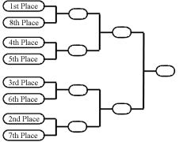
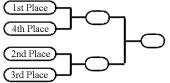
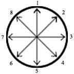
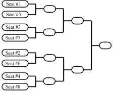
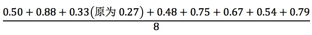
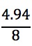
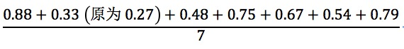
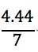

# 版本说明

MTR正文翻译版本：2025年7月26日

本文件新版中文译者：吴振宇、李思扬

过往翻译贡献者：许兆本

MTR精解（Annotated MTR）是对MTR逐字逐句的分析及解释。MTR是一份非常浓缩的文件，解释性的额外说明很少。因为文件中的每一句话都是有意义的，这份MTR精解的宗旨在于解析出隐藏于这些字句中的详细细节。它可以用作2级裁判的学习材料、为回归的裁判刷新知识、解决裁判间对问题的争论等，但它最主要的目的是教育。此文档的英文版位于裁判官方博客，如果你发现问题、或想要提供建议，请发邮件给Amtrfeedback@gmail.com。

在本文件中，精解部分在对应的正文下方用方框包裹。形如：

>这是一段注解

MTR精解翻译版本：2025年7月26日

MTR精解初版翻译团队：申成皓、陈锐鸣、常雨桐、吕家恺、杜昊

决胜依夏兰版本更新：杜昊

2025_7_26版本更新：鼠鼠

克隆仓库：https://github.com/EmoShuShu/AMTR_2025

克隆仓库提供PDF文件、更新列表以及创作者工具

如精解部分有错漏，请直接在 GitHub Issues 提交反馈。亦可发邮件 Zjjshushu@outlook.com 。

# 目录
- [版本说明](#版本说明)
- [目录](#目录)
- [引言](#引言)
- [MTR 1. 比赛基本要素 Tournament Fundamentals](#mtr-1-比赛基本要素-tournament-fundamentals)
  - [MTR 1.1 Tournament Types 比赛种类](#mtr-11-tournament-types-比赛种类)
  - [MTR 1.2 Publishing Tournament Information 比赛信息的发布](#mtr-12-publishing-tournament-information-比赛信息的发布)
  - [MTR 1.3 Tournament Roles 比赛职责](#mtr-13-tournament-roles-比赛职责)
  - [MTR 1.4 Participation Eligibility 参赛资格](#mtr-14-participation-eligibility-参赛资格)
  - [MTR 1.5 Registration 登记](#mtr-15-registration-登记)
  - [MTR 1.6 Tournament Organizer 比赛主办人](#mtr-16-tournament-organizer-比赛主办人)
  - [MTR 1.7 Head Judge 主审](#mtr-17-head-judge-主审)
  - [MTR 1.8 Floor Judges 巡场裁判](#mtr-18-floor-judges-巡场裁判)
  - [MTR 1.9 Scorekeeper 记分员](#mtr-19-scorekeeper-记分员)
  - [MTR 1.10 Players 牌手](#mtr-110-players-牌手)
  - [MTR 1.11 Spectators 旁观者](#mtr-111-spectators-旁观者)
  - [MTR 1.12 Rules Enforcement Levels 执法严格度](#mtr-112-rules-enforcement-levels-执法严格度)
- [MTR 2. 比赛的各项机制](#mtr-2-比赛的各项机制)
  - [MTR 2.1 Match Structure 对局结构](#mtr-21-match-structure-对局结构)
  - [MTR 2.2 Play/Draw Rule 先手规则](#mtr-22-playdraw-rule-先手规则)
  - [MTR 2.3 Pregame Procedures 游戏前程序](#mtr-23-pregame-procedures-游戏前程序)
  - [MTR 2.4 End-of-Match Procedure 对局结束程序](#mtr-24-end-of-match-procedure-对局结束程序)
  - [MTR 2.5 Conceding or Intentionally Drawing Games or Matches 认输或约和游戏(对局)](#mtr-25-conceding-or-intentionally-drawing-games-or-matches-认输或约和游戏对局)
  - [MTR 2.6 Time Extensions 时间延长](#mtr-26-time-extensions-时间延长)
  - [MTR 2.7 Deck Registration 套牌登记](#mtr-27-deck-registration-套牌登记)
  - [MTR 2.8 Deck Checks 套牌检查](#mtr-28-deck-checks-套牌检查)
  - [MTR 2.9 Appeals to the Head Judge 向主审申诉](#mtr-29-appeals-to-the-head-judge-向主审申诉)
  - [MTR 2.10 Dropping from a Tournament 退出比赛](#mtr-210-dropping-from-a-tournament-退出比赛)
  - [MTR 2.11 Taking Notes 作笔记](#mtr-211-taking-notes-作笔记)
  - [MTR 2.12 Electronic Devices 电子设备](#mtr-212-electronic-devices-电子设备)
  - [MTR 2.13 Video Coverage 视频转播](#mtr-213-video-coverage-视频转播)
- [MTR 3. 比赛规则](#mtr-3-比赛规则)
  - [MTR 3.1 Tiebreakers 同分处理](#mtr-31-tiebreakers-同分处理)
  - [MTR 3.2 Format Categories 赛制种类](#mtr-32-format-categories-赛制种类)
  - [MTR 3.3 Authorized Cards 认可牌张](#mtr-33-authorized-cards-认可牌张)
  - [MTR 3.4 Proxy Cards 代牌](#mtr-34-proxy-cards-代牌)
  - [MTR 3.5 Substitute Cards 辅助牌](#mtr-35-substitute-cards-辅助牌)
  - [MTR 3.6 Card Identification and Interpretation 牌张确认与牌张解释](#mtr-36-card-identification-and-interpretation-牌张确认与牌张解释)
  - [MTR 3.7 New Releases 新发售](#mtr-37-new-releases-新发售)
  - [MTR 3.8 Game Markers 游戏标记物](#mtr-38-game-markers-游戏标记物)
  - [MTR 3.9 Die Rolling 掷骰](#mtr-39-die-rolling-掷骰)
  - [MTR 3.10 Card Shuffling 洗牌](#mtr-310-card-shuffling-洗牌)
  - [MTR 3.11 Sleeves 牌套](#mtr-311-sleeves-牌套)
  - [MTR 3.12 Marked Cards 有记号的牌](#mtr-312-marked-cards-有记号的牌)
  - [MTR 3.13 Hidden Information 非公开信息](#mtr-313-hidden-information-非公开信息)
  - [MTR 3.14 Tapped/Flipped Cards 已横置／已倒转的牌](#mtr-314-tappedflipped-cards-已横置已倒转的牌)
  - [MTR 3.15 Graveyard Order 坟墓场的顺序](#mtr-315-graveyard-order-坟墓场的顺序)
  - [MTR 3.16 Sideboard 备牌](#mtr-316-sideboard-备牌)
- [MTR 4. 沟通交流](#mtr-4-沟通交流)
  - [MTR 4.1 Player Communication 牌手之间的沟通](#mtr-41-player-communication-牌手之间的沟通)
  - [MTR 4.2 Tournament Shortcuts 比赛中的行事简化](#mtr-42-tournament-shortcuts-比赛中的行事简化)
  - [MTR 4.3 Out-of-Order Sequencing 次序不当的行事顺序](#mtr-43-out-of-order-sequencing-次序不当的行事顺序)
  - [MTR 4.4 Loops 重复动作](#mtr-44-loops-重复动作)
  - [MTR 4.5 Triggered Abilities 触发式异能](#mtr-45-triggered-abilities-触发式异能)
  - [MTR 4.6 Team/Two-Headed Giant Communication 团队/双头巨人比赛中的交流](#mtr-46-teamtwo-headed-giant-communication-团队双头巨人比赛中的交流)
  - [MTR 4.7 Game Layout 游戏用具摆放](#mtr-47-game-layout-游戏用具摆放)
  - [MTR 4.8 Reversing Decisions 反悔](#mtr-48-reversing-decisions-反悔)
  - [MTR 4.9 Day/Night 白昼/黑夜](#mtr-49-daynight-白昼黑夜)
- [MTR 5. 比赛违规](#mtr-5-比赛违规)
  - [MTR 5.1 Cheating 作弊](#mtr-51-cheating-作弊)
  - [MTR 5.2 Bribery 贿赂](#mtr-52-bribery-贿赂)
  - [MTR 5.3 Wagering 赌博](#mtr-53-wagering-赌博)
  - [MTR 5.4 Unsporting Conduct 举止违背运动道德](#mtr-54-unsporting-conduct-举止违背运动道德)
  - [MTR 5.5 Slow Play 游戏进行过慢](#mtr-55-slow-play-游戏进行过慢)
  - [MTR 5.6 Outside Assistance 场外援助](#mtr-56-outside-assistance-场外援助)
- [MTR 6. 构组赛制规则](#mtr-6-构组赛制规则)
  - [MTR 6.1 Deck Construction Restrictions 套牌构组限制](#mtr-61-deck-construction-restrictions-套牌构组限制)
  - [MTR 6.2 Card Legality 牌张可用情况](#mtr-62-card-legality-牌张可用情况)
  - [MTR 6.3 Standard Format Deck Construction 标准赛制套牌构组](#mtr-63-standard-format-deck-construction-标准赛制套牌构组)
  - [MTR 6.5 Vintage Format Deck Construction 特选赛制套牌构组](#mtr-65-vintage-format-deck-construction-特选赛制套牌构组)
  - [MTR 6.6 Legacy Format Deck Construction 薪传赛制套牌构组](#mtr-66-legacy-format-deck-construction-薪传赛制套牌构组)
  - [MTR 6.7 Pioneer Format Deck Construction 先驱赛制套牌构组](#mtr-67-pioneer-format-deck-construction-先驱赛制套牌构组)
- [MTR 7. 限制赛制规则](#mtr-7-限制赛制规则)
  - [MTR 7.1 Deck Construction Restrictions 套牌构组限制](#mtr-71-deck-construction-restrictions-套牌构组限制)
  - [MTR 7.2 Card Use in Limited Tournaments 限制赛中可用的牌](#mtr-72-card-use-in-limited-tournaments-限制赛中可用的牌)
  - [MTR 7.3 Continuous Construction 连续构组](#mtr-73-continuous-construction-连续构组)
  - [MTR 7.4 Abnormal Product 异常产品](#mtr-74-abnormal-product-异常产品)
  - [MTR 7.5 Sealed Deck Pool Registration 登记现开套牌牌池](#mtr-75-sealed-deck-pool-registration-登记现开套牌牌池)
  - [MTR 7.6 Draft Pod Assembly 轮抽组的分配](#mtr-76-draft-pod-assembly-轮抽组的分配)
  - [MTR 7.7 Booster Draft Procedures 补充包轮抽程序](#mtr-77-booster-draft-procedures-补充包轮抽程序)
- [MTR 8. 团队赛规则](#mtr-8-团队赛规则)
  - [MTR 8.1 Team Names 团队名称](#mtr-81-team-names-团队名称)
  - [MTR 8.2 Team Composition and Identification 团队组成与识别](#mtr-82-team-composition-and-identification-团队组成与识别)
  - [MTR 8.3 Team Communication Rules 团队交流规则](#mtr-83-team-communication-rules-团队交流规则)
  - [MTR 8.4 Unified Deck Construction Rules 套牌联合构组规则](#mtr-84-unified-deck-construction-rules-套牌联合构组规则)
  - [MTR 8.5 Team Rochester Draft Tournaments 团队罗彻斯特轮抽赛](#mtr-85-team-rochester-draft-tournaments-团队罗彻斯特轮抽赛)
  - [MTR 8.6 Team Sealed Deck Tournaments 团队现开赛](#mtr-86-team-sealed-deck-tournaments-团队现开赛)
- [MTR 9. 双头巨人赛规则](#mtr-9-双头巨人赛规则)
  - [MTR 9.1 Match Structure 对局结构](#mtr-91-match-structure-对局结构)
  - [MTR 9.2 Communication Rules 交流规则](#mtr-92-communication-rules-交流规则)
  - [MTR 9.3 Play-Draw Rule 先手规则](#mtr-93-play-draw-rule-先手规则)
  - [MTR 9.4 Pregame Procedure 游戏前程序](#mtr-94-pregame-procedure-游戏前程序)
  - [MTR 9.5 Two-Headed Giant Constructed Rules 双头巨人构组赛规则](#mtr-95-two-headed-giant-constructed-rules-双头巨人构组赛规则)
  - [MTR 9.6 Two-Headed Giant Limited Rules 双头巨人限制赛规则](#mtr-96-two-headed-giant-limited-rules-双头巨人限制赛规则)
  - [MTR 9.7 Two-Headed Giant Booster Draft Tournaments 双头巨人补充包轮抽赛](#mtr-97-two-headed-giant-booster-draft-tournaments-双头巨人补充包轮抽赛)
- [MTR 10. 认证规则](#mtr-10-认证规则)
  - [MTR 10.1 Participation Minimums 参赛人数下限](#mtr-101-participation-minimums-参赛人数下限)
  - [MTR 10.2 Number of Rounds 对局轮数](#mtr-102-number-of-rounds-对局轮数)
  - [MTR 10.3 Invitation-Only Tournaments 只对受邀牌手开放的比赛](#mtr-103-invitation-only-tournaments-只对受邀牌手开放的比赛)
  - [MTR 10.4 Pairing Algorithm 配对算法](#mtr-104-pairing-algorithm-配对算法)
- [附录A～与过往版本之间的更动](#附录a与过往版本之间的更动)
- [附录B～时间限制](#附录b时间限制)
- [附录C～平分处理释疑](#附录c平分处理释疑)
- [附录D～限制赛中推荐的补充包构成](#附录d限制赛中推荐的补充包构成)
- [附录E～瑞士式比赛中推荐进行的局数](#附录e瑞士式比赛中推荐进行的局数)
- [附录F～各比赛计划的执法严格度](#附录f各比赛计划的执法严格度)

# 引言

本份文档的目的在于：通过厘清相应的规则、责任及在一切受DCI认证的万智牌比赛中均须遵守之行事程序，从而为举办万智牌的比赛奠定基础。

无论举办地点为何，DCI认证的比赛都应依照此标准进行。此举能保证身处不同地域的牌手都能得到相同的待遇，同时也使得他们能够顺利地融入国际比赛之中。所有的牌手都应平等相待，并依据赛事所采取的执法严格度（REL）共担责任。牌手和工作人员应该携手合作，以达成他们共同的目标～举办一场正规的DCI认证比赛。牌手和工作人员须坦诚相待，相互尊敬，共同遵守这些规则及其制订精神。他们都应遵从最新版本的《万智牌比赛规则》（MTR）以及《万智牌完整规则》（CR）。旁观者自身也有需担负的责任。违反了DCI规则的人，将根据比赛的执法严格度对应文档中载明之内容，受到相应的处分。

本文档中所包含的信息或许会与《完整规则》中所述之信息相矛盾（或包含后者当中所未备载的信息），此时，以本份文档所述为准。

载于威世智官方网站之针对特定比赛的正式说明资料中，可能会规定不同的，或是额外的方针或程序。若本文档中所述情形与载于威世智官方网站之针对特定比赛的正式说明资料中所述情形相矛盾时，以说明资料中的信息为准。

威世智公司保留更改此规则的权利，同时保有对此规则进行解释、修订、厘清，及以其它方式发布正式更动，而无需事先通知的权利。

本文档的更新，计划于售前赛之后的星期一发布。可能会发生需要更改各赛制可用牌张规定，而在下列表定时间之外更新本文档的情况。此类例外修订之公告时间均会提前4周告知。其余不影响牌张可用性之更改，则可能会在未事前告知的情况下径行修订，敬请注意。

最新的版本可于 http://wpn.wizards.com/en/document/magic-gathering-tournament-rules 找到。

# MTR 1. 比赛基本要素 Tournament Fundamentals

## MTR 1.1 Tournament Types 比赛种类

There are two types of sanctioned Magic tournaments: rated and casual.

万智牌认证赛事分为两种：积分赛和休闲赛。

Rated tournaments are further divided into two types: Premier and non-Premier. Premier tournaments are run by Wizards of the Coast or select Tournament Organizers. They have unique names and features. Non-Premier tournaments are tournaments that are not explicitly Premier.

积分赛又分为两种类型：重要比赛及非重要比赛。「重要比赛」系指由威世智公司或指定的比赛主办人承办的比赛，具有独特的名称和制度。「非重要比赛」系指未明确标识为「重要比赛」的其他比赛。

>Premier tournaments include or have included Magic: The Gathering World Championship, World Magic Cup, World Magic Cup Qualifiers, World Magic Cup Qualifier Trials, Pro Tour, Regional Pro Tour Qualifier, Preliminary Pro Tour Qualifier, Grand Prix, Grand Prix Trial, WPN Premium Tournament, and WPN Premium Qualifier. Non-Premier tournaments include any other sanctioned tournaments. The key point is that MTR is a policy document for both Premier and non-Premier sanctioned tournaments.
>
>重要比赛包括或曾包括：万智牌世界冠军赛，万智牌世界杯，万智牌世界杯资格赛，万智牌世界杯资格赛预选赛，专业赛，区域专业资格赛，初选专业资格赛，大奖赛，大奖赛预选赛，WPN顶级比赛以及WPN顶级比赛资格赛。非重要比赛包括任何其他的认证比赛。重点：MTR是一份同时针对重要认证比赛以及非重要认证比赛的方针文件。

There are two major tournament formats: Limited and Constructed. Each has rules specific to its format. In Limited tournaments, all product for play is provided during the tournament. In Constructed tournaments, players compete using decks prepared beforehand. Some Premier tournaments may consist of multiple formats within the same tournament.

主要的赛制有两种——限制赛和构组赛。每个赛制都有自身特有的规则。在限制比赛中，用于进行比赛的所有产品都是在比赛过程中提供。在构组比赛中，牌手使用赛前所准备好的套牌来参赛。一些重要比赛可能会在同一场比赛中包含多种赛制。

>Limited formats include any format in which a player constructs a deck during the event — e.g., draft, sealed deck, and mini masters. Constructed formats include any format in which a player constructs their deck before the event. The most popular constructed formats are Standard, Pioneer, Modern, and Legacy.  Some ways people play are not sanctionable formats such as Old School or do not well fit into the MTR because of being multiplayer like Commander.
>
>限制赛包括任何需要牌手在比赛过程中构筑套牌的赛制——例如轮抽赛，现开赛以及单包赛。构组赛包括任何需要牌手在比赛前构组套牌的赛制。最流行的构组赛制有标准赛，先驱赛，近代赛以及薪传赛。社群中的某些玩法并非认证赛制（例如复古赛），或是因其多人游戏属性（例如指挥官）而不能完全适用《万智牌比赛规则》。

## MTR 1.2 Publishing Tournament Information 比赛信息的发布

Wizards of the Coast reserves the right to publish DCI-sanctioned tournament information at any time (including during the tournament). Tournament information includes, but is not limited to, the contents of one or more players' decks, descriptions of strategies or play, transcripts, and video reproductions. Tournament Organizers are also allowed to publish this information once their tournament is complete.

威世智公司保留随时发布DCI认证的比赛信息之权利（「随时」包含比赛进行当中的时段）。「比赛信息」包括，但不限于：一位或更多牌手的套牌之内容；战术或打法的描述；对局记录；以及视频记录。比赛主办人在其比赛结束后，亦能发布此类信息。

>Decklists should not be made public until an event has completed except in certain Premier events where player decklists are often shared with opponents at the beginning of the round. This is to minimize advantage created by certain lists being made public by coverage. Wizards of the Coast’s right to publish this information does not necessarily mean judge or Tournament Organizers have to record it.
>
>At Premier events like Grand Prix and Pro Tours, Wizards of the Coast often has online coverage of the event. This section is explicitly state they are allowed to publish lists. Tournament Organizers also have the right to publish this information after the event ends, but some TOs receive permission to handle the coverage similar to Wizards. For example, Star City Games Opens regularly publish decklists on the Star City Games website during the event or Top 8.
>
>除了在一些会将牌手的套牌登记表在赛前向对手共享的重要比赛外，在比赛结束之前，套牌登记表都不应该对外公开。这是为了尽量减少因为报道团队透露套牌登记表而对一些牌手带来的获利。威世智有权发布该信息并不意味着裁判或比赛主办人必须记录这些信息。
>
>在例如大奖赛和专业赛这样的重要比赛中，威世智通常会对比赛进行线上报道。本章节的内容明确规定了他们有权利公布相关内容。比赛主办人同样有权利在比赛结束时公布此类信息，一些比赛主办人同样有权利与威世智采用同样的方式公布信息。例如，[星城公开赛](http://www.starcitygames.com/)会在比赛中或八强决赛中在他们的网站上发布套牌登记表的内容。

Wizards of the Coast reserves the right to publish penalty and suspension information.

威世智公司保留发布处罚及停权信息之权利。

>Judges should take all investigation and penalty information very seriously, as it could end up in an article on Wizards of the Coast’s webpage.
>
>Wizards of the Coast will often report on disqualifications or other high profile penalties during Pro Tours.
>
>While this statement says that Wizards can publish a list of players who are suspended from the game, they do not. This decision was made in 2019. Since then, outside of specific public articles, there is no way to tell if a player is suspended. If a Judge or tournament official attempts to register a suspended player, the Wizards event software will notify them, assuming they didn’t just use a new email address or DCI number.
>
>裁判必须作出充分的调查并严肃认真地做出判罚，因为处罚信息可能会记载在威世智的网页信息中。
>
>威世智通常会在专业赛期间就取消资格或者其他影响较大的处罚做出报告。
>
>尽管此条款声明威世智可以公布被停权牌手的名单，但他们并不会这样做。该决定于2019年做出。自此以后，除了特定的公开文章外，外界将无法得知一名牌手是否处于停权状态。如果裁判或赛事工作人员尝试为一名被停权的牌手进行注册，威世智官方赛事软件会向其发出提醒，前提是该牌手没有使用新的邮箱地址或DCI号码。

## MTR 1.3 Tournament Roles 比赛职责

The following roles are defined for tournament purposes:

依比赛的角度，定义比赛相关职责如下：

• Tournament Organizer 比赛主办人

• Head Judge 主审

• Floor Judge 巡场裁判

• Scorekeeper 记分员

• Player 牌手

• Spectator 旁观者

The first four roles above are considered tournament officials. The Head Judge and floor judges are collectively considered judges. A single individual may act in any combination of tournament official roles. Individuals who are not judges at a tournament are spectators in any match in which they are not playing. Members of the press are also considered spectators.

上述职责中，前四者视为比赛工作人员。主审和巡场裁判统称「裁判」。数种不同的职责可以由同一位人士来兼任。在比赛中，不担任裁判的个人于其不参与的对局中视作旁观者。媒体记者亦视作旁观者。

>It is possible for one person have multiple roles during at a small tournament. However, at larger events tournament officials typically only have a single role. Any player is a spectator of the matches taking place in nearby seats. All individuals that are not tournament officials of an event, including those with or without a DCI number, are considered spectators. 
>
>Players and Spectators are expected to follow all instruction given by Tournament Officials, therefore it’s important to know who that title applies to. It’s also important to define each of these roles in detail, which luckily the MTR does for us in Sections 1.6-1.11, in the order listed above.
>
>在小规模的比赛中，一个人可能会身兼数职。在规模较大的比赛中，比赛工作人员通常只担任单一角色。处于比赛桌附近的位置的牌手便属于旁观者。
>
>所有非比赛工作人员的个人，无论他们是否有DCI号，都被当作旁观者。牌手及旁观者都应遵从比赛工作人员给出的指示，因此需要明确认识每个角色的职责。上述的角色也应当被明确定义，这在[MTR的1.6～1.11](#目录)中有详细的说明。

## MTR 1.4 Participation Eligibility 参赛资格
Anyone is eligible to participate as a player in a DCI-sanctioned tournament except for:

任何人都有资格以牌手身份参加DCI认证的积分赛，但以下除外：

* Individuals currently suspended by the DCI.  Individuals currently suspended from the DCI may not act as tournament officials;

* 目前被DCI所停权者。目前为DCI所停权者不得担当比赛工作人员；

>This is kind of the definition of suspended or banned.
>
>这些牌手指的是被停权或禁赛的牌手。

* Other individuals specifically prohibited from participation by DCI or Wizards of the Coast policy (such determination is at Wizards of the Coast’s sole discretion);

* 其他被DCI或威世智公司的方针明令禁止参赛者（此类决定为威世智公司的单方判断）；

>This could be another form of banning, or could apply to Wizard employees.  What it means is up to Wizards.
>
>此条款可指代另一种形式的禁赛，或适用于威世智员工的情况。其最终解释权归威世智所有。

* Individuals thirteen (13) years of age and younger who do not have their parent/guardians’ permission;

* 年龄十三（13）岁以下（含13岁），且未获父母／监护人许可者；

>Thirteen is the recommended age for the game provided by Hasbro and Wizards of the Coast.
>
>十三岁是孩之宝以及威世智推出的这款游戏的推荐年龄。

* Anyone prohibited by federal, state, or local laws, the rules of the Tournament Organizer, or by a venue’s management.

* 被联邦、州或当地法律、比赛主办人制订的规则或比赛场馆之管理规定禁止参赛者。

>Federal, state, and local laws supersede any rules set forth by Wizards of the Coast. For example, if a player isn’t allowed within 500 ft of a particular store, employee, or other players because of a restraining order or some other legal limitations, he or she can’t play. Being able to play is a privilege, not a right, and extenuating legal circumstance may prevent people from playing.The store owner has the right to bar anyone from their store or venue for any reason they see fit. Typically store owners only use this as a last resort for recurring problems players, or in the case of theft. Wizards cannot force a store or venue to allow a specific individual.
>
>联邦、州或当地法律优先于一切威世智制定的规则。例如，如果由于禁制令或其他法令限制，某牌手不允许与店家、员工或其他牌手距离低于500英尺，那么该牌手不能参与游戏。能够参加比赛是一项特权而非基本权利，对于合法条件的漠视会将参赛者拒而远之。店家有权利以任何理由拒绝他们认为不合适的牌手进店。一般来说，店家将其作为驱离有问题的牌手或者防止偷盗的最后手段。威世智无法强制店家或比赛场地接纳特定个人。

* Tournament Organizers may choose to age restrict any Regular REL events that they organize. They must clearly indicate this in their marketing for the event on the Store and Event Locator description as well as any other place they display the event information. (i.e. Tournament Organizers may advertise an age 16 and under Friday Night Magic).

* 比赛主办人可针对其主办的一般级别执法严格度赛事设置年龄限制。它们必须在店内为此活动进行的营销宣传、「Event Locator」上的说明以及其他显示赛事信息的场合清楚标明此限制。（即，比赛主办人可以宣传仅限16岁以下人士参加的周五认证赛。）

Anyone is eligible to participate as a tournament official (Tournament Organizer, Head Judge, floor judge or Scorekeeper) for a tournament except for:

任何人都有资格担任比赛工作人员之职务（比赛主办人、主审、巡场裁判或是记分员），但以下除外：

* Individuals currently suspended by the DCI;

* 目前被DCI所停权者；

>If someone is suspended as a player, they aren’t allowed to judge either. Keep in mind, this does not directly correspond with judge certification. Just as non-certified individuals can act as judges for the event, being suspended does not directly revoke your certification, though it may be taken into consideration.
>
>如果某牌手作为牌手被停权，那么他也同样不能参与执法。切记，这和裁判的认证资格并无直接联系。就像未认证的裁判仍然可以执法一场比赛，被停权不意味着撤销裁判认证，虽然仍可能会被考虑在内。

* Anyone who has played in the tournament, unless it is a tournament that explicitly allows tournament officials to play while acting as a tournament official.

* 当前比赛的参赛者；明确允许比赛工作人员在行使职责的同时参与比赛之比赛不在此限。

>This rule is to prevent conflicts of interest.  You cannot rule impartially in a tournament you are hoping to gain from. However, there are specific low-stakes tournaments where the conflict of interest is sufficiently mitigated.  These exceptions are outlined in the next section.
>
>本条规则旨在防止利益冲突。你无法在一场你希望从中获益的比赛中公正地执法。然而，在某些特定的低级别赛事中，这种利益冲突得到了充分的缓和。这些例外情况将在下一节中进行概述。

Tournament officials may play in a DCI-sanctioned, rated tournament for which they are a tournament official if (and only if) the tournament is of the following types:

在DCI认证比赛中担任职务的工作人员不得参加该场比赛，但当（且仅当）该场比赛属于下列类别的比赛时，不在此限：

* Friday Night Magic 周五认证赛

* Prerelease 售前赛

* Launch Parties 发售赛

* Game Day 欢乐日

* Store Championship 店家冠军赛

* Other non-Premier Magic Tournaments 其他的万智牌非重要比赛

* Tournaments in which the official Wizards of the Coast tournament fact sheet specifically permits officials of that tournament to play 在正式的威世智比赛说明文档上特别注明该场比赛之工作人员亦可参赛的比赛

If one or more tournament officials play in the tournament, it must be run at Regular Rules Enforcement Level. If tournament officials play in the tournament and the tournament is not one of the allowed types listed above, the tournament will be invalidated. Tournament officials are required to officiate tournaments fairly and without regard to their own self-interest.

若某场比赛有比赛工作人员参加，则该比赛必须以一般级别的执法严格度来举行。若比赛工作人员参加不在上述许可列表当中的比赛，则该场比赛无效。比赛工作人员及职员行使职责时，必须保证公平公正、不含私心。

The owners of organizations that run Premier Events are not permitted to play in those tournaments, even if the owner is not listed as a tournament official (organizer, judge, and/or scorekeeper) for that tournament.

举办重要比赛之组织的负责人不得参加此类比赛，即使此负责人不属于当场比赛的工作人员（主办人、裁判，和／或记分员），也需遵循此限制。

Premier Events include the following tournaments: Magic: The Gathering World Championship, Pro Tour, Pro Tour Qualifier, Spotlight Series, Regional Championship, Regional Championship Qualifier.

下列比赛属于重要比赛：万智牌世界冠军赛、专业赛、专业赛预选赛、Spotlight系列赛、区域冠军赛、区域冠军赛预选赛。

Some tournaments have additional criteria regarding player and tournament official eligibility (e.g. invitation-only tournaments, such as Pro Tour and Regional Championships).

某些比赛在参赛者资格或是担任比赛工作人员方面具有额外的限制条件（如专业赛及区域冠军赛等只对受邀牌手开放的比赛）。

The Premier Tournament Invitation Policy defines specific eligibility rules with regards to certain types of invitation-only Premier Tournaments (e.g. Pro Tour and Regional Championships).

针对某些只对受邀牌手开放的比赛（如专业赛及区域冠军赛等），《重要比赛邀请方针》中规定了如何获取资格的规则。

Individuals with questions regarding their tournament eligibility should contact PremierPlay@wizards.com.

对自己的参赛资格有疑义者，请联系 PremierPlay@wizards.com。

>All Competitive and Professional Rules Enforcement Level events require players and judges to be separate people, because of the potential problems it could cause. If someone were playing against the person judging the event at a large cash prize event, it might make them less confident in the judge’s ability to remain impartial, especially if they need to ask a question about a card in their hand.
>
>The “tournaments in which the official Wizards of the Coast tournament fact sheet specifically permits officials of that tournament to play” does not have anything under that category, but is an option for the future. The general policy is that all Regular Rules Enforcement Level events someone can both play and act as a Tournament Official, for Competitive and Professional they cannot.
>
>所有的竞争级别以及专业级别的比赛要求区分牌手和裁判，这是为了避免造成一些潜在问题。如果某牌手正在和执法该比赛的裁判对局，且比赛的奖池又很大，那么这位牌手很可能会质疑裁判的公正性，尤其是在他想询问关于手中的牌的相关信息时。
>
>暂时没有“在正式的威世智比赛说明文档上特别注明该场比赛之工作人员亦可参赛的比赛”这样的分类，这里的标注仅为了给将来带来方便。目前的一般方针是，一般级别的比赛工作人员也可以参加，但是竞争级别和专业级别则不行。

## MTR 1.5 Registration 登记

In order to participate in Magic: The Gathering tournaments, players must be able to provide the necessary and appropriate identifying information to participate in the tournament.

牌手须提供合适的身份信息来参加万智牌的赛事。

>Depending on the tournament, it may use different registration software such as EventLink or Melee.gg 
>
>根据比赛的不同，可能会使用不同的注册软件，例如EventLink或Melee.gg。

For tournaments run using the EventLink tournament management software, players must provide a Wizards Account and/or a first and last name. Players without a Wizards Account should obtain one from .

对于使用EventLink软件运行的赛事，牌手必须提供威士智账号和/或姓名。没有威士智账号的牌手可以通过注册。

>Eventlink is the current software for store level events.  It prefers Wizards Account information.  First/Last name can cause problems.
>
>Eventlink是当前用于店赛的软件。它优先使用威世智账户信息，直接使用姓名可能会导致问题。

## MTR 1.6 Tournament Organizer 比赛主办人

The Tournament Organizer of a tournament is responsible for all tournament logistics including:

比赛主办人负责所有的比赛后勤工作，包括：

* Sanctioning the event.

* 规划认证赛事。

>This is obtained by sanctioning the event in Eventlink, through the creation of the event. Each event has a unique sanctioning number.
>
>这项认证通过在Eventlink中创建比赛即可获得。每场比赛都会有一个唯一的认证号。

* Providing a site for the tournament that meets the tournament’s expected needs.

* 为比赛提供满足需求的场所。

>To ensure a smooth running event, the tournament organizer must provide a play space that will allow the event to have space required for the expected number of players. This may range from the store they run having enough room for their FNM, or renting out a room in a hotel or convention center to make adequate space.
>
>为了确保比赛顺利进行，比赛主办人必须提供一个能够容纳预期牌手数量的场地。这包括在足够大的店铺中举办FNM，或者租借酒店会议室或会展中心来确保足够大的空间。

* Advertising the tournament in advance of the tournament date.

* 在比赛日前宣传本次比赛。

>In order to ensure that players are available to participate in the tournament, we need to ensure that it is advertised when and where the event is happening. This can range from making sure the event shows up inWizards Store & Event Locator, to promoting the event on Facebook and other social media, to having large ads on magic related websites.
>
>为了确保牌手能够参加比赛，我们希望比赛的信息能够被公告，让大家知道比赛的举办时间和地点。确保比赛信息能够出现在[店家搜寻器](http://locator.wizards.com/)中，或者在Facebook或者其他社交媒体上推广比赛，以及在万智牌相关网站上投放大型广告。

* Staffing the tournament with appropriate tournament officials.

* 为比赛找到合适的工作人员。

>Tournament Organizers need to ensure that they have properly qualified tournament officials to staff the event. As a rule of thumb, you want one judge per 32 players for smaller events,  with additional judges as you break 100 players.  Additionally the type of event (Regular REL or Competitive) may require additional rules that specific levels of judges have been trained in. 
>
>比赛主办人需确保拥有足够的具有资质的比赛工作人员来为比赛进行分工。根据经验法则，在小规模的比赛中，建议为每32名牌手配备一名裁判；当牌手人数超过100人时，则需要增派额外的裁判。此外，赛事的类型（例如一般级或竞争级）可能要求裁判掌握某些特定规则，而这些是特定等级的裁判才接受过的训练。 

* Providing all materials necessary to operate the tournament (e.g. product for Limited format tournaments).

* 提供所有用来举办该比赛的道具（如：用于限制赛的产品）。

>Tournament Organizers need to ensure that sealed product and other required materials are available for limited format tournaments and that deck list sheets available for constructed tournaments. Those are pretty straightforward. The Tournament Organizer is also responsible for providing a lot of other things that players may take for granted — e.g., a computer and printer to take results and print pairings, tape, places to post pairings, round clock, and scissors/paper cutter to cut results slips. Some of these aren’t required but make the event go smoother, and typical Tournament Organizers will provide these. Some may find alternate ways to do some of the tasks these are used for, such as using a large TV to display pairings.
>
>比赛主办人需确保限制赛的产品数量和其他相关物料并确保为构筑赛制提供套牌登记表。比赛主办人也需要提供一些其他的必需品——例如记录成绩和打印配对的电脑和打印机，计时器，用于切开成绩条的剪刀或裁纸机。上述的某些物品可能不是必备的，但是无疑会使比赛的运行更流畅，一般来说比赛主办人都会提供这样物资。当然可以用一些其他的方式来替代上述物料，例如用大电视来显示配对。

## MTR 1.7 Head Judge 主审

Sanctioned tournaments require the physical presence of a Head Judge during play to adjudicate disputes, interpret rules, and make other official decisions. The Head Judge is the final judicial authority at any DCI-sanctioned tournament and all tournament participants are expected to follow their interpretations. Although it is beneficial, the Head Judge does not have to be certified.

认证的比赛在进行时需要一位主审在场裁决争议、解释规则，及做出其他正式的决定。在所有的DCI认证赛中，主审都拥有最终裁判权，所有的参赛者都应当遵从主审的指示。虽然由认证裁判担任主审为佳，但担任主审者不需具备认证资格。

>The Head Judge of a tournament is not necessarily a certified Judge. Often the Head Judge of an event will simply be a store employee or the Tournament Organizer themselves. Most Competitive Rules Enforcement Level events will have a certified Head Judge but this is not necessarily required. Note it is recommended that you have at least a Level 2 judge for any Competitive REL events.
>
>比赛的主审并非一定是认证裁判。一般来说，比赛的主审可能就是店里的员工或者比赛主办人自己。大多数的竞争级别比赛会有一位认证裁判作为主审，但这不一定是必要的。请注意，建议为所有竞争级别的赛事配备至少一名二级裁判。

The Head Judge’s responsibilities include:
主审的责任包括：

* Ensuring that all necessary steps are taken to deal with game or policy rule violations that they notice or are brought to their attention.

* 确保在处理他所知或被告知的违规举动（无论是游戏规则还是方针方面的规定）时采用了所有必要的处理步骤。

>In larger events the Head Judge may not be the primary individual fielding judge calls. Sometimes the Head Judge will be handling other tournament aspects and be unable to take calls, or the Head Judge will be trying to let an available Floor Judge answer the call. 
>
>The Head Judge should be a ready resource for Floor Judges to assist in making sure players get the best possible call. In addition to appeals discussed in the next bullet, investigations that may lead to a disqualification are among the most important tasks a Head Judge performs. 
>
>在大型比赛中，主审的主要职责并不是第一时间去处理裁判呼叫。有时主审会因为处理比赛的其他事物而无法处理呼叫、或者试图让一个有空的巡场裁判来处理呼叫。
>
>主审应当是巡场裁判的可靠后援，以协助他们确保牌手能得到最优的判决。除了下一条目中将讨论的上诉外，那些可能导致取消资格的调查，亦是主审所执行的最重要的任务之一。

* Issuing the final ruling in all appeals, potentially overturning the ruling of a floor judge.

* 做出申述的最终裁定，主审可推翻巡场裁判所做出的裁定。

>Players are allowed to appeal the decision of any Floor Judge to the Head Judge. The Head Judge is the final arbiter of all rulings and sometimes that will mean reversing the decision of a Floor Judge. If a decision is reversed, it is vital that the Head Judge explain the reasoning behind the reversal to both the players and the judge.
>
>牌手可以不满巡场裁判的判罚并上诉至主审。主审是判罚的最终裁决者，有时甚至可以推翻巡场裁判的判罚。如果后者的判罚被推翻，主审需同时向该巡场裁判和牌手解释其中的原因。

* Coordinating and delegating tasks to floor judges as needed.

* 协调巡场裁判之工作，并可以在需要时委之以相应的任务。

>In tournaments with multiple judges, the Head Judge is responsible for assigning and organizing Team Leads and teams. The Head Judge creates the teams (at big events sometimes with the assistance of the Tournament Organizer or Judge Manager), and makes sure everyone’s tasks are understood. The Head Judge is also responsible for overseeing other judges at the event. Not all tasks assigned are always strictly tournament operations and may be other things needed by the organizer.
>
>在一场有多名裁判的比赛中，主审需要分派团队并指派队长。主审会创建团队（在大型比赛中可能会在比赛主办人或者裁判经理的帮助下），并确保每位裁判了解自己的职责。主审也需要在比赛中监督其他裁判，确保所有的任务能够按照比赛计划严格进行，并帮助主办人完成一些其他任务。

If necessary, the Head Judge may temporarily transfer their duties to any judge if they are unable to fulfill them for a period of time. Also, in exceptional circumstances, if the tournament’s integrity would be damaged otherwise, the Tournament Organizer may replace the Head Judge.

若有需要，当主审无法履行自身职责时，可将此职务临时转交给其他裁判来履行。此外，在比赛的严肃性可能受到损害的特殊场合，比赛主办者可更换主审。

>At store level events this is most common during lunch breaks but this can also happen if the Head Judge becomes ill or ends their shift and a new Head Judge takes over. This is incredibly rare for Premier events but for side events the person acting as Head Judge may be more fluid. The Tournament Organizer has final say about whether the Head Judge needs to be replaced due to exceptional circumstances.
>
>在店赛中通常是因为午餐休息时间而出现这种情况，但是如果一旦主审生病或者下班，那么会由新的主审来接管比赛。这种情况对于重要比赛来说很少见，但在外围赛中作为主审的人员可能会经常变化。在特殊情况下，关于是否更换主审的最终决定权在于比赛主办人。

Certain Premier tournaments have multiple Head Judges and/or different Head Judges for different portions of the tournament. All Head Judges share the same responsibilities and exercise the same authority while they are serving as a Head Judge.

某些重要比赛会出现拥有多个主审和／或在竞赛的不同阶段由不同的人来担任主审的情况。所有的主审共同承担同一份责任，且在分别行使主审职务时具有同样至高无上的权威。

>Large events will often have several judges acting as Head Judges (usually noted by wearing burgundy judge shirts at Premier events or red at Star City Games events). It is also possible that a tournament may be organized into multiple flights, each with its own Head Judge. No Head Judge is more ‘ahead’ of another and each of their rulings is final. Each of the Head Judges can take appeals, run investigations, and satisfy all of the other duties that the Head Judge of record is afforded.
>
>大型比赛中通常会有若干名裁判来充当主审的职责（他们通常在重要比赛中穿着酒红色裁判制服、或在星城公开赛中穿着红色制服）。也有可能一场比赛会分成若干个部分，每个部分都有各自的主审。这些主审没有相对的级别“高低”，他们作出的判罚均是最终判罚。每位这样的主审都能处理上诉，展开调查，以及开展主审所需要执行的工作。

## MTR 1.8 Floor Judges 巡场裁判

Floor judges are available to players and spectators to answer questions, deal with illegal plays, or assist with reasonable requests. They do not have to be certified.

对牌手和旁观者而言，他们可向巡场裁判获取自身疑问的解答，召唤巡场裁判来处理非法动作，或请求巡场裁判协助自己完成合理的请求。此类裁判没有认证要求。

>When it comes down to it, the biggest responsibility of Floor Judges is to be there to answer questions, fix play errors, and providing other assistance to help the event to run. They are the lifeblood of the event. Floor Judges at events, both at Competitive and Regular Rules Enforcement Level, do not need to be certified in order to judge at an event, however it is recommended that the judges at higher level events be certified or be working toward certification.
>
>关于巡场裁判，他们最大的职责是回答问题，修正游戏错误，以及提供其他资源来帮助比赛进行。他们是比赛的血脉。巡场裁判，无论是在竞争级别还是一般级别的比赛中，都不一定要是认证裁判。然而，在高级别的比赛中，强烈建议裁判是认证的或正在往认证方向努力。

Judges will not generally assist players in determining the current game state but can answer questions about the rules, interactions between cards, or provide the Oracle™ wordings of relevant cards. At Regular Rules Enforcement Level, the judge may assist the player in understanding the game state in the interest of education. If a player wishes to ask their question away from the table, the request will usually be honored. Players may not request specific judges to answer their calls, but may request a tournament official to help translate. This request may be honored at the discretion of the original judge.

总体而言，裁判不会协助牌手对当前游戏的场面做出判断，但会就下列这些问题做出回答：规则、牌张之间的互动，或是相关卡牌的Oracle（万智牌的牌张参考资料库）叙述。

Judges are able to answer questions about the rules and interactions between cards as long as they do not provide strategic advice regarding plays to make in a situation. Oracle text is the authoritative rules text for a card. Oracle text can be found on gatherer.wizards.com, but many other sources such as phone apps will have up to date Oracle text as well. More reading on what type of information judges can assist with is available in section 4.1.

裁判们可以回答关于规则以及牌张互动的问题，只要他们不对牌手做出策略建议。Oracle叙述是牌张的权威规则解释。Oracle叙述能在[gatherer.wizards.com](gatherer.wizards.com)上找到，但是许多其他资源（例如手机app）中也可以查询到最新的Oracle叙述。关于裁判可以协助取得何种类型的信息可以参考[章节4.1](#mtr-41-player-communication-牌手之间的沟通)。

在执法严格度为一般级别的情况下，为了进行教学推广，裁判也可协助牌手对当前的游戏局面做出判断。

>Regular Rules Enforcement Level events provides an entry into the game for players. As a result, players may ask judges what the game state is and why something is the way it is. The emphasis is on education and helping new players, and there are likely smaller prizes on the line. This doesn’t mean the judge can tell the player what they should do, but the judge may assist a player in understanding a more complex interaction or game state in a less formal way than at Competitive Rules Enforcement Level.
>
>一般级别的比赛是让牌手入门万智牌的好机会。在巡场时，牌手可能会询问裁判有关当前游戏状态和为什么会导致这种情况的问题。这里的重点侧重于教导并帮助新牌手，这些比赛的奖池也相对较小。这不意味着裁判可以告诉牌手后者应当怎么做，但是裁判可以帮助牌手理解复杂的牌张互动和游戏状态，且不需要使用像在竞争级别中那么严肃的方式。

牌手可请求在远离游戏的场所对裁判进行提问，此类请求通常会予以执行。

>If the player wants to ask a question that they feels may give too much information to their opponent, the player may ask to have the question answered away from the table. A good habit for judges is to stand far enough away so opponents cannot hear them or the player asking for assistance.
>
>如果某牌手想要咨询一个问题但是害怕向对手透露过多信息，该牌手可以申请在牌桌外得到解答。裁判最好能够足够远离，这样对手就不会听到裁判的回答以及牌手询问的内容了。

牌手在呼叫裁判时，不得要求由某一名特定的裁判来响应此次呼叫，但可以请求比赛工作人员来协助翻译。经原裁判斟酌，此请求可予以执行。

>Players may not request that a specific judge answer their call, as it would compromise tournament integrity and give the impression of partiality. But there are tournaments throughout the world, and players may not speak the local language. If there are tournament officials that speak the player’s language,they may help to translate in order to ensure clear and efficient communication. At international events like an European Grand Prix, there is often a list of judges who speak different languages as a resource provided to Scorekeepers and Judge Managers.
>
>牌手不得要求某一名特定的裁判来回应他们的呼叫，这可能会对比赛的公正性造成影响并给人一种偏袒的印象。然而全世界都有万智牌比赛，牌手可能不会使用该地的语言。如果有工作人员能使用该牌手的语言，那么他们可以帮助进行翻译确保沟通的效率和准确性。在例如欧洲大奖赛的国际比赛中，往往会有一些使用多国语言的裁判来协助记分员和裁判经理。

Judges do not intervene in a game to prevent illegal actions, but do intervene as soon as a rule has been broken or to prevent a situation from escalating.

裁判不得在非法行动尚未发生时就中止比赛以防止其发生；但在已经发生违规行为，或是为了防止局势发生恶化的情形下，裁判应尽快介入比赛。

>Like in other sports, judges aren’t there to prevent mistakes. However, as soon as a game infraction happens, judges step in and apply the necessary corrections and penalties. Judges may step in if they believe a tense situation would otherwise escalate to unsportsmanlike conduct.
>
>与其他运动一样，裁判不是为了阻止错误发生而存在的。然而一旦游戏中产生了违规情况，裁判就应当介入并且适用必要的修正，做出相应的判罚。裁判也可以在他们确信当前紧张的事态会导致违背运动精神的举止的情况下介入。

## MTR 1.9 Scorekeeper 记分员

The Scorekeeper ensures the correct generation of pairings and all other tournament records throughout the tournament. The Scorekeeper’s responsibilities include:

记分员须确保在比赛整个过程当中生成的对局配对和其他比赛记录文档都正确无误。

>This includes both match slips and every sanction issued by a judge during the tournament. Scorekeepers usually keep slips separated and organized in round pairs, so if a problem arises they have both electronic and paper copies of relevant documents.
>
>这包括成绩条以及裁判在比赛中记录的判罚。记分员通常按轮次保管配对和成绩条，如果有问题，便可以从电子设备中和纸质记录的相关文件中找到依据。

记分员的责任包括：

* Generating correct pairings each round and accurately entering the results of those rounds.

* 为每局对局生成正确的对局配对并准确地输入该局对局的比赛结果。

* Generating standings for posting before and after the final Swiss round. Other rounds may also be posted at the Head Judge’s discretion.

* 在最后一局瑞士式对局开始之前及结束之后生成供张贴使用的排名。经主审斟酌，也可以在其他局次中张贴排名。

* Solving all scorekeeping problems that arise in consultation with the Head Judge.

* 在与主审协商后，解决所出现的一切记分问题。

* Making sure all necessary information is included in the tournament’s report.

* 确保在比赛报告中包含有所有的必要信息。

>While scorekeeping might seem simple, ensuring that the results of each match are correctly kept is crucial to guarantee that the tournament runs as smooth as possible.
>
>The Tournament Organizer or the Head Judge is typically the Scorekeeper of smaller events, but in larger events (120+) a dedicated scorekeeper is recommended. Larger Premier events often have professional Scorekeepers who are experienced with scorekeeping software. Their scorekeeping ability does not correlate to their judge level; some professional Scorekeepers are uncertified, and others are Level 2+ judges.
>
>尽管记分的工作看似简单，确保每个对局的成绩能够完好保存对比赛的顺利运行来说是至关重要的。
>
>在小型比赛中，比赛主办人或主审往往担任了记分员的角色，但是在大型比赛（120人以上）中建议有专门的记分员。大型的重要比赛中则会有精通记分软件的专业记分员来负责。他们的记分水平和裁判等级无关，一些专业记分员并非认证裁判，一些专业记分员则是二级以上裁判。

The Head Judge has the final authority in determining corrective action for scorekeeping errors.

主审在确定如何对记分错误进行修正方面拥有最终决定权。

>In the event of any issue with the pairings at any given round, the Head Judge may dictate a solution they see fit. In the end, the Head Judge is the final decision maker when it comes to the running of the event.
>
>如果在比赛中出现任何与配对相关的情况，主审将确定一个他认为最合适的解决方案。说到底，与比赛运行相关问题的最终决定权在于主审。

## MTR 1.10 Players 牌手

Players are responsible for:

牌手的责任包括：

* Behaving in a respectful manner toward tournament officials, other tournament participants, and spectators and refraining from unsporting conduct at all times.

* 尊重比赛官员、其他参赛者以及旁观者，保持克制，任何时候都不得出现违反体育道德的行为。

>Examples of behavior which are considered unsporting are found here. Players are otherwise expected to treat others with some level of respect.
>
>在[这里](#mtr-4-沟通交流)可以找到关于违反运动精神行为的案例。牌手必须在一定程度上对他人表示尊重。

* Maintaining a clear and legal game state.

* 保持对局状态清晰、合法。

>Playing Magic can sometimes be complex, sometimes stressful, and sometimes frustrating, but still that’s not an excuse for a judge not penalizing a player for playing unclearly. Comprehension, legality and clarity are the most important things in a Magic game, for they can be the difference between no penalization and a Disqualification. There is a specific section about Maintaining the Game State in the IPG.
>
>万智牌的对局有时可能非常复杂，有时让人感到充满压力，有时甚至会让人沮丧。不过这都不是能让裁判宽恕未能清晰地进行游戏的牌手的原因。总的来说，理解、合法、清晰是进行万智牌对局最重要的三件事，这些事情可能会成为从无判罚到取消资格的巨大差异。在IPG中专门有一节是关于[维护游戏状态](http://blogs.magicjudges.org/rules/ipg2-6/)的。

* Complying with announced start times and time limits.

* 遵守宣告的开始时间以及时间限制。

>Tournaments are always organized to run in a timely fashion, and Tournament Officials (judges and organizers) look to keep them running smoothly and quickly. If no extenuating situations appear, players are expected to follow every time limit to keep the tournament flowing. There is a specific section about Tardiness in the IPG.
>
>一般来说，比赛需要尽可能快地运行，比赛工作人员（裁判和主办人）会尽可能确保比赛快速并流畅地进行。如果没有特殊情况发生，我们希望牌手能够注意时间节点，确保比赛能够正常进行。在IPG中专门有一节是关于[迟到](http://blogs.magicjudges.org/rules/ipg3-1/)的。

* Calling attention to any rules or policy infraction they notice in their matches.

* 将在其对局中发现的违规举动（不论是游戏规则还是方针方面的规定）时提请他人注意。

>Judges can’t be everywhere all the time, so players are encouraged to cooperate in maintaining a legal and clear game. Any rules and/or policy infraction should be pointed out to any judge as soon as noticed. This way we can all enjoy of a healthy and correct game! Failing to notice mistakes quickly may lead to Warnings (see IPG 2.6), and intentionally ignoring them can be much worse (see IPG 4.8).
>
>裁判不可能照顾到方方面面，所以我们鼓励牌手能够共同维护比赛的清晰合法。一旦发现规则或者方针上的问题，需及时向裁判提出。这样我们才能共同享受健康以及正确的游戏环境！未能及时注意到错误会导致警告的判罚（IPG2.6），故意忽略这些错误可能会得到更糟糕的判罚（IPG4.8）。

* Bringing to a judge’s attention any discrepancies in their tournament match record.

* 发现自己比赛对局记录有出入时告知裁判。

>This is a very important responsibility. Players are required to inform a judge immediately if they are offered a bribe, or asked to record an improper game result. Failing to do so may result in a severe penalty for both the player offering and the player who did not call attention to the illegal action. Additionally, any errors that have been made in results entry should be brought to a Tournament Official’s attention as soon as they are noticed.
>
>这是一项十分重要的职责。当牌手遭遇行贿，或被要求记录非法游戏结果时，他应当及时通知裁判。如果不这样做，可能会为双方都带来十分严厉的判罚。此外，任何关于上报成绩的错误应当立即引起比赛工作人员的注意。

* Accurately reporting the results of their matches in a timely manner.

* 正确且及时地回报自己的比赛结果。

>In a world without match slips, it’s even more important for players to report their results one way or another ideally before leaving the table or immediately thereafter.
>
>在不再使用纸质成绩条的今天，牌手及时汇报比赛结果变得尤为重要。理想情况下，这一汇报应在牌手离开牌桌前后立即完成。

* Refraining from enrolling in tournaments in which they are not allowed by policy to participate.

* 不报名参加受相应方针限制而无法参加的比赛。

>Some tournaments award invitations to other events or have participation restrictions based on level, players’ invitation history, or other factors. Players are required to be aware of their eligibility and should not intentionally enter events they are ineligible for.
>
>一些比赛会提供参加另一些比赛的邀请，或者具有基于牌手级别、邀请历史或其他因素的参赛限制。牌手需要明晰自己是否符合参赛标准，不应去参加他们不能参加的比赛。

* Being familiar with the rules contained within this document.

* 熟识本文档中包含的规则。

>While judges know how to handle rules and how to interpret them, players are responsible for knowing something about the rules contained in the game they play. Note, this is stated in the MTR, but not in the IPG. We expect players to know and adhere to Tournament Rules, but they don’t need to know what infraction or penalties are. Some violations of the MTR, such as Bribery and Improperly Determining a Winner involve penalties that will be applied whether or not the players know the relevant rules.
>
>裁判知道如何处理并解释规则，同时牌手也需要了解一些自己玩的游戏中所包含的规则。请注意，这是在MTR中说明的，但没有在IPG中说明。我们希望牌手了解并遵守比赛规则，但是他们不必了解违规和判罚的具体内容。一些违反MTR的违规，例如贿赂和不当决定胜方，一旦牌手触犯，无论他们是否知道相关规则，都会受到判罚。

* Being physically present for the tournament.

* 亲自到场参加比赛。

>This document hasn’t yet been updated for online tournaments, but thats not what this rule is for.  You have to actually be at a tournament you are playing in.  For example, if an event gives a promo to everyone that registers, you actually have to appear at the event to be allowed in the event.  You cannot just pre-register, no-show, then expect your promo.  You were dropped from the event. 
>
>本文件尚未针对线上赛进行更新，但本条规则的用意并非在于此。你必须亲身到场参加你所报名的比赛。例如，如果一场比赛为所有报名者提供一张纪念闪卡，你也必须实际到场才能被算作正式参赛。你不能只进行预先报名，然后缺席，还指望能拿到那张闪卡。在这种情况下，你已经被移出赛事了。

A player must bring the following items to a tournament in order to participate:

牌手须齐备下列所述各物品以参加比赛：

* A physical, visible, and reliable method to maintain and record game information (tokens, score counters, pen and paper, and so on).

* 具体的、可辨识的、可靠的方式，以维持和记录游戏信息（衍生物，记分器，纸笔，等等）。

>Players are responsible for maintaining a clear and legal game state. Therefore players must bring items that help keep a clear game state — e.g., pen and paper for life totals, dice for counters and actual mana pool, tokens, etc.
>
>牌手有义务维持清晰合法的游戏状态。因此牌手需要携带一些物件来帮助体现清晰的游戏状态——例如，用于记录生命的纸笔，用于表示指示物或者法术力池的骰子，衍生物，等等。

* Any materials specifically required for a particular tournament format, such as assembled decks and/or decklists for constructed tournaments.

* 某些特定赛制所明定的其他必需物品，如构组赛中需要的已构组好的套牌和／或套牌登记表。

>Some tournaments require players to have certain items in order to play, e.g., a decklists and constructed decks. Decklists help maintain an event’s integrity and provide information about the decks played at the tournament and their legality.
>
>一些比赛需要牌手携带特定的物品参赛，例如套牌登记表和构组赛用的套牌。套牌登记表帮助维护比赛公正并提供了参赛套牌的信息并确保该套牌合法。

Players retain their responsibilities even if a judge provides them with extra assistance.

在裁判提供了额外协助的情况下牌手也须履行好上述责任。

>Players may request a judge’s assistance to comply with their responsibilities as a player. For example, during the pool registration portion of a limited event, a judge may step in to help a struggling player register their pool to get the event moving. Nevertheless, the player still needs to fulfill with his responsibilities as best they can.
>
>为了履行自己作为牌手的职责，牌手可以向裁判寻求帮助。例如，在限制赛的牌池登记环节，裁判可以帮助觉得困难的牌手登记牌池来确保比赛正常进行。然而，牌手仍需在可行的范围内尽可能地自己履行职责。

The individual members of a team are considered players, and are equally responsible for required tournament procedures, such as accurately reporting the results of their match. Players are only responsible for the games they play themselves and not separate games being played by their teammates, but are expected to point out rules violations they observe in their teammates’ matches.

一个团队的每一位队员都算作一位牌手，因此也需要为必要的比赛过程承担同等的责任，例如准确回报他们的对局结果。每位牌手只需为他们自己所参与的对局负责，而不需为他们同队队员所参与的其他对局承担责任，但在发现队友对局中出现违反规则情事时，应予以指出。

>Individual players on a team must comply with the same tournament procedures as players not playing on a team but should not be held responsible for their teammates’ errors, However that doesn’t mean they can ignore errors if they see them. If they see a problem with one of their teammate’s games they cannot deliberately ignore it.
>
>团队中的每一位队员都需要像个人赛中的牌手一样履行相应的职责，然而他们不需要为队友的错误负责。但这并不意味着他们可以无视其看到的错误。如果他们发现了队友游戏中的问题，他们不能故意忽略之。

Players who do not fulfill their responsibilities may be subject to penalties and review by the DCI. Wizards of the Coast and the DCI reserve the right to suspend or revoke a player’s membership without prior notice for any reason they deem necessary.

未能确实达成以上责任的牌手可能会受到相应的处罚，并由DCI进行复核。只要威世智与DCI认定有此必要，则不论是否预先通知，均保留将玩家停权乃至取消会员资格的权利。

>This is the big ultimatum. Not complying with a required responsibility consciously may end in a penalty and also a review or an investigation conducted by the judges at the event and/or the DCI itself. No player may interfere with the integrity of a tournament under any circumstances.
>
>这是最后通牒。明知却不履行职责的牌手会得到处罚并受到裁判和DCI的后续调查和跟进。任何情况下，牌手都不能干扰比赛的公正。

## MTR 1.11 Spectators 旁观者

Any person physically present at a tournament and not in any other category above is a spectator. Spectators are responsible for remaining silent and passive during matches and other official tournament sections in which players are also required to be silent. If spectators believe they have observed a rules or policy violation, they are encouraged to alert a judge as soon as possible. At Regular or Competitive Rules Enforcement Level, spectators are permitted to ask the players to pause the match while they alert a judge. At Professional Rules Enforcement Level, spectators who are not members of the official coverage team must not interfere with the match directly.

亲临比赛，但并不属于上述任一职能分类之人员便属于旁观者。在对局过程中及参加比赛之牌手亦须保持安静的正式比赛部分当中，旁观者得保持噤声，不主动与他人进行沟通。

>Spectators are allowed as long as they are not disruptive.  Excessive chatting can be disruptive at best, and at the worst can actually aid a player and alter the outcome of a game.  Also, so much information can be gained from watching spectators facial expressions. Pretend you are [Aang talking to Koh](https://avatar.fandom.com/wiki/Koh). 
>
>旁观是被允许的，前提是不能干扰比赛。过多的交谈，轻则会干扰赛场，重则实际上会帮助到某位牌手，甚至改变游戏结局。此外，通过观察旁观者的面部表情也可能获取大量信息。所以，请保持面无表情。

若旁观者认为自己发现了违反游戏规则或比赛方针的举动，鼓励其尽快提请裁判注意。在「一般」或「竞争」级别的比赛中，允许旁观者请求牌手在其寻找裁判期间暂停对局的进行。在「专业」级别的比赛中，不属于正式报导团队之旁观者不得直接干预对局。

>Judges aren’t everywhere and sometimes spectators may identify an action or board state as illegal.  When this happens, a spectator may bring the issue to a judges attention away from the match.  Spectators may ask the players to pause at a Competitive Rel event.  But otherwise, do not tell the players what the concern is.  This is because the spectator may be in error regarding the rules and give the players information.  This can alter the game.
>
>Members of the coverage team are allowed to bring attention to the judge staff about possible problems with the game.
>
>裁判并非无处不在，有时旁观者可能会发现违规行为或不合法的场面状态。在这种情况下，旁观者应当在远离对局的地方提醒裁判注意此问题。在竞争级别赛事中，旁观者可以要求牌手暂停，但除此以外，不应告知牌手他们所顾虑的问题是什么。这是因为旁观者对规则的理解可能有误，而他们的言语会向牌手提供本不应获得的信息，进而可能影响游戏进程。
>
>允许报道团队的成员就游戏内可能的问题提请裁判。

Players may request that a spectator not observe their matches. Such requests must be made through a judge. Tournament officials may also instruct a spectator not observe a match or matches.

牌手可以要求旁观者停止观看自己的对局。所有类似的要求必须通过裁判提出。比赛工作人员同样也可要求旁观者停止观看对局或比赛。

>Some spectators might be scouting other players or talking too much, or just hovering in a disconcerting way. Players can request the judge to have the spectator removed. This request can be refused, but would only happen in situations with extreme mitigating factors.
>
>一些旁观者可能会侦查其他牌手的情况，或者在一旁说太多的话，或仅是以令人不安的方式在旁徘徊。牌手可以请求裁判将这样的牌手驱离他的比赛。裁判一般会同意这样的请求，但是同样也会保留拒绝不合理请求的权利。

## MTR 1.12 Rules Enforcement Levels 执法严格度

Rules Enforcement Levels (REL) are a means to communicate to the players and judges what expectations they can have of the tournament in terms of rigidity of rules enforcement, technically correct play, and procedures used.

执法严格度的用途，是让牌手和裁判对于此比赛的规则执法严厉与否、正确进行游戏的水准以及使用的程序，能够先有所预期。

>The expected mindset and attitude of the average player as well as the standard of behavior judges  are different at each Rules Enforcement Level. From the most casual to most stringent the Rules Enforcement Levels are: Regular Rules Enforcement Level, Competitive Rules Enforcement Level, and Professional Rules Enforcement Level.
>
>牌手的态度和预期心态，以及裁判的行为标准会随着执法严格度的不同而有所改变。执法严格度从休闲轻松，到严格严肃分为以下级别：一般级别，竞争级别，以及专业级别。

The Rules Enforcement Level of a tournament generally reflects the prizes awarded and the distance a player may be expected to travel.

比赛的执法严格度通常应该配合所提供的奖品，以及牌手为参赛所可能花费的路程来增加。

>Typically the higher the stakes for the tournament, the more rigidly the rules are enforced.  For example, FNM is run at Regular Rules Enforcement Level, draws from the store’s local player community, and often offers one or two booster packs per player as the prize pool.  This type of event is more laid back and casual, so a less strict Rules Enforcement Policy is appropriate.  However,  an SCG Tour event, is run at Competitive Rules Enforcement Level, can draw players from several hours away, and often have significant prizes.  For those events, where players are more incentivized to play competive, a stricter Rules Enforcement policy is appropriate. 
>
>通常而言，一场赛事的利害关系越重大，其规则的执行也越严格。例如，FNM的执法严格度是一般级别，大多数参赛牌手都来自牌店的本地牌手社群，一般会提供平均每位牌手1到2包补充包作为奖品池。这类赛事更为轻松休闲，因此采用较为宽松的规则执行策略是恰当的。然而，星城巡回赛 (SCG Tour) 则以竞争级别运作，一些牌手可能会花费几小时的时间赶来参加，并通常设有更丰厚的奖品。对于这类牌手竞争意愿更强的赛事，采用更为严格的执法严格度便是恰当的。

The appropriate Rules Enforcement Level for specific programs is listed in Appendix F.

具体比赛计划对应的执法严格度于附录F中列出。 

* Regular 一般级别

Regular tournaments are focused on fun and social aspects, not enforcement. Most tournaments are run at this level unless they offer sizeable prizes or invitations. Players are expected to know most of the game rules, may have heard of policy and what is “really bad,” but generally play in a fashion similar to the way they do casually. Players are still responsible for following the rules, but the focus is on education and sportsmanship over technically precise play. Infractions in these tournaments are covered by the Judging at Regular Rules Enforcement Level document, located at https://wpn.wizards.com/en/rules-documents.

一般的比赛主要是为了娱乐和社交，而非铁面无私。大部分的比赛都是采用这个等级，除非比赛提供了一定程度的奖品或是邀请资格。对牌手的期待是应该知道大部分的游戏规则，可能听过一些比赛政策或知道哪些事情「很不好」，但通常是以类似休闲娱乐的方式来比赛。牌手还是有责任去遵循规则，但所强调的主要在于教育性和运动道德，而不是技术上的精确无误。在此类比赛中处理牌手违规行为的细则，由《一般执法严格度下执法指南》此份文档详述，该文档可于此处获取：https://wpn.wizards.com/en/rules-documents.

>Regular Rel events are often players introduction to Magic tournaments.  As they are often coming from playing at home, it is expected that they bring that style of play with them.  Playing at home is fun and low stakes, and Regular tournaments should strive to capture that same vibe.  Note that the IPG does not apply at Regular Rules Enforcement Level. Instead, we use the Judging at Regular Rules Enforcement Level (JAR) document, which lays the groundwork for a fun, casual atmosphere where only repeat offenders and serious problems —like cheating, aggressive behavior, bribery, and theft— are punished. Instead of punishing players for innocent tournament and play errors, it’s our job as judges at Regular Rules Enforcement Level to help them learn the right way to play so that they can succeed at higher Rules Enforcement Level tournaments.
>
>一般级比赛是走向万智牌比赛的第一步。由于这些牌手通常习惯了在家打牌，他们自然也会将那套游戏风格带到赛场上。家庭对局的特点是充满乐趣且利害关系不大，而一般级比赛也应致力于营造出同样的氛围。请注意，IPG不适用于一般级别的比赛。取而代之的是，我们会使用JAR，这份文件基于创造快乐、休闲的游戏氛围而制定，只有重复犯错和触犯严重问题（例如作弊，进攻性举止，贿赂，偷窃）的牌手才会受到惩罚。比起惩罚犯错的牌手，在一般级别的比赛中我们裁判更应该帮助牌手懂得怎么做才是正确的，这样他们才能在未来更高级别的比赛中取得成功。

* Competitive 竞争级别

Competitive tournaments are usually those with significant cash prizes or invitations awarded to Professional tournaments. Players are expected to know the game’s rules and be familiar with the policies and procedures, but unintentional errors are not punished severely. These are tournaments that protect the interests of all players by providing tournament integrity while also recognizing that not all players are intimately familiar with Professional-level tournament structure, proper procedures, and rules. Infractions in these tournaments are covered by the Magic Infraction Procedure Guide, located at https://wpn.wizards.com/en/rules-documents.

竞争等级的比赛通常指有着高额奖金，或有专业比赛邀请资格的比赛。对牌手的要求是了解游戏规则并熟悉竞赛政策和流程，但是无意的失误不会导致严厉的处罚。为了保护所有牌手的乐趣，这类比赛要尽力维持一致性，也要了解并非所有牌手都十分清楚专业级比赛的架构、适当的流程，以及规则。在此类比赛中处理牌手违规行为的细则，由《万智牌违规处理方针》此份文档详述，该文档可于此处获取：https://wpn.wizards.com/en/rules-documents.

>One thing to clarify here is that there is a difference between “Competitive tournaments” and “competitive tournaments”.  Any game of Magic you play, where you are trying to win, is a competitive game. However Competitive Tournaments is a class of tournaments where players begin competing for significant prizes. This is the Rules Enforcement Level at which many large magic tournaments are run. Grand Prix Trials, Preliminary Pro Tour Qualifiers, Regional Pro Tour Qualifiers, and the first day of Grand Prix are all run at Competitive Rules Enforcement Level. Tighter technical play and clearer communication are both important at this level, and tournament and game play infractions are penalized according to the IPG.
>
>Competitive tournaments have more expectations of players.  For example, decklists are required at Competitive events, which they are a discouraged option at Regular.
>
>首先需要区分，“竞争级比赛” 和“竞争性的比赛” 这两个概念的区别。任何一场你以获胜为目标的万智牌对局，都带有竞争性质。然而，“竞争级比赛”则是一个正式的赛事类别，在这一类别中，牌手们开始为更重大的奖品而战。大多数竞争性较强的万智牌比赛都会使用这个执法严格度。大奖赛预选赛，初选专业资格赛，区域专业资格赛，大奖赛第一天都是以竞争级别的执法严格度进行的。这个级别的比赛要求更严谨的游戏技巧以及更清晰的交流，并且会根据IPG对违规进行相应的处理。
>
>竞争级比赛对牌手有着更高的要求。例如，在竞争级赛事中，牌手必须提交套牌登记表，而在一般级赛事中，这通常是不鼓励的选择。

* Professional 专业级别

Professional level tournaments offer large cash awards, prestige, and other benefits that draw players from great distances. These tournaments hold players to a higher standard of behavior and technically-correct play than Competitive tournaments. Infractions in these tournaments are covered by the Magic Infraction Procedure Guide, located at https://wpn.wizards.com/en/rules-documents.

专业级别的比赛会提供高额的奖金、声望和其他福利，吸引牌手不远千里而来。这些比赛和竞争等级的比赛比起来，更要求牌手具备高水准的行为和精确的游戏动作。在此类比赛中处理牌手违规行为的细则，由《万智牌违规处理方针》此份文档详述，该文档可于此处获取:https://wpn.wizards.com/en/rules-documents.

>This is the strictest Rules Enforcement Level and is correspondingly rare. Day two of Grand Prix and the Pro Tour are both run at Professional Rules Enforcement Level.  Its also very similar to Competitive REL, with most of the difference in the rules managing spectators.
>
>这是最严格的执法严格度，但相对也使用得最少。大奖赛第二天以及专业赛都是用这个执法严格度进行的。它与竞争级非常相似，主要区别在于有关旁观者管理方面的规则。

# MTR 2. 比赛的各项机制

## MTR 2.1 Match Structure 对局结构

A Magic match consists of a series of games that are played until one side has won a set number of games, usually two. Drawn games do not count toward this goal.

一局万智牌对局包含有一系列盘数的游戏，双方持续进行每盘游戏，直到有任何一方游戏获胜的盘数达到一定数量为止,通常此数量为二。以平局告终的游戏并不会计入此数量。

>This rule is often incorrectly abbreviated ‘best of three’.  While it is true that most matches are usually won as 2-0 or 2-1, draws can result in forth or even fifth games being played.  Two Headed Giant matches, unlike regular two player matches, are played till one team has won a match.
>
>本条规则常被误称为“三盘两胜”。虽然大多数对局确实以2-0或2-1的比分结束，但平局的存在可能导致需要进行第四盘甚至第五盘游戏 。此外，双头巨人的对局与常规双人比赛不同，它是一盘定胜负的。

If the round ends before a player has won the required number of games, the winner of the match is the player who has won the most games at that point.

如果在本局对局时间终止之前,任一方牌手都未能赢下所需数量的游戏,则当时握有最多游戏获胜盘数的一方便为该局对局的胜利者。

>If the round has ended and only one player has won a game then that player is the winner of that match because they have won the majority of games.
>
>如果当本局比赛时间结束时只有一个牌手赢过一盘比赛，那么该牌手就是本局的获胜者因为他赢得了更多的盘数。

If both players have equal game wins, the match is a draw.

若双方游戏获胜的盘数相同,该局对局结果为平局。

>If the round has ended and the result is 1-1 or even 0-0  then the match is a draw.
>
>如果当本局对局时间结束时比赛结果为1-1或者0-0则该局为平局.

The Tournament Organizer may change the required number of games to be won for any portion of the tournament as long as this choice is announced before the tournament begins. 

比赛主办人可在比赛任意阶段中，变更任意一方要获得对局胜利所需的游戏获胜盘数，但此变更须在比赛开始前公布。

>For example, the Pro Tour finals are played until one player wins three games. While a local store can structure their tournment in this way, certain premier tournaments supported by Wizards, have a prescribed structure.  Certain tournaments supported by Wizards may have a specified structure required to run it. If so, that structure supersedes this rule.
>
>例如，专业赛的决赛需要牌手赢得3盘比赛。尽管本地店家可以自行设定其比赛结构，但某些由威世智支持的重要赛事有其指定的、必须遵守的结构。若存在此种指定结构，则其效力将优先于本条通用规则。

Match results, not individual game results, are reported at the end of the tournament.

对局结果(而不是各盘游戏的结果)将在赛后回报。

>The results of these matches are sent to WoTC.  They used to do something with these results in the form of planeswalker points.  Now?  Who knows. Post your conspiracy theory online.
>
>这些比赛的结果会上报给威世智。过去，他们曾利用这些结果来计算鹏洛客分数 。至于现在？天晓得。欢迎把你的阴谋论发到网上。

## MTR 2.2 Play/Draw Rule 先手规则

For the first game of a match, a designated player - the winner of a random method (such as a die roll or coin toss) during Swiss rounds, or the player ranked higher at the end of Swiss rounds during playoff matches - chooses either to play first or to play second.

每局对局的第一盘游戏由指定牌手决定哪方先手：若是在瑞士式对局期间，由随机方式（例如掷骰子或抛硬币）之胜利者决定；若是在决胜局期间，则是由瑞士式对局结束时排名较高的牌手决定。

>For non-Playoff matches, both players must agree on the random method. This can get a little tricky when the players don’t agree on the method (such as rolling a spindown dice) so and Judges may step in and help players select a random method like odds and evens or something similar. ‘Higher ranked choosing’ is the default rule for any single elimination portion of a tournament. This only applies to the first game of each match. After the first game, the loser of the previous game makes the choice. This rule was created to discourage intentional draws during swiss, by giving players an incentive to play it out.  In practice, it isn’t enough of an incentive to have any practical effect.
>
>对于非淘汰赛的对局而言，双方牌手必须协定某个随机方式。当牌手无法决定出某个随机方式时就有点棘手了（例如丢一个顺数字骰子），此时裁判可以介入并帮助牌手决定一个随机方式，例如猜单双或者其他类似的方法。排名较高的牌手决定先手是单淘汰赛制比赛的默认规则。这只适用于对局第一盘的选择。在第一盘比赛之后，上一盘的输家选择先后手。制定本条规则的初衷，是通过激励牌手打完来减少瑞士轮的约和。然而事实上，这种激励的力度并不足以产生任何实际效果。

They must state this choice before looking at their hand. If they state no choice, it is assumed that they are playing first.

该位牌手须在检视手牌之前确定相应的选择。若该牌手未置可否，则认为他选择先手。

>Players are supposed to decide whether they want to play or draw before looking at their opening hands, since the contents could influence their decision greatly. If someone does not announce their choice before seeing their opening hand, they gain information would could impact their decision. This is a fairly common and innocent mistake, so there is a simple solution; the player who sees their opener before declaring plays first by default.
>
>牌手应该在看到他们的手牌前决定是否先手，因为其内容会极大地影响他们的决定。如果有人在看到其手牌前没有宣告其选择，他们获得的信息会影响他们的决定。这是一个相当普遍和无意的错误，所以解决方案也很简单：牌手未宣布先手选择就看到手牌默认为选择先手。

The player who plays first skips the draw step of their first turn. This is referred to as the play/draw rule.

先手的牌手略过他第一个回合的抓牌步骤。此规则称为「先手规则」。

>For more information this, check out CR 103.7, which covers the beginning of the game.
>
>更多关于游戏开始的信息，参见[CR 103.7](http://blogs.magicjudges.org/rules/cr103#7)。

After each game in a match, the loser of that game decides whether to play first in the next game. they may wait until after sideboarding to make the decision. If the previous game was a draw, the player who decided to play or draw at the beginning of the drawn game chooses.

在对局中的每盘游戏之后，输掉该盘游戏的人决定自己下盘是否先手。此决定可在更换完备牌后作出。如果某盘游戏以平局告终，则由决定该盘先后手的牌手来选择自己在下盘游戏中是否先手。

>Games that have ended in a draw have functionally not happened. There is thus no need to rechoose, as we are instead merely beginning the act of playing again. Thus, if the previous game ended in a draw, the player who chose last chooses again.  Additionally, a player may wait until after sideboarding, but doesn’t have to.  However, they cannot announce a decision prior to sideboarding, and then try to change the choice after sideboarding
>
>以平局结束的游戏等同于是没有发生。因为我们只是重新开始这盘游戏，所以不需要重新选择。因此，如果某盘游戏以平局告终，由上一盘决定先后手的牌手再次决定。此外，牌手可以选择等到完成换备后再做决定，但这并非必须。然而，牌手不能在换备前先宣布决定，然后在换备后又试图更改该决定。

## MTR 2.3 Pregame Procedures 游戏前程序

The following steps must be performed in a timely manner before each game begins:

在每盘游戏开始前,必须执行下列步骤，且须以合理的耗时完成之:

>The term “timely” here is important. Players cannot take excessive time sideboarding or shuffling, or they may be subject to Slow Play or Stalling penalties.
>
>合理的耗时是很重要的，牌手不能花过多的时间用于换备或者洗牌，否则他们可能会受到拖延或者作弊的判罚。

1\. If sideboarding is allowed, players may remove cards from their decks and add cards from their sideboards.

1\. 如果本盘游戏允许更换备牌，则牌手可以从套牌中去掉原有牌张，并将备牌中的牌加入套牌。

>Sideboarding is allowed between games only when a previous game had actions taken during it. A tournament should test a player’s skill in deck building and technical play first, not in advance scouting opponents. This is just a fancy way of saying the game wasn’t lost because of a tardiness penalty or a Game Loss coming from a deck check. Additionally, a player may not offer to intentionally draw the opening game prior to taking game actions in order to introduce sideboard cards for the match. If the players have completed game actions, it’s reasonable for them to use that knowledge to sideboard effectively. Note that this applies to the first game of the match, or to any match that begins on a second or subsequent game due to penalties assessed to one or more players prior to the first game beginning. This includes games started by the third activated ability of Karn Liberated; treat these restarted games as the same game in the match.
>
>只有在上一盘游戏中进行过游戏动作的情形下才允许更换备牌。一场比赛首先测试的应该是牌手的套牌构筑技巧以及牌技，而不是从侦查对手中获得优势。说白了，因为迟到判罚或套牌检查判负不能换备。牌手不能在进行游戏动作前就提出约和第一盘比赛以使用备牌。如果牌手进行了游戏动作，使用因此而获得的信息进行有效换备便是合理的。注意这适用于每局的第一盘比赛或是由于在第一盘比赛开始前一个或多个牌手受到判罚而从第二盘或之后开始的比赛。这也包括了诸如因重获自由的卡恩的第三个异能而产生的情况；把这些重新开始的游戏当做原本的那盘游戏一样处理即可。

2\. Players shuffle their decks. Steps 1 and 2 may be repeated.

2\. 双方牌手洗自己的套牌。步骤 1 和步骤 2 可重复进行。

>Each player must present a fully randomized deck for each game — a player may not know the specific or general location of any card in the deck. “Pile shuffling,” or laying cards out in a determined number of stacks, is not considered sufficient for this process (MTR 3.9). Shuffling the deck is not a signal that all sideboarding is completed. Players may shuffle and reconsider their sideboard choices, so long as this is done in a reasonable time frame.
>
>每盘游戏中，每个牌手都必须呈出一副充分随机化的套牌——也就是说，任何一个牌手都不知道任何牌在套牌中的确切或大致位置。“分堆洗牌”，也就是把牌摊开在桌子上分成几堆，并不足以达到这个要求(MTR 3.9)。洗牌并不代表换备已经完成。牌手可以洗牌并重新考虑他们的换备选择，只要在合理的时间内完成即可。

3\. Players present their decks to their opponents for additional shuffling. The sideboard (if any) is also presented at this time.

3\. 双方牌手将套牌呈视于对手，以让对手进行额外的洗牌。此时牌手也需将自己的备牌（若有）呈视于对手，以示数量正确。

>This clause is to prevent players from stacking their own decks through sleight-of-hand tactics in the shuffling process. Players should also allow their opponent to verify the legality of the sideboard for each game (the number of cards but not the contents). Once a player has presented their deck and the opponent has shuffled it, the time for repeating steps 1-2 has passed.
>
>这一条款是为了防止牌手在洗牌过程中通过特殊的技巧排列他们的套牌。牌手也应当允许对手在每盘游戏中核实其备牌的合法性（牌的数量而非内容）。一旦一个牌手呈出了他或她的套牌并且对手已经为之洗牌，就不应当再重复步骤1-2了。

4\. If a companion is being used, it is noted. After the first game, the companion does not need to be noted again; it is assumed to be in use until rescinded.

4\. 如果牌手使用行侣，展示之。在第一盘游戏之后，不需要再作表示，在取消使用之前行侣视为一直适用。

>This gives explicit direction that once a companion is revealed, for game 2 and game 3, the players deck must conform to the companion restriction for those games, unless the companion is explicitly rescinded. This implicit assertion may impact how judges evaluate deck problem infractions.
>
>本条规则明确说明：一旦牌手展示了行侣，那么在第二盘和第三盘游戏中，除非牌手明确表示放弃使用该行侣，其套牌必须持续符合该行侣的构组限制。这种默认可能会影响裁判在评估套牌问题相关违规行为时的判罚。

5\. The appropriate player must decide whether to play first or second at this point, if they haven't done so already (see section 2.2).

5\. 若相关牌手尚未决定自己是先手还是后手，则他需在此时决定（参见第2.2节）。

>This is covered in MTR 2.2 as well, but to recap: players decide if they want to play or draw before looking at their hand, as that could influence them greatly. Most people want to play first anyway, so we just default to that if they don’t explicitly announce it.
>
>这一条在[MTR 2.2](#mtr-22-playdraw-rule-先手规则)中也有说明，这里重复一下：牌手在看到自己手牌前决定是否先手，因为手牌会极大地影响这个决定。大多数人都习惯选择先手，所以我们默认如果他们不明确宣告就如此做。

6\. Each player draws seven cards. Optionally, these cards may be dealt face down on the table.

6\. 每位牌手抓七张牌。牌手可以选择先将这七张牌以面朝下的方式发到桌面上。

>This rule defines the starting hand size for sanctioned tournament play. The method of drawing these cards is inconsequential as long as far as exactly seven cards are drawn. Dealing the cards face down on the table does not mean they are drawn. Many players do this to count out the cards to make sure they get the correct number.
>
>这一条款定义了用于认证比赛的起手牌数量。只要正好抓了7张牌，抓牌的方法并不重要。将牌张面朝下地发在桌上并不意味着它们已经被抓起。许多牌手都会这么做来清点牌数，以确保他们抓起了正确的数目。

7\. Each player, in turn order, may take mulligans. (Rules on mulligans can be found in the Magic Comprehensive Rules, rule 103.4). If a player takes a mulligan, they shuffle again and repeat the presentation process described above.

7\. 每位牌手可以依照回合顺序来进行再调度。（关于再调度的规则,请参阅《万智牌完整规则》规则 103.4）如果牌手进行再调度，则他需再次洗牌并重复执行上述之呈视流程。

>Once a player has announced a decision to keep a starting hand, they may not later decide to take a mulligan based on the opponent’s decision. When a player announces a mulligan decision, they is held to that choice, even if it is made out of order. Note that steps 1-2 are not repeated during mulliganing. Cards may not be added or removed from the deck at this time. For all of the technical details in how to proceed with mulliganing, check the Comprehensive Rules, rule 103.5.
>
>一旦牌手宣告保留其起手手牌，他或她就不能依据对手的决定在之后再次决定再调度。当牌手宣告要再调度，他或她便应执行这个选择，即使宣告时并没有严格按照顺序。注意，步骤1-2在再调度时并不会再次进行。此时不能在套牌中添加或减少牌。有关再调度的所有技术细节，请参阅[CR 103.5](https://blogs.magicjudges.org/rules/comprehensive-rules/#rule-103-5)。

The game is considered to have begun once all players have completed taking mulligans. Pregame procedures may be performed before time for the match has officially begun.

一旦所有牌手的再调度均进行完毕，便视作双方已开始此盘游戏。于主办人为该局对局所指定的时间正式开始之前，便可以执行游戏前程序。

>This rewards punctual players, who may be able to capture the full round time for game play, while still allowing a firm line of what can be done before the start of the round is announced.
>
>这一条奖励了准时的牌手，他们可以将完整的一轮时间用于对局本身，并且仍有一条明确的界限确定哪些可以在比赛开始的宣告前进行。

## MTR 2.4 End-of-Match Procedure 对局结束程序

Once the game is complete, players may not leave the table until the result of the match is recorded unless they are doing so to record the result.

一旦对局结束，除非牌手是为了上报比赛结果，否则直到对局结果被上报前，牌手不得离开牌桌。

>This is a warning shot. As events move away from match slips, and towards digital submissions, tournament officials are running into problems.  Too many players leave their match and do not report there results. A some events, as many as 60 matches can be empty and have no results submitted. This means the stage has to page each match to get the results. This sentence is “step 1” in moving towards a future where players are penalized for not submitting match results. If this is sufficient (spoilers: it won’t be) then further steps will not be necessary.
>
>这可以算是一种警示。随着赛事逐渐淘汰纸质成绩条，转向数字化提交，赛事工作人员正面临一个难题：太多的牌手在赛后不汇报结果就径直离开。在某些赛事中，甚至可能有多达60桌对局的结果无人提交，导致主办方不得不通过广播逐一呼叫这些对局来获取结果。本条规定就是迈向“未来将对不提交比赛结果的牌手进行处罚”这一方向的第一步。如果这一步就已足够（提前说一下：肯定不够），那么后续的措施也就没必要了。

If the match time limit is reached before a winner is determined, the player whose turn it is finishes their turn and five additional turns are played in total.

如果在确定对局胜利者之前，该对局的时间限制便已达到，则当正在进行回合的牌手结束他的回合后，双方再进行总共五个延长回合。

>This “overtime” procedure is in place to allow all matches a chance to come to a natural conclusion and prevent one player from “milking the clock” and forcing a draw. While these additional turns are technically untimed, players are still expected to play at a reasonable pace, and are liable for slow play penalties.
>
>这个“加时”流程存在的目的是允许所有的比赛能有机会以一个自然的结果结束并防止牌手通过“磨洋工”来强迫平局。虽然这些延长回合理论上不计时，牌手依然需要以合理的速度进行游戏，并依然可能受到游戏进行过慢的处罚。

This usually means that one player takes three turns and the other two, but a player taking extra turns may affect this.

通常情况下,其中一方牌手得以进行三个回合，另一方得两个，但若有牌手能进行额外回合时则会改变这种情况。

>There will only be five turns in the additional turn portion of the round. (But see IPG 3.3 — Slow Play, where two additional turns are added as an additional remedy.) Game circumstances (e.g., the activation of Ral Zarek’s third ability) may result in one player being entitled to all five turns. For more details on extra turns, see CR 500.7.
>
>每轮比赛将只有5个延长回合（需要注意[IPG 3.3 游戏进行过慢](http://blogs.magicjudges.org/rules/ipg3-3/)的进一步的修正部分，可能会额外加入两个延长回合）。游戏中的情形（如起动拉尔查雷克的第三个异能）可能会使这五个回合都属于其中一位牌手。关于额外回合的更多细节，参见[CR 500.7](http://blogs.magicjudges.org/rules/cr500#7)。

If the active player has already indicated that they would like to pass the turn when the time limit is reached, that is considered to be in their opponent’s next turn.

如果在达到对局时间限制时，主动牌手已表明要让过回合，则视作已进入对手的下一个回合。

>This rule is to handle the case where the opponent is “thinking” during the end of a players turn, in order for this tiny fraction of a turn to count as turn zero.
>
>本条规则旨在应对下述情形：在当前牌手回合结束时，其对手故意进行所谓的思考，以此让回合末这极短的瞬间被算作时间的第0回合。

Team tournaments featuring multiple players playing together (such as Two-Headed Giant) use three turns instead of five.

在由多位牌手共同参加的团队比赛(如双头巨人赛)中,延长进行的回合数为三个，而不是五个。

>Team turns take longer significantly longer, so they get less of them.  We are trying to start the round here.
>
>团队回合的耗时明显更长，因此他们获得的加时回合数也更少。毕竟，我们总得想办法开始下一轮比赛。

Once time is called, no new games should begin.

宣告本局时间终了之后，不得开始新一盘的游戏。

>Players are not entitled to start a new game to take advantage of their remaining additional turns once time has been called. The round score should be reported following the conclusion of the most recent completed game.
>
>一旦时间终了，牌手便不允许开始一盘新的游戏来利用剩余的延长回合。本轮的成绩需以最近完成的游戏之后的结果来上报。

If the game is incomplete at the end of additional turns, the game is considered a draw.

若在延长进行的回合结束后，游戏仍未完成,则认为该盘游戏是平局。

>Players may discuss and come to an agreement on an alternate outcome for the game/match (e.g. a concession) so long as there is no incentive offered for the result (see IPG 4.4: Bribery and Wagering). Players may not utilize out-of-game assets, including but not limited to rolling a die, revealing cards off the top of the library, or the results of adjacent matches, to come to this decision (see IPG 4.3: Improperly Determining a Winner). Players must decide in a reasonable time frame, as it is unfair to make other players wait on this individual match debating who would have won seven turns from now. If players cannot come to an agreement, the match is still a draw and Judges are encouraged to “nudge” players to fill out their results slips, without influencing the decision.
>
>牌手可以讨论并就比赛结果达成协议（如一方认输），只要这一结果不是因为提供了奖励而换来的（参见[IPG 4.4: 赌博与贿赂](http://blogs.magicjudges.org/rules/ipg4-4/)）。牌手不允许利用游戏外的因素，包括但不限于投骰子，展示牌库的顶牌或是临桌的比赛结果以达成此协议（参见[IPG 4.3: 不当决定胜方](http://blogs.magicjudges.org/rules/ipg4-3/)）牌手必须在一个合理的时间内做出决定，因为让其他牌手等待他们辩论“再给七个回合谁能赢”是不公平的。如果牌手不能达成一致，比赛将保持平局。我们鼓励裁判在不影响他们做出决定的前提下，“敦促”牌手填写好他们的成绩条。

If a judge assigned a time extension (because of a long ruling, deck check, or other reason) the end-of-match procedure does not begin until the end of the time extension.

如果裁判给予了时间延长（由于长时间的判罚、套牌检查或其他原因），则对局结束程序在给予的时间延长结束后方才开始。

>Players are entitled to use the full time of a round to play their match of Magic. Should some interruption occur, time extensions are awarded to allow players a chance to fully play out their games. Players with a time extension who are still in a game when time is called should call a judge to ensure time continues to be kept accurately.  Typically a judge will write the extension in the top right corner of the match slip.
>
>牌手有权使用完整的一轮时间来进行万智牌比赛。一旦发生了中断，牌手将获得补时，以使牌手能够能完整地进行游戏。如果牌手获得了补时，在时间终了后仍然在比赛中的话，应当呼叫一个裁判来确保继续计时的准确无误。通常，裁判会将补时记在成绩条的右上角。

In single-elimination rounds, matches may not end in a draw.

在单淘汰赛制中，对局不会以平局收场。

>This is because the winner advances to the next round, and if this is the last match, the tournament still needs a winner. There are some instances where the single-elimination portion of a tournament requires timed rounds (e.g., a venue closing or other curfew). Often this will be the case with single elimination Last Chance Trials at a Grand Prix. This necessitates the declaration of a winner despite a game or match not coming to a natural conclusion.
>
>原因在于，胜者需要晋级下一轮；而如果这已是最后一场比赛，那么整场比赛也必须决出一位最终的胜者。在某些情况下，比赛的单淘汰部分需要对每轮的时间加以限制（如场地关闭或其他宵禁）。通常这例子会出现在大奖赛的最后机会预选赛。这就需要在对局没有自然地产生结果的情形下决定一个胜者。

If all players have equal game wins at the end of additional turns, the player with the highest life total wins the current game. In the event all players have equal life totals (or are between games and the game wins are tied), the game/match continues with an additional state-based action: if a player does not have the highest life total, they lose the game. Two-Headed Giant teams are treated as a single player for determining a game winner.

若进行完延长回合后，双方牌手的游戏获胜盘数相同，则在当前游戏中，生命值最高的牌手获得该游戏的胜利。若出现双方牌手生命值相同的情况（或对局正处于两场游戏之间，且双方牌手游戏获胜盘数相同的情况），则游戏/对局会以附加下述之状态动作的情况下继续：“若某牌手的总生命并非当前对局中的最高者，则他输掉此盘游戏”。在双头巨人赛中判断对局胜利者时，将双方的团队视作单一牌手进行处理。

>This is the “Sudden Death” rule. Life totals are used because things like board state position and the like cannot be objectively judged, and can be dependent on cards in hand and library manipulation. As such, the most common win condition, the life total, is used as the ultimate tiebreaker to the unfortunate detriment of decks that utilize alternate win conditions (poison, milling, etc.).
>
>这就是“突然死亡”规则。之所以使用生命值是因为场面局势或类似的东西无法被客观地判断，可能还会依赖于手牌及牌库操作。因此，最通常的获胜条件：生命值，被用作最终的决胜因素，即使这对于使用其他获胜方式（中毒指示物，磨牌库等等）的套牌来说非常不利。

## MTR 2.5 Conceding or Intentionally Drawing Games or Matches 认输或约和游戏(对局)

Until the result of a match has been recorded, players may concede or mutually agree to a draw in that game or match.

直到对局成绩上报之前，游戏双方都可以在对局或比赛中认输或者约合。

>Players may concede or mutually draw up until the point the match slip has been filed out, or the result submitted electronically. Once the result has been recorded, that is the result. Players are allowed to intentionally draw, as preventing mutually beneficial IDs would result in players trying to fabricate an ID through convoluted play. If players were not allowed to intentionally draw, but a draw would still benefit both players, we would be encouraging players to “intentionally unintentionally draw” by slow playing —or worse— by playing at a reasonable pace but deciding to never attack and eventually just stall the game out, which just wastes everyone’s time.
>
>Players can also agree to draw only a specific game, which must be accurately reported to the Scorekeeper (e.g., 2-1-1) for tiebreaker purposes.
>
>直到比赛记录条填写完毕或结果被电子化提交为止，牌手都可以认输或约和。一旦结果被记录，便成定局。允许牌手约和，是因为禁止对双方都有利的约和会导致牌手试图通过拖沓繁琐的对局来伪造出平局的结果。如果不允许约和，但平局的结果对双方仍有利，那我们无异于在鼓励牌手通过游戏进行过慢——或更恶劣地，通过表面上正常游戏但永不进攻，最终将游戏拖平的方式——来达成有意地制造平局。这纯粹是在浪费所有人的时间。
>
>牌手也可以只约和某一单盘游戏，但为了算小分，该结果必须被准确地报告给记分员（例如：2-1-1）。

If the conceding player won a game in the match, the match must be reported as 2-1. Intentional draws where no games were played are always reported as 0-0-3 in EventLink.

如果认输的牌手曾在该局中赢过一盘，则该局比赛必须以2-1的结果上报。未进行过游戏即约和的对局一律以 0-0-3 的成绩在EventLink上回报。

>As players can concede at any time, they can concede up to the conclusion of the match.  However, if the conceding player won at least one game, they cannot concede 2-0, and their win must be recorded, as some tournament tiebreakers are dependent on games won and lost. The note for intentional draws codifies and standardizes the scorekeeping practice. Please note that EventLink records intentional draws as 0-0-1, and must be changed after submission as EventLink does not follow this specific tournament rule.
>
>直至整局比赛结束为止，牌手可在任何时候认输。然而，如果认输方已经赢下至少一盘游戏，他就不能以0-2的比分认输；其胜盘必须被记录在案，因为某些比赛的小分计算会依赖于具体的胜负盘数。有关约和的注释，其目的便是为了将记分实践法典化与标准化。请注意：EventLink会将约和的结果记录为0-0-1，该结果在提交后必须手动修改，因为EventLink并未遵循此项特定的比赛规则。

Players may not agree to a concession or draw in exchange for any reward or incentive. Doing so will be considered Bribery (see section 5.2).

牌手不得以认输或约和来换取奖励或报酬。以认输或约和来换取奖励或报酬的举动会被视为「贿赂」（请参见第 5.2 节）。

>Ignorance of this rule is not a defense for having committed it, however there are different penalties on if this was done knowing/not knowing this was illegal (see IPG 4.4: Bribery and Wagering). Typically Judges make announcements stating this is illegal, so it is unlikely that a player can credibly claim ignorance. It is recommended that a player who is offered any reward or incentive alert a judge immediately.
>
>对这一规则的无知并不能成为触犯它的理由，然而，处罚的轻重将取决于该行为是明知故犯还是无意为之（详见[IPG 4.4：贿赂与赌博](http://blogs.magicjudges.org/rules/ipg4-4/)）。通常，裁判会在赛前就宣布此类行为是违规的，因此，牌手声称自己不知情的说法很难令人信服。一旦有人为此向牌手提供奖励或报酬，建议该牌手立刻向裁判报告。

If a player refuses to play, it is assumed that they have conceded the match.

如果有牌手拒绝进行比赛，则视为该牌手此局认输。

>If you aren’t playing, what exactly are you doing?
>
>如果你没在玩游戏，那你在干什么呢？

## MTR 2.6 Time Extensions 时间延长

If a judge pauses a match for more than one minute while the round clock is running, they should extend the match time appropriately.

若有裁判在本局尚在计时的情况下暂停对局超过了一分钟，该裁判须相应地延长比赛时间。

>Players are entitled to use the full time of a round to play their match of Magic. If an interruption of more than a minute occurs, a time extension is given to allow players a chance to fully play out their games. Players with a time extension who are still in a game when time is called should call a judge to ensure time continues to be kept accurately.
>
>牌手有权使用完整的一轮时间来进行万智牌比赛。一旦发生了超过一分钟的中断，牌手将获得补时，以使牌手能够能完整地进行游戏。如果牌手获得了补时，在时间终了后仍然在比赛中的话，应当呼叫一个裁判来确保继续计时的准确无误。

If the match was interrupted to perform a deck check, players are awarded time equal to the time the deck check took plus three minutes.

如果因进行套牌检查需中断对局，则双方牌手获得等同于套牌检查用时再加上三分钟的时间。

>Because a deck check typically orders the deck in an intentionally non-random way, players should be afforded adequate time to randomize their decks before proceeding with the next game. While no longer codified, the benchmark for pre-game and between-game procedures is three minutes, so this much time is afforded to each player. This extension is given even if one player is receiving a game loss as the result of a penalty discovered during the check.
>
>这是因为套牌检查通常会使套牌呈非随机排列，牌手应当在继续进行游戏前得到足够的时间来随机化他们的套牌。虽然并无明文规定游戏前程序和游戏间程序的基准为三分钟，但这是通常赋予牌手补时的标准。即便有牌手因本次检查发现的违规而被判一盘负，也应给予相应的补时。

Feature matches at a tournament with online coverage receive a time extension equal to three minutes plus time elapsed in the round when players reach their table. This is not necessary if feature matches are being timed separately.

进行在线转播之比赛的焦点对局会有时间延长，其延长时间为三分钟加上对局牌手来到对局桌边就座时已经过的时间。如果焦点对局单独计时，则不需延长时间。

>Feature matches are often announced after players have already sat at their table number and pulled out their deck and playmats.  When the feature matches are announced, they then have to pack everything up and go to the feature match area.  The extra time is to account for the time it takes to move and get settled into a new space. Players who are on coverage are doing so at the request of the organizer. We do not want to put players at a disadvantage because they simply have an interesting match to watch, and are doing the TO a favor. Of course, if the feature matches are timed separately we do not have to worry about the players being at a time disadvantage!
>
>焦点桌的对局通常在牌手们已于各自的桌位号就座，并拿出套牌和牌垫之后才会被宣布。当焦点桌被宣布时，这些牌手就必须收拾好所有物品，并前往焦点桌区域。额外的补时便是为了补偿他们在移动和到新位置后重新布置所花费的时间。这些牌手是因比赛主办人的要求而被在线转播的。我们不应让牌手仅仅因为其比赛被直播（从而为主办方服务）而遭受比赛时间上的损失。当然，如果焦点对局单独计时，我们就不用担心牌手因此遭受不利了。

Certain slow play penalties add turns rather than a time extension. These additional turns are added to the end-of- match additional turns.

某些游戏进行过慢之惩罚会采取增加回合数的方式来执行。此类递补的回合会增加在对局结束程序所延长的回合之后。

>For more information, see IPG 3.3: Slow Play. If a player receives a warning for slow play, each player is awarded an additional turn, totaling seven additional turns if one player is warned and nine additional turns if both players are warned. Note that no additional turns are awarded if slow play is penalized during the additional turns procedure. This is chosen as a way to give back some of the time that was lost, without having to try and quantify how much time was lost.
>
>需要更多信息，参见IPG 3.3: 游戏进行过慢。如果一个牌手因游戏进行过慢受到警告，每个牌手获得一个延长回合，即如果其中一个牌手受到警告将有总共七个延长回合，而如果两个牌手都受到警告则有九个。注意在延长回合中受到的游戏进行过慢判罚不会给予延长回合。我们选择这种方式来追回一些损失的时间的方式，并且不需要量化具体损失了多少时间。

## MTR 2.7 Deck Registration 套牌登记

Players are required to register their decks and sideboards (if applicable) in Competitive and Professional Rules Enforcement Level tournaments. The Head Judge may require registration in Regular Rules Enforcement Level tournaments.

在「竞争」和「专业」级别的比赛中，牌手需要将他们的套牌和备牌(如果有的话)登记在案。主审亦可以在「一般」级别的比赛中要求套牌登记。

>Decklists are expected in Comp and Professional REL.  If a Tournament Organizer wants to have decklists at Regular Rules Enforcement Level, they should make sure they inform the players as early as possible, as most won’t expect the requirement and won’t have them prepared in advance. If a Tournament Organizer decides the event is serious enough to warrant decklists at Regular Rules Enforcement Level, they may want to consider changing the Rules Enforcement Level to Competitive. Regular Rules Enforcement Level events with decklists are very rare.  Typically requiring lists at Regular is in response to suspected rampant cheating.
>
>在竞争级别和专业级别中，应进行套牌检查。如果比赛主办人要求在一般级别比赛中提交牌表，应确保其尽早通知牌手，因为通常不会有此要求，牌手也不会事先准备。如果比赛主办人判断该比赛严肃到需要在一般级别填写牌表，那么他们可能会考虑将比赛级别改为竞争。需要牌表的一般级别比赛是非常罕见的。通常，在一般级赛事中要求提交套牌登记表，是为了应对疑似猖獗的作弊行为。

Registered decklists record the original composition of each deck and sideboard (if applicable). Once your decklist has been accepted by a Tournament Official it may not be altered. If electronic decklists are used, decklists cannot be altered after the date and time that decklists are required to be submitted.

登记在案的套牌登记表中记录了每份套牌及其备牌（如果有的话）原本的内容组成。一旦套牌登记表已被比赛工作人员接收，牌手便不得对其套牌登记表进行修改。如果牌手使用电子牌表，在登记截止时间之后不得更改牌表。

>Altering a decklist after it has been accepted by a Tournament Official, or after the official cutoff time for electronic submission, is not allowed for various reasons: TOs/Judges may perform tournament operations on the list, players might gain additional strategic information by scouting opponents.  Much like presenting a deck to an opponent is signifying a legal deck, submitting a decklist to Tournament Official (online or physically) is a declaration that the decklist is legal and final. A judge is allowed to alter the decklist when applying the fix for a Decklist Problem.
>
>在比赛工作人员收取牌表之后，或在电子提交时间截至后，便不能再改变牌表，此举是出于多种原因的考量：其一，主办人/裁判可能已基于该牌表进行赛事操作；其二，牌手可能会通过侦查对手来获取额外的战略信息。正如向对手出示套牌即代表该套牌合法一样，向赛事工作人员线上或实体地提交套牌登记表的行为，本身就是一项声明，即该登记表是合法且为最终版本的。允许裁判在修复套牌登记表问题时修改牌表。

In Constructed tournaments, decklists must be submitted to a tournament official prior to the start of the tournament.

在构组赛中，牌手须在比赛开始之前将牌表交至比赛工作人员处。

>In tournaments using the IPG, not submitting your decklist prior to the announced first round of the tournament is considered Tardiness, and does upgrade.  This is irrespective of byes that might have been awarded.
>
>在采用IPG的比赛中，若未在宣布第一轮比赛开始前提交套牌登记表，该行为将被视为迟到违规，且其处罚会升级。此规定不受牌手是否持有奖励轮空的影响。

In Limited tournaments, decklists must be submitted prior to the start of the first round in which that player participates.

在限制赛中，牌手须在自己亲自参加的首局比赛开始之前将牌表交至比赛工作人员处。

>Constructed decklists need to be turned in before round 1 begins. Limited needs to be turned in before the first round the player is actually playing in begins.   The rules for constructed and limited are effectively the same,  however, sometimes large sealed events may have byes, and in those rare cases players with byes may have different build times. The wording for this rule allows for that possibility without explicitly mentioning byes because WoTC doesn’t have any events that award byes anymore.
>
>构组赛的牌表应当在第一轮开始前提交。限制赛的牌表应当在牌手实际进行比赛的轮次之前提交。这两条规则的本质是相同的。然而，在某些大型现开赛中可能会有轮空，在这些罕见情况下，持有轮空资格的牌手可能会有不同的套牌构组时间。本条规则的措辞之所以如此设计，便是为了涵盖这种可能性，同时又避免了直接提及轮空——因为威世智官方已不再举办任何会给予奖励轮空的赛事了。(译注：奖励轮空是曾经的机制，牌手可通过比赛或者奖励轮空资格，从而在另一场比赛轮空，以1-0开局。)

Players have the right to request to see their decklist between matches. Such a request will be honored if logistically possible.

牌手有权在两局对局之间请求查看自己的套牌登记表。倘若行事上可为，便可予之查看。

>What is logistically possible is up to the judges at an event. Some event have thousands of decklists collected around the same time and trying to find one before they are organized might not be possible. If a player has alerted a judge to an error before they could gain advantage or before the event has begun, please be mindful of this information if unable to provide their list. Additionally, players will now often take a picture of their decklist once they have requested it, for their future use.
>
>是否行事上可行由比赛中的裁判决定。有些比赛可能会在同一时间收集数千张牌表，因此在整理好前从中寻找特定的某张是不可能的。如果牌手在可能从中获得优势或比赛开始前就告知裁判有错误发生，如果此时尚不能为牌手提供牌表，请注意牌手提供的这个信息。此外，如果牌手请求查看了牌表，他们通常会对牌表拍照，以备其将来使用。

Generally, decklists are not public information and are not shared with other players during a tournament. At Professional Rules Enforcement Level tournaments (World Championship, Pro Tour, Regional Championships), opponents’ decklists will be provided to players.

通常情况下，套牌登记表不属于公开信息，在比赛过程中不会对其它的牌手开放阅览。在专业级别比赛中（世界冠军赛、专业赛及区域冠军赛）中，对手之套牌登记表将会提供给牌手查阅。

>The reason certain events share decklists is to negate the disadvantage some players gain as a result of event coverage during the Swiss portion of the tournament. In the single-elimination playoffs of limited events, the chances of your opponent gaining information about your decklist are a lot smaller. As such, we only provide decklists for constructed-format events. Star City Games Open Series have also allowed Top 8 players to view the opponents decklists due to coverage.
>
>Note that while they have the decklist, it is considered to be notes taken outside of the game so players may only view them while in between games.
>
>某些赛事之所以会公开所有牌表，是为了抵消因瑞士轮阶段的赛事报道而对部分牌手造成的劣势。在单淘汰决胜阶段的限制赛中，你对手获得关于你牌表信息的机会非常小。因此，我们只在构组赛中提供牌表。由于赛事报道，星城公开系列赛也允许8强牌手查看对手的牌表。
>
>注意，虽然这是他们的牌表，但在比赛中也被视为是游戏外做的笔记，因此牌手只能在两盘游戏间查看。

Additional information regarding digital decklists can be found in section 2.12 – Electronic Devices.

有关电子牌表的额外规定详见第2.12节 - 电子设备。

## MTR 2.8 Deck Checks 套牌检查

Deck checks must be performed at all Competitive and Professional Rules Enforcement Level tournaments, and the Head Judge has the option to perform deck checks at Regular Rules Enforcement Level tournaments. At least ten percent of all decks should be checked over the course of the tournament.

在所有「竞争」或「专业」级别的比赛中都要进行套牌检查，主审亦可选择在「一般」级别的比赛中进行套牌检查。整个比赛期间至少应对所有参赛套牌的百分之十进行检查。

>Deck Checks are an important deterrence to certain forms of cheating, discouraging players from doing anything dishonest with their deck, since deck checks are going on. Deck checks should be frequent and visible.  However, if you find yourself doing deck checks on more than 10% of the field, you might be unintentionally trolling the players.  While Deck checks are great for higher stakes tournaments, they are a fairly intrusive burden at Regular REL.  Be very wary of using this option.
>
>套牌检查是威慑某些作弊形式的重要手段，它能打消牌手在套牌上动歪脑筋的念头，因为他们知道套牌检查正在进行。套牌检查应当频繁且公开。然而，如果你已经检查了超过10%的牌手，你可能就是在无意中折腾大家了。尽管套牌检查对于高利害关系的比赛来说非常有效，但在一般级别的赛事中，它是一种干扰性很强的负担。因此，请务必谨慎使用此选项。

A full deck check should not be performed if a player has drawn an opening hand and potentially made mulligan decisions.

如果牌手已经抓好了起手的牌，且很可能已经做好了是否要进行再调度的决定，就不应对其进行完整的套牌检查。

>Judges can still do a deck check after the opening hand/mulligans have been made, but the cost of a judge error is significantly higher in this case, and is typically not worth the risk unless there is a very specific reason for checking the deck at that exact moment.
>
>裁判在起手/再调度完成后仍可进行套牌检查，但在这种情况下，裁判失误所造成的代价将显著提高，因此通常不值得冒此风险——除非有非常明确的理由，必须在该特定时刻进行检查。

## MTR 2.9 Appeals to the Head Judge 向主审申诉

If a player disagrees with a judge’s ruling, they may appeal the ruling to the Head Judge.

如果牌手不同意裁判的判决，他可就该判决向主审申述。

>The ‘right to appeal’ is the right to have your case heard by the most authoritative judge at the event.  There is no ‘right to a second opinion’.  If the first judge to take your call is the Head Judge, then you just had your case heard by the most authoritative judge at the event. Additionally, judges should not go out of there way to protect the ‘chain of appeals’ because there is no such chain.  In single-judge events, this is a bit awkward because there is only a single judge.  There is no other judge to appeal to.  However, Judges are expected to take the necessary steps to ensure their ruling is correct.  If the judge has doubts in their ruling, it is correct and proper to take the appropriate steps to remove those doubts.
>
>上诉权指的是让赛事中最具权威的裁判来听取你申诉的权利，而并非征求第二意见的权利。如果第一位处理你裁判呼叫的恰好就是主审，那么你的申诉已经由赛事中最具权威的裁判听取完毕了。此外，裁判不应刻意去维护所谓的上诉链，因为这样的链条根本不存在。在只有一名裁判的赛事中，情况会有些尴尬，因为没有其他裁判可供上诉。然而，裁判仍应采取必要措施来确保其裁决的正确性。如果裁判对自己的裁决存有疑虑，那么采取适当步骤来消除这些疑虑便是正确且恰当的做法。（译注：上诉链是国外社区的说法，意思是牌手有上诉的权力。作者想要表达的是，牌手实际上拥有的是要求主审受理申诉的权力。因此若一开始就是主审受理申诉，则无法再上诉。）

In larger, Premier-level tournaments (such as Pro Tour, Regional Championships), with prior approval, the Head Judge may designate additional Appeals Judges who are also empowered to hear appeals. They will be wearing the same uniform as the Head Judge.

于大型的重要比赛级别比赛当中(比如专业赛，或地区冠军赛等)，在事前取得许可的情况下，主审可指定额外的申诉裁判，此类裁判也具有受理申诉之权利。申诉裁判穿着的制服与主审相同。

>These other judges are called Appeals Judges, and often have the same certifications as the event Head Judge. Additionally, in non-premier level events, the HJ may designate a backup to handle appeals while they are on break, or in the bathroom or in an investigation. 
>
>这些裁判被称为申诉裁判，并且通常拥有与赛事主审同等级别的裁判认证。此外，在非重要赛事中，主审可能会在其休息、离开处理个人事务或进行调查期间，指定一名备任裁判来处理上诉。

Players may not appeal before the full ruling is made by the responding Floor Judge. Rulings made by the Head Judge or designated Appeals Judges are final.

牌手不得在受其呼唤而来的巡场裁判做出完整判决之前即向主审申述。主审或指定的申述裁判做出的判决为最终判决。

>Players are required to be respectful to judges, which includes letting them finish their ruling before disagreeing with them. Players appealing a judge based on perception of the Judge or how they think the judge is going to rule undermines that judge’s authority, and can be considered Unsporting Conduct — Minor.
>
>牌手应该尊重裁判，包括在他们进行完整判决前不反对他们。根据对裁判的观感或是他们认为裁判会如何判决而申述，将破坏这位裁判的权威，并有可能受到举止违背运动道德~轻微的判罚。

## MTR 2.10 Dropping from a Tournament 退出比赛

Players may drop from a tournament at any time. If a player drops from a tournament before the first round of play has started, they are considered to have not participated in the tournament and will not be listed in the finish order. 

牌手随时可自比赛中退出。如果某牌手在比赛第一局开始之前便退出，则该牌手便会被视作未参加本次比赛，不会在比赛的最终排名中列出。

>They are also not considered to have contributed to the attendance total for the event.
>
>他们也不会被计算入该比赛的总人数。

Players choosing to drop from a tournament must inform the Scorekeeper by the means provided for that tournament before the pairings for the next round are generated.

选择退出比赛的牌手必须在下一局的配对完成前，以当次比赛提供的方式通知记分员。

>The best way to do this is to designate you are dropping on the match slip.  However, you can go to the SK and drop directly.  If you are dropping from an event, please let the SK know.  After they start generating the next round, they arent going to undo that work to remove you from the event.   You will get paired, and someone is going to be sitting across from an empty seat.  They came to play Magic, and now have to be bored for an hour.  
>
>最好的退赛方式是在成绩条上标明。不过，你也可以直接去找记分员办理退赛。如果你决定要退出比赛，请务必告知记分员。这样一旦他们开始生成下一轮的配对，就不会为了将你移出赛事而撤销已经完成的工作了。否则，你依然会被配对，而你的对手将会面对一个空荡荡的座位枯坐。别人是来打万智牌的，现在却不得不无聊一个小时。

Players wanting to drop after the Scorekeeper begins pairing for the next round will be paired for that round.

在记分员开始为下一局配对后才提出想要退出比赛的牌手会在该局中被配对。

>The other alternative would be to withdraw all pairings that were posted, do a repair, repost everything, and make several announcements to try to avoid confusion among those who saw the first set of pairings. Overall this could add noticeable delay to the event.
>
>还有一种方法是取消刚刚公布的所有配对，修正人数，重新公布所有的东西，并进行一些公告，防止看到第一套配对的人产生混淆。总而言之这会显著延误比赛。

If a player does not show up for their match, they will be automatically dropped from the tournament unless they report to the Scorekeeper. Players that repeatedly and/or intentionally drop from tournaments without informing the scorekeepers of those tournaments may be the subject of penalties up to and including suspension.

若牌手并未出现在他们的比赛座位上，且未向记分员报到，则该牌手便会视作自动退赛。若牌手屡次和/或故意未通报比赛记分员便擅自离场退赛,则该牌手有可能会受到处罚，最严厉者可被处以停权。

>Players who frequently drop and don’t inform anyone are bad for the community, as they force someone to sit around for 10 minutes doing nothing, and then for another 40 minutes also not playing Magic. It primarily affects lower tables, who are there at that point just to play Magic, not to win anything.
>
>The suspension line details the fact that Wizards of the Coast can suspend players for repeated no-shows, but that doesn’t happen in practice.
>
>频繁退赛而不通知任何的牌手对社群的影响很不好。他们这样做会迫使一个人坐在桌前10分钟做不了任何事，并且接下来40分钟也玩不了万智牌。这主要影响排名靠后的桌子，而坚持坐在那里比赛的牌手通常只是为了玩牌而不是赢得什么东西。
>
>这条关于停权的规定详细说明了威世智可以因牌手屡次缺席而对其处以停权，但实际上这种情况并未发生过。

Players who drop during limited tournaments own the cards that they correctly have in their possession at that time. This includes any unopened or partially drafted boosters.

自限制赛制比赛中退出的牌手拥有他们当前持有的所有卡牌。这包括未开封或已在轮抽过程中使用的补充包。

>This was clarified for Grand Prix Vegas in 2013 (Modern Masters). Players can take what they have in their hands and go home. This used to primarily cover players who wanted to drop before passing packs for value, but with the new registration procedure, players open the packs they will use, then have another player register. Players can still drop during this portion if there are time constraints/etc, and they get the boosters they originally were handed.
>
>这点在2013年摩登大师的拉斯维加斯大奖赛上被澄清。牌手可以将当前持有的牌全部带回家。这主要涉及那些在传牌前想拿着值钱的牌弃权的牌手，但是在新的套牌登记程序下，牌手打开的补充包就是他们所使用的。然后另一个牌手为之登记。如果牌手因为时间等原因不想继续比赛的话依然可以在这个阶段弃权，并且他们可以带走他们原来持有的补充包。

If a player drops from a tournament after a cut has been made, no other player is advanced as a replacement. If the remaining part of the tournament is single elimination, the highest ranked remaining player receives a bye for the next round instead.

如果牌手在分划赛程之后才退出比赛，则不会有牌手能递补进八强来替代其席位。若比赛接下来的赛程为单淘汰对局，则剩余牌手之中排名最高者将在下一局获得一个轮空。

>It is rare for a player to voluntarily drop after a cut has been made, but emergencies do happen. However, sometimes a player is dropped involuntarily due to a disqualification. If that occurs, judges should not advance any other players into the Top X. The dropped player’s opponent just gets a bye for that round.
>
>在赛程划分后自愿弃赛的牌手是很少见的，但有时紧急情况确实会发生，导致牌手无法继续参赛。但是有时牌手会由于被取消资格而非自愿的退赛。在这种情况下，裁判不应该将任何牌手递补进前X名。退赛牌手的对手在该轮将直接轮空。

Players who have dropped may reenter a tournament at the discretion of the Head Judge. Players may not reenter a portion of the tournament that requires a deck built during a construction period that the player missed. Players may not reenter a tournament after any cut has been made.

主审在斟酌后，可允许已退赛的牌手重新参加比赛。若比赛有要求牌手使用自己组建的套牌参赛的部分，且该牌手未参加该次套牌组建，则牌手不得重新参加该部分的比赛。牌手不得在赛程分划之后重新参加比赛。

>When considering whether or not to reenter a player in the event, the Head Judge should look at how disruptive that it would be to the event as a whole.
>
>在考虑是否允许牌手重新加入比赛时，主审需要审视这会对比赛整体造成何种影响。
>
>Players may not enter into a portion of the event that requires a draft or sealed deck as they would not have a legal deck with which to play their matches.
>
>如果牌手没有合法的套牌去比赛，则不能参加比赛中需要轮抽或现开套牌的部分。

Players may not drop from a tournament in exchange for or influenced by the offer of any reward or incentive. Doing so is considered Bribery (see section 5.2).

牌手不得以退赛此举动来换取对方给予的报酬或奖励，亦不得在对方给予报酬或奖励的诱惑下做出退赛的决定。在此两种情形下的退赛会被视作「贿赂」行为（请参见第 5.2 节）。

## MTR 2.11 Taking Notes 作笔记

Players are allowed to take written notes during a match and may refer to those notes while that match is in progress. At the beginning of a match, each player’s note sheet must be empty and must remain visible throughout the match.

牌手可在对局当中进行笔头记录，并可在对局进行过程中参考该些记录。在一局对局开始的时候，每位牌手用于做笔记的纸都应是空白的，且应在整个比赛过程中保持可见。

>This rule allows players to write down their opponent’s hand while resolving Thoughtseize. Players can take any kind of notes during their match, and they are allowed to check those notes anytime in the current round.  This does not include notes written before the match.  That is why the note sheet must be blank beforehand.  There are only certain times you can access notes written before the match.
>
>这条规则允许牌手在结算攫取思绪时记录其对手的手牌。牌手可以在一局对局过程中记录任意种类的笔记并且可以在本局对局中任意查看。本条规则的适用范围不包括赛前准备的笔记。正因如此，笔记纸在赛前必须是空白的。仅能在特定时刻，才允许查阅赛前准备的笔记。

Players do not have to explain or reveal notes to other players. Judges may ask to see a player’s notes and/or request that the player explain their notes.

牌手不需对其它牌手解释或展示笔记内容。裁判可请求参阅牌手的笔记和/或要求该牌手解释其笔记内容。

>Since a lot of Magic events are multinational ones, players are allowed to take notes in any language they want, even in High Valyrian. Since those notes are only for a player’s personal use, players are not obligated to explain or translate them to their opponent. A judge may ask a player to explain what is on their notes since it is vital for the judge’s job.
>
>由于很多万智牌比赛都有很多国家的牌手参赛，所以牌手可以使用任何语言来记录笔记，甚至是高等瓦雷利亚语。由于这些笔记只是牌手个人使用，牌手没有义务向对手解释或翻译它们。如果对裁判的工作很重要的话，裁判可以要求牌手解释其笔记的内容。

Players may not refer to other notes, including notes from previous matches, during games.

在游戏进行的过程当中,牌手不得参考其他笔记，包括牌手于此前的对局中所作的笔记。

>While each game in the match is in progress, players are allowed only to look at notes they made during the current match. Players cannot check notes from previous rounds or notes that were created before the match during a game of Magic.
>
>当对局的每盘比赛在进行时，牌手只能查看在在本局对局中所记录的笔记。牌手不能查看之前轮次记录的笔记，或者在本局比赛开始前所准备的笔记。

Between games, players may refer to a brief set of notes made before the match. They are not required to reveal these notes to their opponents. These notes must be removed from the play area before the beginning of the next game.

在两盘游戏之间，牌手可查阅在本局对局之前所作的简短笔记。牌手不需向对手展示这些笔记。在下盘游戏开始之前，牌手须将该些笔记收好，不得在游戏区域范围内出现。

>Players may consult notes made outside the match in between games. This is most often used for notes on how to sideboard, which are perfectly fine. If a players are provided their opponent’s deck list, such as during the Top 8 of particular Constructed events (MTR 2.7), this is also the time they may look at them.  Also note that once you have sat for your match, you are not “between games” of that match.
>
>在两盘游戏之间牌手可以查阅在比赛外记录的笔记。这通常是用来记录如何换备，是完全合法的。如果牌手被提供了其对手的套牌登记表，例如某些特定比赛的构筑比赛（[MTR 2.7](#mtr-27-deck-registration-套牌登记)）8强赛，这也是他们可以查看这些牌表的时机。另请注意：当你为一局比赛坐下后，就不再算是“两盘游戏之间”的时间了。

Excessive quantities of notes (more than a sheet or two) are not allowed and may be penalized as slow play.

牌手不得参阅过量的笔记（如超过一两张纸的笔记），否则可能会以「游戏进行过慢」加以处罚。

>Since browsing through notes can take a while, players are not allowed to have very many. While a sheet or two is perfectly fine, a player can’t go through a novel. Players should be able to find and read relevant sections of notes in a reasonable amount of time.
>
>虽然浏览笔记可以花费一些时间，但是牌手不能用去太多时间。例如一两张纸是可以的，要看一本书那么厚的笔记就不行。牌手需要在合理的时间内找到并阅读笔记的相关部分。

In tournaments where opponents’decklists are provided to players, players are not permitted to transcribe their opponent’s entire decklist as part of their notes for the match.

在提供对手牌表的比赛中，不允许将对手的整个牌表转录为比赛笔记的一部分。

>When the TO provides decklists, its considered an outside note the player can reference between games. That does not mean a player can write the list and turn it into a note they can reference during a game.
>
>若主办方提供了牌表，该列表便被视为一种外部笔记，牌手可以在盘间查阅。但这并不意味着牌手可以将该牌表抄写下来，从而将其转化为一份可在游戏进行期间查阅的笔记。

The use of electronic devices to take and refer to notes is permitted at Regular Rules Enforcement Level (see section 2.12).

在执法严格度为一般级别的比赛中,牌手可利用电子设备来记录或阅读笔记（参见第 2.12 节）。

>But not at Competitive Rules Enforcement Level. The bulk of information is in Section 2.12, this is just specifically relaxing what is allowed at Regular Rules Enforcement Level.
>
>但是在竞争级别这是不行的。大部分这方面的信息在MTR 2.12节。关于一般级别比赛中电子设备的使用，这句话宽慰了牌手。

Players and spectators (exception: authorized press) may not make notes while drafting.

牌手和旁观者（经授权的媒体除外）不得于轮抽期间进行笔头记录。

>Taking notes while drafting would add a lot of time to an event, and would have serious strategic impact on the game. Since spectators in a draft may be friends with players, they are not allowed to take notes either, and sometimes for Competitive and Professional Rules Enforcement Level, spectators aren’t even allowed to watch closely.
>
>在轮抽过程中记录笔记会导致比赛用去很多额外时间，并会对游戏产生重大战略影响。由于轮抽的旁观者可能是牌手的朋友，所以他们也不被允许记录笔记，并且在某些竞争级别或专业级别的比赛中，旁观者甚至不被允许接近观看。

Players may not reference any outside notes during drafting, card pool registration, or deck construction.

牌手不得在轮抽、牌池登记或构组套牌的过程中参阅外部笔记。

>Rules in this section apply also to other parts of the tournament outside of matches, especially drafting and deckbuilding. In Competitive Rules Enforcement Level tournaments we are challenging players’ ability to create the best limited deck they can through card evaluation and deck construction, not just following a flowchart of what cards are best for different archetypes.
>
>这部分规则也适用于比赛之外的比赛其他部分，特别是轮抽以及构组过程中。在竞争级别比赛中，我们考验的是牌手运用其对牌张的评估以及套牌构组技术来构组最好的限制赛套牌的能力，而不是根据一张流程图选择出每种套牌最强的牌张来使用。

Players may refer to Oracle text at any time. They must do so publicly and in a format which contains no other strategic information.

牌手可随时参阅 Oracle 牌张参考文献。在参阅此类文献时，牌手须于公开的场合进行之，且所参阅之文献形式不得含有其他战术信息。

>Oracle text is considered the text written on the card. Since there have been a lot of wording changes or even functional changes for a lot of older cards, Oracle is available for everyone. Players can have printed Oracle text for cards as long as there is no other information on those papers and it’s not reached via forbidden electronic devices.
>
>Oracle叙述是被认为印在牌上的文字。由于很多古老的牌有了很多文字甚至功能上的改变，所有人都可以查阅Oracle。只要其上没有其他信息、并且没有通过禁止的电子设备获取，牌手可以使用打印到纸上的Oracle叙述。

Consulting online sources, such as gatherer.wizards.com, is allowed at Regular Rules Enforcement Level even if they contain a small amount of strategic information. If a player wishes to view Oracle text in private, they must ask a judge.

在执法严格度为一般级别的比赛中,牌手可查询线上资源（例如gatherer.wizards.com）。如果牌手想要私下查阅 Oracle 的叙述,则必须询问裁判。

>At Regular Rules Enforcement Level events players can access Oracle by themselves, yet you need to show what they are doing to the opponent as well. Of course players are always allowed to ask a judge for current Oracle text in private as long as they are able to identify the card they are looking for, either by name, or by description.
>
>在一般级别比赛中牌手可以自行获取Oracle，但是你需要向对手展示你在干啥。当然牌手也可以向裁判私下询问当前的Oracle 叙述，前提是他们能通过名字或是描述识别其需要查询的牌。

Artistic modifications to cards that indirectly provide minor strategic information are acceptable.

可间接透露细微战术信息的艺术加工可以出现在牌面上。

>Players are allowed to have minor card alterations that don’t directly provide them with substantial strategic advice, but has some minor information. Painting a Sensei’s Divining Top on a Trinket Mage is OK. Writing the latest strategy article on a Plains is not.
>
>只要在牌张的改动上不直接提供大量的战略建议而只提供细微的信息，牌手可以使用这些经轻微改动的牌。在琐物法师上画一个师范占卜陀螺是可以接受的。在平原上写最新的策略文章则是不行的。

The Head Judge is the final arbiter on what cards and notes are acceptable for a tournament.

主审在确定哪类牌张及笔记可于比赛中使用方面拥有最终决定权。

## MTR 2.12 Electronic Devices 电子设备

Electronic devices are permitted, but players may not use them to access information that contains substantial strategic advice.

使用电子设备是被允许的，但牌手不得使用电子设备浏览包含详尽策略建议的信息。

>With the MTG companion App, Wizards has finally had to open up its electronic policy. Mobile devices are a fact of life now.  We can only mitigate what they are used for.
>
>随着Companion的推出，威世智最终也不得不放宽其电子设备方针。移动设备在今天已是大势所趋，我们唯一能做的，便是设法管控其用途。

For events that use digital decklists, players may only access the decklists of other players prior to the start of a game or in between games. Digital decklists may not be referenced during games.

对于使用电子牌表的赛事，牌手只能在对局开始前或两盘游戏之间浏览对手的牌表，在对局期间则不能查看。

>There are some events that use digital tools and allow you to access your opponents decklist.  If you are in an event that makes this available, your opponents decklist is considered an outside note, and must be put away at the beginning of the first game. Accessing the decklist during the game is treated the same as if you accessed outside notes during a game with respect to the recognition of an infraction being committed
>
>在某些采用数字化工具的赛事中，会允许牌手查阅对手的牌表。如果你参加的赛事提供此功能，那么对手的套牌列表便被视为一种外部笔记，且必须在第一盘游戏开始时收好。就违规行为的认定而言，在游戏进行期间查阅该列表，与在游戏中查阅其他外部笔记将被同等对待。

Device use during a match other than brief personal calls must be visible to all players. Players wishing to view information privately on electronic devices during matches must request permission from a judge.

除简短接听电话外，牌手在对局过程中使用电子设备时应公开进行。希望在对局过程中私下使用电子设备查看信息的牌手须事前获得裁判的许可。

>Sometimes an opponent is a first responder, or they have a pregnant spouse, or a sick family member.  Magic isn’t as important as those things.  However, the call must still be visible to the opponent so that they know you aren’t cheating.  If the nature of the call is private, speak to a judge in advance.
>
>有时，牌手的对手可能是急救人员，或是其配偶即将临盆，又或是家人身患重病。与这些事相比，万智牌并没有那么重要。然而，接打电话的过程必须让对手看见，以确保他们知道你并非在作弊。如果通话内容涉及隐私，请提前告知裁判。

At Competitive and Professional Rules Enforcement Level during drafting and deck construction, players may not use electronic devices capable of taking and storing notes, communicating with other people, or accessing the internet.

在执法严格度为竞争及专业级别的比赛中，于轮抽以及套牌构组期间，牌手不得使用具备下列功能的电子设备：记录并储存笔记，与他人通讯，或访问互联网。

>At this moment, you aren’t tracking your life, or looking up gatherer text.  So your need to use your mobile device is nearly zero for legitimate purposes.  Again, if you need to take an emergency call, involve a judge. 
>
>此时，你既不需要记录自己的生命，也不需要查询Gatherer上的牌张叙述。因此，你出于正当目的而需要使用移动设备的可能性趋近于零。再次重申，如果你需要接听紧急电话，请让裁判介入。

The Head Judge or Tournament Organizer of a tournament may further restrict or forbid the use of electronic devices during matches.

比赛主审或比赛主办人可进一步限制，甚或禁止对局过程中电子设备的使用。

>The Head Judge, as always, has final authority on what is allowed, and can forbid players from being able to use electronic devices if they see fit.
>
>一如既往地，主审拥有最终权威来决定什么是允许的，并且如果他们觉得合适也可以禁止牌手使用电子设备。

## MTR 2.13 Video Coverage 视频转播

Some Competitive and Professional Rules Enforcement Level tournaments use video for live streaming or replay broadcast of matches. Players may decline to appear on camera; however, players in the playoff matches of Professional Rules Enforcement Level tournaments may not decline to appear on camera.

一些「竞争」级别及「专业」级别的比赛会将实时视频用于网络现场直播或对局过程回放。牌手可拒绝被摄入镜头；但参加专业级别执法严格度比赛之决胜局阶段比赛的牌手不得拒绝出镜。

>Typically every player fills out a press release form at larger events with video coverage. Players can refuse for reasons from being shy to being in witness protection, but all Top 8 matches are on coverage.
>
>通常来说，每位牌手在具有视频转播的大型比赛都会签署一份媒体发布协议。牌手可以因为各种理由拒绝出镜，例如害羞或者正受到证人保护，但所有的前八对局都会进行转播。

Video commentators are considered spectators for the purpose of the tournament, but may talk during the match as long as they can’t be heard by players being covered. They are responsible for behaving respectfully to all tournament participants during coverage.

虽然从比赛职责划分的角度而言，视频评述员亦属于该场比赛的旁观者，但只要他们所言不为直播中的牌手听闻，他们在对局进行期间也可以用言语对比赛的过程进行评论。在转播期间，视频评述员应尊重每一位参赛人员。

>At large events, the coverage team is usually more than 25m (75 ft) away from the feature match area so that players can’t overhear the coverage team talking about cards that were just drawn, or lines of play available to players.  If, at your local store, there is some sort of stream, the TO needs to ensure that the commentators cannot be heard.
>
>在大型赛事中，转播团队通常与焦点对局区距离25米以上，这样牌手便不能听到转播团队讨论他们刚抓到的牌、或是可能的战术思路。如果在你的本地店家设有某种形式的直播，主办方需要确保解说员的声音不会被牌手听到。

Spectators are also permitted to record matches provided that they do so unobtrusively.

在举止不过分夸张的情况下，旁观者也可以记录对局进行过程。

>This typically takes the form of a buddy or helper recording the play so the player can review after the fact.  Its not common, but it can happen.  It’s typically considered safe because spectators can’t share those notes with a player during play.  However if the spectator is being obtrusive or disruptive, the opponent and/or the judge can ask the spectator to leave.
>
>这种情况的通常形式是，由一名同伴或助手记录对局过程，以便牌手在事后进行复盘。这虽不常见，但确有可能发生。此行为通常被认为是安全的，因为旁观者不能在游戏进行期间与牌手分享这些记录。然而，如果该旁观者的行为造成了冒犯或干扰，其对手及/或裁判便可以要求该旁观者离开。

The Head Judge of a World Championship, or Pro Tour tournament may, in their sole discretion, use video replay to assist in making rulings during a match. Video replays may not be used to assist in making rulings in tournaments other than a World Championship, or Pro Tour tournament. Players may not request that a judge consult a video replay. Video replays may also be used for investigative purposes at a later time.

世界冠军赛或专业赛的主审可根据自身判断借助视频回放来辅助自己在对局过程中进行判罚。在世界冠军赛或专业赛之外的比赛中，不得使用视频回放来协助进行判罚。牌手不得要求裁判参考视频回放。在比赛结束之后，若系调查需要，也可利用视频回放进行。

>The use of video to make a ruling is severely limited due to the consistency of the recording and the time added to even mundane investigations.  At the larger events where the stakes and visibility are amongst the highest, and the quality and availability of video is consistent, the Head Judge may utilize the option to use video replay to make a decision.  The decision to review video has to be at the HJs sole discretion because otherwise, players would call for a video review any time a judge call did not end up in their favor. 
>
>使用录像进行判决的做法受到了严格限制，这是出于对录像质量的可靠性以及时间成本的考量——即便是常规调查也会因此耗费大量额外时间。然而，在那些利害关系与曝光度均为顶格，且录像质量和可用性都稳定可靠的大型赛事中，主审可以选择通过录像回放来做出裁决。是否启用录像复核的决定权，必须完全由主审一人酌情而定。否则，牌手每当遇到于己不利的判决时，便会要求进行录像复核。

# MTR 3. 比赛规则

## MTR 3.1 Tiebreakers 同分处理

The following tiebreakers are used to determine how a player ranks in a tournament:

在比赛中，依次采用下述的同分处理来决定牌手在本次比赛中的名次情况：

- Match points 对局积分
- Opponents’ match-win percentage 对手局胜率
- Game-win percentage 盘胜率
- Opponents’ game-win percentage 对手盘胜率

Definitions of these tiebreakers can be found in Appendix C. Not all of these tiebreakers may be used in formats with single-game matches.

上述同分处理之定义可于附录C中找到。若某种赛制在每局对局中只有一盘游戏，则并非上述所有的同分处理都会在该类比赛中使用。

>Appendix C is awesome. People should go read it now. We will wait.
>
>附录C很重要，建议读者现在可以转去阅读。

## MTR 3.2 Format Categories 赛制种类
Wizards of the Coast sanctions the following formats as individual, three-person team, or Two-Headed Giant tournaments:

威世智公司认证下列赛制，受认证的比赛可采用单人赛、三人团队赛，或是双头巨人赛等形式：

Constructed Formats 构组赛制
For complete details on each of the Constructed formats, including their banned and restricted lists, check out MTR Sections 6.3–6.7

欲知更多有关构组赛制的详细细节，包括禁限牌列表，请查看MTR6.3～6.7。

• Standard 标准赛

• pioneer 先驱赛

• Modern   近代赛

Eternal Constructed Formats 经典构组赛制

• Vintage 特选赛

• Legacy 薪传赛

>For complete details on each of the Constructed formats, including their banned and restricted lists, check out MTR Sections 6.3–6.6
>
>欲知更多有关构组赛制的详细细节，包括禁限牌列表，请查看[MTR 6.3～6.6](#目录)。（译注：已与原作者沟通过，应为MTR 6.3-6.7。此处为笔误。）

Limited Formats 限制赛制

* Sealed Deck 现开赛

MTR Section 7 covers Limited Tournament Rules, and Sealed Deck is explained more there.

[MTR章节7](#mtr-7-限制赛制规则)中详细描述了限制赛赛制规则，其中包括现开赛的更多详细细节。

* Booster Draft (individual and Two-Headed Giant only) 补充包轮抽（仅限个人赛和双头巨人赛）

>MTR Sections 7.6 and 7.7 cover Draft Pod Assembly and Booster Draft Procedures, respectively. Additionally, section 9.7 covers Two-Headed Giant Booster Draft procedures.
>
>MTR的[7.6](#mtr-76-draft-pod-assembly-轮抽组的分配)与[7.7](#mtr-77-booster-draft-procedures-补充包轮抽程序)分别描述了轮抽组分配以及补充包轮抽流程。此外章节9.7描述了双头巨人补充包轮抽流程。

* Rochester Draft (three-person team only) 罗彻斯特轮抽（仅限三人团队赛）

>MTR Section 8.5 covers the details on this format.
>
>[MTR8.5](#mtr-85-team-rochester-draft-tournaments-团队罗彻斯特轮抽赛)涵盖了本赛制的细节。

## MTR 3.3 Authorized Cards 认可牌张

Players may use any Authorized Game Cards from Magic: The Gathering expansions, core sets, special sets, supplements, and promotional printings. Authorized Game Cards must be regulation-sized, genuine Magic cards publicly released by Wizards of the Coast. Cards that are not Authorized Game Cards are prohibited in all sanctioned events.

牌手可使用出自万智牌扩充系列、核心系列、特殊系列、补充版及推广印次中的「认可游戏牌张」。认可牌张必须是规定大小的，由威士智公开发行的正版万智牌张。不是认可游戏牌张的牌在所有认证赛事中均不可使用。

>This section of the MTR defines authorized cards.  It used to spell out what cards were allowed, however Wizards has printed so many ‘whacky’ things in the last several years, that it has become easier to define what is not an Authorized Card, than what is.  Essentially we start with the universe of ‘everything printed by Wizards’, and then define groups of “no, not these”.
>
>MTR的本章节旨在界定“认可牌张”。在过去，它会明确列出哪些牌张是允许使用的。然而，由于威世智在近几年印刷了太多千奇百怪的东西，以至于采用反向定义——即明确哪些牌张不被授权——反而比正面列举来得更容易。我们的逻辑起点基本上涵盖了“所有由威世智印刷的产品”这个全集，然后再从中划定出几类“不行，这些不能用”的牌张。

Cards that, unaltered, feature gold borders on their front or back, and cards from the “Heroes of the Realm” and Theros block “Challenge Deck” series (usually denoted by a different card back), are not Authorized Game Cards.

正面或背面边框为金色、员工卡或是塞洛斯系列的挑战套组（通常使用不同的卡背）中的牌张不是认可游戏牌张。

>Some collector edition cards feature gold borders on the front or back.  Most ‘Heroes of the Realm’ cards do not have a standard Magic back, although one does.
>
>某些收藏版牌张的正面或背面采用了金色边框。大部分员工卡不具备标准的万智牌牌背，但其中有一张是例外。

Silver-bordered cards and cards with an acorn-shaped security stamp or acorn-shaped symbol may only be used in casual events and only when the format explicitly permits them.

银边牌或是有橡果标记的牌张，只有在休闲赛事中、相关赛制明确允许使用的情况下方得使用。

>Previously all un-cards were silver boarder.  However in order to increase their perceived legitimacy in casual play, WoTC discontinued silver boards, and instead use an acorn symbol to indicate the cards nutty-ness. Occasionally WOTC will create exceptions to tournament play for Silver Bordered events.
>
>过去，所有鸡飞系列牌张均采用银色边框。然而，为了提升它们在休闲玩法中的正统感，威世智停用了银边设计，转而改用一个橡果符号来标明这些牌张的无厘头程度。偶尔，威世智也会为特定的银边赛事设立特例，允许这些牌张在比赛中使用。

Cards labeled “Not for constructed play,” “Playtest”, or featuring a playtest sticker or picture of a playtest sticker on another Magic card may not be used in Constructed events.

标注有 “不可用于构组游戏”、 “游戏测试”的牌张，附有游戏测试贴纸绘有游戏测试贴纸的牌张，不得用于构组赛事。

>These are for some cards from Mystery Boosters, or the special event Gavin Verhey hosts at MagicCons, or random secret lair style inserts.
>
>这些内容适用于来自神秘补充包的部分牌，或是Gavin Verhey在MagicCon上主持的特别活动中的牌，或者是类似秘室珍品风格的赠牌。

Wizards includes additional game material in packs, intended as game aids and not as traditional cards. Examples include tokens, title cards, dungeons, and art cards. These are not required for play and players are welcome to use any representation that is clear to both players when they are needed in the game.

在卡包中，威士智添加了一些额外的物件作为辅助工具，包括衍生物、封面牌、地城、插画等。这些并不是游戏中的必须品，我们鼓励牌手在游戏中根据需要使用任何能向双方作出清晰表述的方式。

>While its fairly obvious that advertisements in packs are not cards, we do want to call out that tokens, dungeons, stickers, and The Ring Tempts You cards are not real cards.  But the more relevant part of this rule is that a player does not actually need a physical Dungeon insert to Venture into the Dungeon.  If both players are clear as to what is going on, any representation is fine.  If you want to make your favorite dungeon into your playmat, go for it.
>
>虽然补充包里的广告牌显然不是牌张，但我们仍要特别指出，衍生物、地城、贴纸，以及魔戒引诱你等牌都不属于真正的牌张。 不过，这条规则更重要的一点是：玩家在深入地城时，并不需要实际的地城牌。只要双方都清楚目前的状况，任何形式的表示方式都可以接受。 如果你想把自己最喜欢的地城印在牌垫上使用，那完全没问题。

Players may use otherwise-legal non-English and/or misprinted cards provided they are not using them to create an advantage by using misleading text or pictures. Official promotional textless spells are allowed in sanctioned Magic tournaments in which they would otherwise be legal.

非英语版本和／或具有印刷错误的卡牌，只要该牌符合其他使用要求，且牌手并非刻意利用牌面上具有误导性的文字或插画来获取优势，便可以使用。一些正式发行的无内文的咒语赠牌，在符合其他使用要求的情况下，可以在万智牌认证比赛中使用。

>It is not required that players play with cards that are printed in the native language of the area in which the tournament is being run. If a player needs to know what a card does, either because it is in a language they cannot read, or it is a textless printing, they may call for a judge and ask for the Oracle text.
>
>There are some famous misprints whose art is from a different card. For example, the German-language printing of Revised had a Forest (Wald) with Plains art. These cards, while an interesting curiosity, create an ambiguous and confusing game state and should not be used in tournament play.
>
>并不苛求牌手使用比赛所在地文字的牌张参加比赛。如果牌手因语言障碍或者印刷原因无法得知牌张内容，那么他可以请求裁判帮助查询oracle叙述。
>
>有一些经典的印刷错误的例子，牌张的图片印刷错误了。例如，德文R版的树林被印上了平原的图。这些带有明显歧义的牌会混淆游戏状态，不应在比赛中使用。

Artistic modifications are acceptable in sanctioned tournaments, provided that the modifications do not make the card art unrecognizable, contain substantial strategic advice, disparaging remarks, or contain offensive images. Artistic modifications also may not cover or change the mana cost or name of the card.

在牌面上进行过艺术加工的牌可以在认证比赛中使用，但需保证此类加工：不会使得该牌上面的插画变得无法识别；未含有隐性的战术指导信息；未含有歧视性内容；未含有侮辱性的图像。艺术加工不得覆盖或更改牌张的法术力费用或名称。

>While the Head Judge of an event may decide to allow or disallow any given altered card, it is important to keep the above guidelines in mind. If the art is still recognizable, the name and mana cost are not obstructed, and the card is not distinguishable from any other card in the deck while in a hidden zone (like the paint made it noticeably thicker), then it should be allowed.  The potential offensiveness of an alter is a more subjective area and should likely have a more conservative approach. Another thing to note, is that the alter cannot contain substantial strategic advice.  This means it can have non-substantial strategic advice.  An example of an acceptable non-substantial strategic alter is writing “play me pre-combat” on a creature with haste.  That alter does technically contain strategic advise, but you can’t make an argument that that advice is substantial, because…what else do you want to do with a hasty boi?  In fact, the opposite, outlining the reasons/conditions you would NOT want to play a haste creature in pre-combat main would probably qualify as substantial strategic advice.
>
>尽管主审有权利允许或禁止一些带有加工的牌，但是仍需遵守上述的指导原则。如果对于牌张的艺术加工并未遮挡名称以及法术力费用，且该牌张不能在隐藏区域中被区分（例如加工使其显著变厚），那么这样的加工是应当认可的。而关于加工图案是否有可能冒犯他人则是较为主观的，裁判应当在这个问题上更加保守。另外需要注意的是，加工不能包含实质性的策略建议。 这意味着它可以包含非实质性的策略建议。 例如，一个可以接受的非实质性加工是：在一只具有敏捷的生物上写上“战斗前行动阶段使用我”。 从技术上讲，这确实算是一种策略建议，但你无法主张这种建议是“实质性的”，因为——说真的，你还能指望对一只有敏捷的家伙干别的事吗？ 事实上，反过来说，如果你在加工时详细说明为什么或在什么情况下不应在战斗前行动阶段施放一只具敏捷的生物，那就可能构成实质性的策略建议了。

The Head Judge is the final authority on acceptable cards for a tournament. 

主审拥有最终决定确定何种牌能在比赛中使用的权利。

>To ensure consistency within any given tournament, the Head Judge is the sole arbiter of the legality of a card. It is good practice for players using altered cards to get approval from the Head Judge prior to the start of the tournament.
>
>为了确保在同一场比赛中的一致性，该比赛的主审是判别牌张是否合法的唯一仲裁者。对牌手而言，在使用加工牌张参赛前，先征得主审同意，是值得推崇的行为。

If a player is required to replace a card in their deck and is unable to find a replacement, the player may replace the card with a card named Plains, Island, Swamp, Mountain, or Forest of their choice. This also applies to cards that are lost and must be replaced to have a legal deck.

如果在裁判要求某位牌手更换其套牌中的某张牌时，该牌手无法找到替代品，该牌手可以自行选择一张基本地牌（仅限名称为平原、海岛、沼泽、山脉或树林者）来替换该牌。此规则同样适用于牌手弄丢牌张而须更换以确保套牌合法的情形。

>Never issue proxies for marked cards, unless it is a Limited format event and the cards were opened marked. Foils in humid environments are sometimes marked fresh out of the package. Note that lost sideboard cards are not required to be replaced with lands. The player may revert back to the original configuration of acceptable replacements are found later in the event. Please note that wastes and snow covered lands are not acceptable replacement lands!
>
>除非是在限制赛比赛中、且牌在开到时就已带有标记，否则绝不要为有标记的牌制作代牌。潮湿环境下的闪卡有时在刚开出来时就是有标记的。注意丢失的备牌不必替换为地。牌手可以在稍后找到可接受的替代品时改回其套牌原有的配置。请注意荒野和雪境地不能用作替换用地！

The Head Judge of a tournament may issue a proxy (see section 3.4) for a card that has become worn or damaged during the tournament.

比赛主审可为在比赛过程中磨损或损坏的牌张制作代牌（参见第3.4节）。

>Further discussion of proxies may be found in MTR section 3.4, but it is important to note that a proxy may only be issued by the Head Judge of an event, and should only be issued for cards that are damaged during the course of the tournament, or from damaged or misprinted Limited product. The original, damaged card must be kept near the play area and will replace the proxy whenever that card is on the stack or the battlefield.
>
>关于代牌的进一步说明详见MTR3.4，但是代牌只有在比赛主审的同意下，且原牌在比赛过程中被损毁、或限制赛产品印刷错误的情况下才能使用。原牌必须放置在游戏区域附近，并在代牌处于堆叠或战场时用于代替代牌。

## MTR 3.4 Proxy Cards 代牌

A proxy card is used during competition to represent an otherwise legal Magic card or checklist card that can no longer be included in a deck without the deck being marked. For a proxy to be issued, the card it is replacing must meet at least one of the following criteria:

代牌指在比赛过程中用以代表符合规定之万智牌牌张或列表牌的用具。当在套牌中使用原本牌张会导致套牌出现明显标记的情况下，便可用代牌来代替之。可使用代牌来代替之牌张，须至少满足以下条件之一：

*	The card has been accidentally damaged or excessively worn in the current tournament, including damaged or misprinted Limited product. Proxies are not allowed as substitutes for cards that their owner has damaged intentionally or through negligence.

*	该牌在当前比赛中被意外损毁或遭受过量磨损（包括遭损毁或具有印刷错误的限制赛用产品）。不得用代牌来代替拥有者出于故意或疏忽而损毁之牌张。

*	The card is a foil card for which no non-foil printing exists.

*	该牌是闪卡，且非发行过该牌之普通版本。

>We want to issue proxies only in cases where the card or cards have been damaged through no fault of the player or they do not exist as a non-foil variant (“Kess, Dissident Mage” for example). Cards being expensive or rare are not reasons to issue a proxy.  “I don’t want to damage my Retro Frame Foil Etched Showcase+ storm crow” is not a reason to issue a proxy. Also, while purchasing well-worn or damaged cards will save money, if the cards are distinguishable from others in the deck, they cannot be played and no proxy will be issued.
>
>我们只希望在牌张遭受非人为的意外损毁的情况下或不存在非闪版本的情况下（例如异见法师凯丝初次印刷的时候）为牌手制作代牌。牌张的价值或稀有程度不能成为制作代牌的合理理由。诸如“我不想损伤我的老框蚀刻闪风暴乌鸦”不构成制作代牌的理由。此外，一些牌手会因为旧牌或者破损牌的价值较低而特意购买并使用它们，如果这些牌能够在套牌中被明显区分，那么这些牌便不能使用，同时也不满足制作代牌的条件。

Players may not create their own proxies; they may only be created by the Head Judge who has sole discretion as to whether the creation of a proxy is appropriate. When a judge creates a proxy, it is included in the player’s deck and must be denoted as a proxy in a clear and conspicuous manner. The original card is kept nearby during the match and replaces the proxy while in a public zone as long as it is recognizable. A proxy is valid only for the duration of the tournament in which it was originally issued.

牌手不得自己制作代牌；是否应当制作代牌，由主审自身判断为准，且只能由主审来制作。当裁判为牌手制作代牌时，将此牌放进该牌手的套牌中，且必须以清晰明了的方式表明此为代牌。原本那张牌便在对局进行过程中放在一旁备用。当代牌在公开区域当中时，只要它一直处于可被辨识的状态内，便使用原本的牌来替代。代牌只可在原本制作此张代牌的比赛中使用。

>Using a sharpie on a basic land is a simple and effective way to issue a proxy. It is recommended to initial the proxy as well so that the judge staff and other players in the event can recognize that the proxy was properly issued. Include the name of the card, and its mana cost on the proxy. Any other information may be added at the Head Judge’s discretion.  Additionally, a proxy created by another head judge at last weeks event does not satisfy the criteria for “only created by the Head Judge”
>
>在基本地上用细记号笔书写是简单有效的代牌制作方式。建议在牌上签署姓名的首字母，以便裁判和比赛中的其他牌手能够识别这确实是合法制作的代牌。在牌上写上名称，法术力费用。主审可酌情写上其他相关内容。此外，上周的比赛中由另一位主审制作的代牌，不符合“只由主审制作”的要求。

## MTR 3.5 Substitute Cards 辅助牌

Official substitute cards are used to represent double-faced cards in the sets that contain them. Only official substitute cards may be used to represent double-faced cards in a deck. 

正式的辅助牌用于代表含有双面牌之系列中的该类牌张。只有正式的辅助牌才能用于代表套牌中的双面牌。

>It is a player’s responsibility to have substitute cards or appropriate sleeves. A judge should not create proxies to represent substitute cards unless the original card has become damaged during the current tournament.
>
>牌手必须选择使用辅助牌或者使用合适的牌套。除非原辅助牌在当前比赛中被意外损毁，裁判不得为辅助牌制作代牌。

The name of the card that the substitute card is representing must be legible. Other modifications must follow the rules for modifying normal Magic cards.

辅助牌所代表的牌的名称必须清晰可辨。其他的图样加工必须遵循通常牌张的图样加工原则。

>Substitute cards represent cards, and cards have to have their name displayed clearly on them. There is space on these cards for other alterations, and do you know what happens to a substitute card that doesn’t follow the rules for modifying the card?  The same thing that happens to everything else.
>
>辅助牌用来代表真正的牌张，而牌张必须清楚显示其名称。这些辅助牌上仍有空间用于其他加工。 你知道如果一张辅助牌没有遵守加工规则会发生什么吗？ 那就会适用和其他所有牌同样的处理。

The use of substitute cards is required if a player has double-faced cards in their deck and is not using completely opaque sleeves.

如果牌手在其套牌中使用了双面牌，且并未使用完全不透明的牌套，则该牌手必须使用辅助牌。

>The easiest way to check for a sleeves opaqueness is to look for the white mana symbol on the back of a non-double-faced card.
>
>检查牌套是否透明最简单的方法，是从牌套背面观察是否能透过白色法术力符号。

If a player uses a substitute card to represent a double-faced card in their deck, then all copies of that double- faced card in the deck must be represented by substitute cards, and any copies of that double-faced card in a hidden zone are considered to not exist for purposes of determining deck legality.

如果牌手决定使用辅助牌来代表其套牌中的某张双面牌，则其套牌中所有与该牌同名的其他牌张都必须用辅助牌来代表。此时，在判定套牌是否合乎规则时，所有处于非公开区域中具该名称的双面牌均视作不存在。

>If a player accidentally shuffles their double-faced card into their deck with substitute cards, we treat them the same way we would a token shuffled in and remove them without issuing an infraction. Note that this also means you may not mix and match. If a player has Archangel Avacyn substitute cards in their deck, then they may also have Duskwatch Recruiter cards.
>
>如果牌手意外将双面牌和对应的辅助牌同时洗回牌库，那么我们将用类似处理衍生物的方式来处理：移除原牌不作判罚。值得注意的是，现在的牌库中可以混合使用双面牌和辅助牌了：牌手可以在牌库中使用大天使艾维欣的辅助牌以及暮巡班招募官的原牌。

A substitute card is only used while the card it represents is in a hidden zone. The card represented by a substitute card is not a playable Magic card until the substitute card has been placed in a public zone. Multiple substitute cards cannot be used to represent a single copy of the actual card. For each substitute card used, the player must have a copy of the actual card available, though they are not considered sideboard cards and are not presented to their opponent.

仅当需代表的牌处于非公开区域中的时候,才会使用辅助牌来代表之。辅助牌所代表的卡牌，只有在代表它的列表牌置于公共区域之后，才属于可在游戏中使用的万智牌卡牌。不得使用多张辅助牌来代表同一张实际卡牌。牌手需为其使用的每一张辅助牌准备一张相对应的实际卡牌，但所准备的这些实际卡牌不算作其备牌，亦不需呈视于对手。

>When the card is on the battlefield, the real card should be placed over the substitute card. Checking to make sure a player has the proper number of double-faced cards for the number of substitutes in their deck is very important during deck checks. Also, you can’t have one physical copy of a DFC and use four substitute cards for it in your deck.
>
>该牌在战场上时，需将真牌放在辅助牌上。切记，在套牌检查时，查看双面牌与辅助牌的数量是否对应是非常重要的。另外，不能只有一张双面牌却使用四张对应的辅助牌。

Some older substitute cards contain a list of a set of cards that they may represent. These are sometimes referred to as “checklist cards” and can be used to represent any card listed on them. Each individual checklist card used must have one (and only one) of the items checked.

一些较早的辅助牌包含可以代替的一组牌张列表，它们被称为列表牌，可以用来表示其上的任一牌张。每张所使用的列表牌上都必须有一项（也仅能有一项）作了标记。

>Checklist cards are substitute cards from early sets that had checkboxes for specific cards.  You didn’t have to write the name, you just checked a box.  Some players will black out all of the boxes except for the card they are representing. Any way of marking the checklist card that makes the card unambiguous is acceptable.
>
>列表牌是早期系列中的辅助牌，上面带有用于特定牌的选择框。你无需写上牌名，只需勾选对应的选择框即可。有些牌手会将列表牌上不使用的区域全部涂黑，这也是可以接受的，只要确保牌手能够明确表示该列表牌对应哪张牌即可。

## MTR 3.6 Card Identification and Interpretation 牌张确认与牌张解释

A card is considered named in game when a player has provided a description (which may include the name or partial name) that could only apply to one card. Any player or judge realizing a description is still ambiguous must seek further clarification.

当牌手作出能够唯一确定某张牌的描述（包括说出全部或部分名称）时，便视为说出了该牌的名称。若牌手或裁判觉得所说描述无法唯一确定牌张，便须要求对方进一步说明。

>Anytime a player names a card, it needs to be done in a way so everyone is aware of what card they are naming. Describing the card is fine. If anyone believes they have not done so, they need to ask for further clarification. “That rare gaea’s cradle elf” is sufficient. 
>
>每当牌手说出一张牌的名称时，须以所有人都能知晓该名称所指为哪张牌的方式作出。描述一张牌也是可以的。如果有任何人认为他没有作到，应当要求该牌手作出进一步厘清。描述为“那张金牌苗地妖精”是足够厘清的。

Players have the right to request access to the official wording of a card they can describe. That request will be honored if logistically possible. 

牌手拥有要求查阅牌张标准叙述之权利，只是该牌手须能描述出该牌。如实际可行，便可准予牌手查阅。

>The fact that most card-searching apps include Oracle text is made very relevant by this bit. Players will often request oracle text for cards they or their opponents are using in tournaments, and judges should be prepared to provide it. Several phone apps include complete, downloaded, searchable databases of every single card’s Oracle text, and these are by far the easiest way to quickly find and display it. As a general rule, if you can punch the info they give you into the search function and find a precise card, they’ve described it well enough. Saying “the green three drop that people play a lot in standard” or “The one-drop red burn spell” isn’t uniquely identifying a card, but saying “The white planeswalker from Magic: Origins” or “The take an extra turn card with Delve” is. If a card is revealed to a player, they do not need to know anything about the card to request Oracle text for it.
>
>现在很多手机app能够帮助做到这一点。牌手通常会请求了解对手的某张牌的Oracle叙述，裁判应随时准备好进行回答。一些手机app提供了完整的离线数据库便于查询Oracle叙述。牌手提供的信息足以帮助你查询到想要的内容。通常来说，如果你能根据他们的描述使用app的搜索功能准确找到一张牌，就能算是唯一辨识。“3点绿费的标准赛用牌”，“1点红费的直伤咒语”类似的叙述不能帮助唯一辨识一张牌。但是”万智牌起源的白色鹏洛客“或者”带有掘穴的产生额外回合的咒语“可以唯一辨识。如果牌手能够看到某张牌，那么他无需知道任何事情便可以向裁判请求查询Oracle叙述。

The official text of any card is the Oracle text corresponding to the name of the card. 

牌张的规则文字以该牌在Oracle牌张参考文献中所对应的文字叙述为标准。

>Regardless of what the text on the card says, any sanctioned event must use the current Oracle text for each card, which can be found on Gatherer or pretty much on any phone app that you can search for cards on. If we didn’t use Oracle text, several old cards wouldn’t work with the game’s rules, several cards would be missing important errata, and the Portuguese printing for Stoic Rebuttal wouldn’t actually do anything.
>
>不管牌面叙述为何，任何认证比赛都应遵从牌张的Oracle叙述，Oracle叙述可以通过官方的牌张数据库以及一些手机app来查询。如果不使用Oracle叙述，一些老牌无法根据游戏规则运作，一些牌无法得到勘误，葡萄牙语版的寡欲抗辩什么都做不了。

Players may not use errors or omissions in Oracle to abuse the rules. The Head Judge is the final authority for card interpretations, and they may overrule Oracle if an error is discovered.

牌手不得利用Oracle中的错误或遗漏来滥用规则。主审是所有牌张解释的最终裁决者，当发现Oracle有错误时，主审的判决高于Oracle。

>This may look like a clause that’s included just in case a card has a typo, but there have been cases where a Head Judge has overruled an oracle to prevent abuse. Wizards of the Coast is much more careful about the cards they print and the errata they make these days, but there have been high profile cases of a Head Judge overruling Oracle, notably the 1999 French Nationals and the Oracle text for Yawgmoth’s Will.
>
>虽然看起来这一条只是为了防止牌张印刷错误导致的问题，但过去确实曾有主审为防止滥用Oracle中的错误而做出高于Oracle判决的案例。如今，威世智也在设计牌张以及做出勘误方面做出了十分细致的工作，但确实有过主审做出高于Oracle判罚的著名案例，例如1999年法国国冠赛中关于约格莫夫的意志Oracle叙述的案例。

Some cards with a Universes Beyond treatment have different names for the Universes Beyond and Universes Within versions. These cards are considered to be the same card. Other special treatments of cards may alter the name in ways that are clear references to the original card (e.g. Swords2Plowshares); these are also considered to be the same card.

一些联动宇宙牌张会具有和原宇宙不同的牌名，它们被视为同一张牌。牌张的一些特殊处理也可能会在清晰引用原牌名的前提下使用改动后的牌名（例如Swords2Plowshares 化剑为犁），它们也被视为同一张牌。

Some nontraditional cards (i.e., attractions) may share a name across multiple versions of the card. The name is considered to refer to all versions and does not need further disambiguation, including during deck registration.

一些非传统牌（例如景点）可能会在多种版本中共享同一个名称。该名称被视为指代该牌的所有版本，不需要进一步区分，包括在登记牌表时也是如此。

>Many attractions have multiple versions of the same card as indicated by the ‘lights’ on the frame.  In this case, naming one attraction names them all.  There is very little advantage gained in not-listing the specific light in deck registration, so judges are instructed to ignore that missing information when performing deck checks.
>
>许多景点存在同一张牌的多个版本，这通常由牌框上的灯灯号标识。在这种情况下，说出其中一个景点就等于说出了全部版本。 在登记套牌时不列出具体的灯光几乎不产生任何优势，因此裁判在进行套牌检查时应忽略这类缺失信息。

## MTR 3.7 New Releases 新发售

Newly released card sets become tournament legal for sanctioned, rated tournaments on the following dates:

自下述日期起，新发售的系列便可以在认证比赛中使用：

* Edge of Eternities™ July 25, 2025 - 虚空边域  2025年7月25日

* Magic: The Gathering | Marvel’s Spider-Man September 19, 2025 - 万智牌 | 漫威的蜘蛛侠 2025年9月19日

* Magic: The Gathering | Avatar: The Last Airbender November 14, 2025 - 万智牌 | 降世神通：最后的气宗 2025年11月14日

For official Prerelease tournaments only, new sets are legal for use before the official format legal date. In these cases, any announced rules updates shall be in effect at these tournaments, including informal explanations of new rules and mechanics. Judges may apply additional rules that they believe will be updated.

新系列仅于正式举办的售前比赛当中可于上述的日期之前使用。如属于此种情况，则所有已公告之规则订正（包括针对新规则和机制的非正式说明）均适用于该场比赛。若裁判认为在此之外还会有其他规则订正，也可在该场比赛中适用这类订正。

>Cards are essentially legal for their respective formats when you have them legally. Typically this means Prerelease Weekend.  However it is possible that prerelease tournaments are available before the release. This is uncommon now, but was common in the past. Any changes to the rule, whether big or small, are in effect at the Prerelease tournament even though they aren’t officially brought into effect until the release of the set. Judges applying rules they believe will be updated should be incredibly obvious rules additions, such as allowing masterpieces to be played without a legal magic border.
>
>当你合法获得牌张时，这些牌在其对应的比赛环境中基本上是合法的。通常，这指的是在售前周获得的牌。然而，也有可能在正式发售前就能参加预发布赛事。这在现在已经不常见，但在过去很常见。任何大大小小的规则改动在售前赛都会提前生效，即使这些改动不会在发售日前的其他比赛中起作用。裁判所适用的即将更新之规则订正应当是极为明显的规则更新，例如允许没有合法万智牌边框的逸品重现在比赛中使用。

These dates may be subject to change. Any changes will be announced at http://www.magicthegathering.com.

这些日期有可能变动。如有变动，则会公告于此网址：http://www.magicthegathering.com。

>This clause is unlikely to ever be relevant, but it’s here in case it’s ever needed.
>
>这句话很可能永远都没有用，但只是以防万一。

## MTR 3.8 Game Markers 游戏标记物

Small items (e.g. glass beads) may be used as markers and placed on top of a player’s own library or graveyard as a reminder for in-game effects. These markers may not disguise the number of cards remaining in that zone nor completely obscure any card.

牌手可将一些小型物件（如玻璃珠）用作标记物放在自己的牌库或坟墓场顶上，以提醒自己注意游戏区中的效应。这些标记物不能用来隐瞒在该区域中的牌数，亦不得将该区域的任意牌张完全遮盖。

>Players will often put something on top of their deck in order to remind them of an upkeep trigger, such as rebound, and occasionally players will put something on top of their graveyard in order to remind them of some continuous effect. “Small” is very subjective, and there are stories of a player using a plastic fishbowl to completely cover their own deck to prevent them from drawing a card before remembering the upkeep trigger. The key rules are that the item can’t obscure the cards, can’t make it difficult to see any revealed cards, and can’t be a card itself.
>
>牌手有时会用一些小物件放在牌库顶来提醒自己记住维持触发，例如弹回。有时也会将小物件放在坟场里的牌上用于提醒自己一些持续性效应的存在。“小“是一个很主观的概念，传闻牌手曾用塑料鱼缸盖住整个牌库避免维持前抓牌来确保维持触发。这里的关键在于，这些小物件不能盖住牌张，让人无法辨认，并且也不能使用另一张牌来当做此类小物件。

## MTR 3.9 Die Rolling 掷骰

Some game actions use a die roll to determine their outcome. Any method may be used to simulate this as long as all results have an equal chance of occurring. For example, using a 20-sided die to simulate a 6-sided die by dividing by 3 and rounding up (rerolling on 19 or 20) is acceptable. Dice with similar numbers clumped together (such as a spindown life tracker) may not be used for these actions.

一些游戏动作使用骰子来决定其结果，只要所有结果发生的概率相同，就可以使用任何形式来进行模拟。例如，可以使用20面骰将掷骰结果除以3后进位来模拟6面骰（19、20重掷）。但数字有明显聚集规律的骰子（比如生命计数器）不能作此用。

>With Adventures in the Forgotten Realms, several cards were added that require the roll of a D20, (the associated Commander Products might use a D4 or a D12, etc).  If you don’t have the required die, you may use another method that yields the same results with the same probability.  Spindown life trackers are not allowed in tournament play as there is excessive anecdotal evidence that the results can be manipulated easier than with a fair D20. However, in casual games, the MTR doesn’t apply and a spindown is fine.  If you think you a player at your kitchen table is cheating, why are they at your kitchen table?
>
>在被遗忘国度战记系列中，有几张牌需要掷 D20（相关的指挥官产品可能会使用 D4、D12 等其他骰子）。如果你没有所需的骰子，可以使用其他方法，只要该方法能产生相同概率的结果即可。 在比赛中，不允许使用旋转式生命计数器，因为大量的经验表明，其结果比普通的D20更容易被操纵。然而，MTR不适用，因此使用旋转式计数器是可以的。 如果你认为在自己餐桌上玩的玩家在作弊，那……他们为什么还在你餐桌上呢？

Dice must have clear and easy to read values, and not be so large as to be disruptive when rolled. They must be rolled from a discernable height. Dice that leave the playing surface after landing, become mixed with similar dice, or do not land flat are ignored and rerolled.

骰子的数值必须清晰可见，且不得因其体型过大而影响正常滚动。它们必须从一定的高度掷出。忽略落地后离开桌面、混入其它相似骰子或是没有在平面上停止的骰子，并重掷它们。

>These rules are just to ensure no one can hide the result of a roll, or roll improperly.  It also covers the age-old D&D question of “If it rolls off the table, do I re-roll or keep the result”. The section about the dice not being so large as to be disruptive, is because this game has trolls, and if that rule isn’t there, someone will bring a 1 ft diameter dice plushie and argue that it’s legit because the rules don’t say they can’t.
>
>这些规则是为了确保没有人能隐藏骰子的结果，或不正当地掷骰。 它同样涵盖了DND由来已久的问题：“如果骰子滚下桌子，我是重新掷还是保留结果？” 关于骰子大小不应过大以免干扰游戏的规定，是因为这个游戏里有恶作剧玩家。如果没有这一条规则，总会有人带一个直径一英尺的骰子毛绒玩具来，并辩称这样做合法，因为规则中并没有明文禁止。

Players are expected to be clear about why they are rolling a die. A player who wishes to respond to a die roll is expected to prevent the rolling player from taking action, but the rolling player cannot rush through to preempt responses. A die roll is complete once the result is visible to the opponent.

牌手应明确自己是出于什么原因掷骰。若牌手希望在对手掷骰前对该行动作出响应，则应先阻止对手做出该行动，但掷骰一方也不得通过贸然推进该行动的方式，致使对手错失响应的机会。一旦掷骰的结果可见于对手，则该行动便视作完成。

>These rules are in place to stop gamesmanship on both sides of the table.  Typically cards that use dice rolling have the rolling as part of resolving the effect.  Once the roll starts, the effect is happening.  As such, it is important for the players to communicate that they are about to roll, so the opponent knows they need to respond. We don’t want opponents deciding that they werent given a chance to respond until after the result is known.  We also don’t want a player to push past any possible responses by rolling too fast and claiming its “too late” to respond.  We definitely don’t want a player just rolling D20s and then when they get a result they like, claim it was for an effect.
>
>这些规则的设立是为了防止双方玩家在牌桌上耍小聪明。 通常，涉及掷骰的牌，其掷骰行为是效应结算的一部分。一旦开始掷骰，效应就已经在发生了。因此，玩家必须提前告知即将掷骰，以便对手知道需要做出反应。我们不希望对手在结果揭晓后才说自己没有机会响应。 同样，我们也不希望玩家通过过快掷骰来压制任何可能的响应，然后声称“已经太晚了，无法响应”。更不希望有人随意掷D20，当结果符合自己心意时，再声称这是为了某个效应而掷的。

Some actions may require multiple dice to be rolled. If additional rolls would have no impact on the game, the player skips them. If a player rolls too many dice at once, all those dice are ignored and the correct number of dice are rolled.

有些动作可能需要投掷多个骰子，如果额外的掷骰对游戏不产生影响，则忽略它们。如果牌手一次掷了过量的骰子，忽略这次掷骰的所有结果，并重新投掷正确数量的骰子。

## MTR 3.10 Card Shuffling 洗牌

Decks must be randomized at the start of every game and whenever an instruction requires it. Randomization is defined as bringing the deck to a state where no player can have any information regarding the order or position of cards in any portion of the deck.

在每盘游戏开始时，或是在有指示要求的情况下，牌手必须将自己的套牌随机化。「随机化」的定义为：「将套牌调整为随机状态的过程；调整过后的套牌内任意部分牌张的排列次序，或是其中某张牌具体位置这类的信息无从为任何牌手所知晓」。

>The phrase “order or position” is key. A deck that is “mana-weaved” is not random; even though the player may have no information about the location of a specific card, they have information about the cards’ order (that is, land-spell-spell, land-spell-spell). Also key is that a player shouldn’t know any information on where a card is, not even which half of the deck it is in.
>
>“排列次序与具体位置“是关键。经过“法术力编织”的套牌并不是随机化的：即使牌手不知道特定牌的位置，但是他却知道牌张的大致顺序（类似地-咒语-地）。牌手也不应知道某张牌的任何信息，包括知道该牌在牌库中的哪一部分也不行。

Pile shuffling may not be performed other than once each at the beginning of a game to count the cards in the deck.

分堆洗法属于清点套牌张数的方法，每位牌手只能在每盘游戏开始时为此目的使用一次。

>Pile shuffling is completely non-random, since individual cards can be tracked and since cards are shuffled into a deterministic order. A single pile shuffle can help players count their decks and loosen sticky cards, but more than that a pile shuffle does not contribute to randomization and will qualify as Slow Play. Once the game has begun the need to count the deck during randomization is largely gone.  As such, a single pile shuffle at the start of the game is permitted, but is not allowed at any other time.  Please remember when applying the IPG that habits are hard to break, and a single caution may be appropriate the first time.
>
>分堆洗牌完全不是随机过程，因为单张卡牌可以根据洗牌的顺序来充分推定。一次分堆洗牌可以帮助牌手清点牌张数量、避免让牌张粘在一起，但多次分堆洗牌并不能帮助套牌更加随机化，并可视为游戏行动过慢来处理。一旦游戏开始，在随机化的时候再去清点牌张的必要性就基本不存在了。因此，在游戏开始时允许进行一次分堆洗牌，但在其他任何时间都不允许进行。请在应用IPG时注意，牌手的习惯是很难打破的，在第一次发生时可以先予口头注意。

Once the deck is randomized, it must be presented to an opponent. By this action, players state that their decks are legal and randomized. The opponent may then shuffle it additionally. Cards and sleeves must not be in danger of being damaged during this process. Players may request to have a judge shuffle their cards rather than the opponent; this request will be honored only at a judge’s discretion.

一旦牌手将自己的套牌随机化后，必须将自己的套牌呈交给对手。通过这一动作，牌手便表明自己的套牌是合乎规定，且已随机化。对手可以对其进行额外的洗牌。在此过程中，不得对牌张和牌套做出有可能将之损毁的举动。

>The deck should be fully randomized when presented to the opponent, and the opponents’ shuffles are not meant to make the deck “more random.” The purpose of the second shuffle is to discourage deck-stacking and cheating.
>
>在呈给对手之前，牌库必须完全随机化。对手再一次洗牌并不意味着让套牌“更随机化。“让对手洗牌的目的在于：阻碍牌手操纵牌库以及作弊。

If the opponent does not believe the player made a reasonable effort to randomize their deck, the opponent must notify a judge.

如果该位对手认为牌手并未尽力使套牌充分随机化，他须就此告知裁判。

>This rule is here so that a player doesn’t have to feel bad about calling a judge for insufficient shuffling.  It’s in the rules, you have to. You aren’t the bad guy accusing the player of cheating.  You are just bringing up an issue and the judge can investigate the issue.
>
>这条规则的设立是为了让玩家在因对手洗牌不足而叫裁判时不必感到内疚。这是规则规定的，你必须这么做。你并不是在指责对手作弊的坏人，你只是提出了一个问题，由裁判来调查处理即可。

Players may request to have a judge shuffle their cards rather than the opponent; this request will be honored only at a judge’s discretion.

双方牌手皆拥有请求裁判来代替自己的对手为自己洗牌的权利；但裁判可自行决定是否要为牌手洗牌。

>Judges should use their discretion on this.  Shuffling takes a significant amount of time, during which the judge can’t take other calls. As shuffling for players is not a service that can be offered for all players it should be reserved for exceptional circumstances. Requests for judges to shuffle are exceedingly rare and typically arise when a player perceives there opponent as ill, or a ‘rough shuffler’, or there are mobility issues.  The first two can be handled with quick instructions to the players (e.g. ‘please be more gentle while shuffling’, or ‘you may have an extension to wash your hands if needed’). Note: If a player is visibly showing signs of illness to the point that it is causing player distress, notify the Tournament Organizer. With respect to mobility issues, players with those issues typically inform the judges in advance, and accommodations have already been made. If a mobility issue arises during the tournament, that is typically considered exceptional.
>
>此处，裁判可以自行衡量。洗牌会花费一定的时间，这使得裁判会有一段时间无法回应其他裁判呼叫。洗牌不是为所有牌手提供的服务，而应尽量将机会留给特殊情况。请求裁判代为洗牌的情况极为罕见，通常发生在以下情形：玩家认为对手有卫生问题、洗牌手法粗暴，或存在行动不便的问题。对前两种情况，可以通过简短指导处理，例如：“如有需要，可以延长时间让你去洗手”，“洗牌时请轻一些”。注意：如果玩家明显出现疾病症状且影响其他玩家，应通知比赛主办方。关于行动不便的问题，通常玩家会提前告知裁判，并已安排好相关便利措施。如果在赛事中临时出现行动不便的情况，这通常被视为特殊情况。

If a player has had the opportunity to see any of the card faces of the deck being shuffled, the deck is no longer considered randomized and must be randomized again.

在洗牌过程中，若牌手得以看到套牌中任意牌张的牌面，便不会认为该套牌「已随机化」，牌手必须将之重新随机化。

>This rule is to codify a point where the shuffle has been undone.  If you shuffle and then maybe see the bottom card while putting the deck down, we have to start over. 
>
>这条规则的目的是明确什么时候洗牌被视为作废。 如果你洗完牌后，在放下牌堆时可能看到了最下面的牌，那么就必须重新洗牌。

At Competitive and Professional Rules Enforcement Level tournaments, players are required to shuffle their opponents’ decks after their owners have shuffled them. The Head Judge can require this at Regular Rules Enforcement Level tournaments as well.

在「竞争」和「专业」级别的比赛中，牌手必须在对手洗完牌之后，为对手的套牌进行洗牌。主审也可以在「一般」级别的比赛中规定必须洗对手的套牌。

>In some cultures, asking to shuffle an opponent’s deck would be considered an insult. The requirement to shuffle an opponent’s deck is intended to prevent cheaters from taking advantage of these cultural norms.
>
>Because a deck presented to an opponent should be random, this additional shuffle does not need to be thorough. However, simply cutting the deck is often not sufficient to meet this requirement.
>
>在一些文化中，要求洗对手的牌库会被认为是一种侮辱。明确要求洗对手的牌库是为了避免作弊者通过特定的文化规范得利。
>
>由于呈给对手的套牌已经经过随机化，那么不必重新做彻底的随机化。然而，仅仅简单地切一下牌库也通常是不足以达到此要求的。

## MTR 3.11 Sleeves 牌套

Players may use plastic card sleeves or other protective devices on cards.

牌手可以在牌上使用塑料制的牌套或其他保护用设施来保护牌。

>Often players will be using card sleeves to protect their cards from the dirt and friction they would otherwise be exposed to through repeated usage. Provided that they do not interfere with shuffling, or could be considered offensive, they will be allowed with the following conditions.
>
>牌手通常会用牌套来保护牌张避免多次使用产生灰尘或者磨损。在不影响洗牌或者造成其他坏影响的前提下，牌手可以在符合下述要求的情形下使用牌套。

If a player chooses to use card sleeves, all sleeves must be identical and all cards in their deck must be placed in the sleeves in an identical manner.

如果牌手决定使用牌套，则该牌手套牌中的所有牌都必须使用相同的牌套，并以相同的方式装入牌套中。

>Having decks of mixed brands/types/colors/condition/size etc. of sleeves allows players to tell their cards apart. Additionally the conditions of the sleeves should be noted. If most of the set is scuffed and worn on the visible side when in the deck, but a few sleeves are in notably better condition, the sleeves are not identical. Another common practice is to “double sleeve” a deck, in this case all cards must be double sleeved so there exist no variation in rigidity and thickness of cards in the deck. Notable deviations from the identical nature of the sleeves ought be considered Marked Cards.
>
>使用不同品牌、类型、颜色、新旧、尺寸等的牌套会让牌手能够区分特定牌张的位置。此外仍需注意牌套的状态。如果大多数牌套都已磨损，而少数几张牌套还比较新，那么这些牌套不能算完全一致。而另一种“双层牌套”的情况下，所有的牌都必须使用双层牌套来确保每张牌硬度和厚度一致。牌套有明显区别会被当作有记号的牌而做出相应处理。

If the sleeves feature holograms or other similar markings, cards must be inserted into the sleeves so these markings appear only on the faces of the cards.

若牌套上有镭射标示或类似的记号，则在把牌装入牌套时，必须使得该些记号只出现在牌面一侧。

>So as to prevent information being revealed by reflecting the face of a card above in a stack all holograms and the like must be solely on the face of the card sleeve.
>
>为了避免镭射标示反射牌张信息，所有的镭射标示都应出现在牌面一侧。

During a match, a player may request that a judge inspect an opponent’s card sleeves.

在对局进行过程中，牌手可以要求裁判检查对手的牌套。

>If a player finds something suspicious they may request a judge to check opponents sleeves for Marked Cards. The process for this is similar to that of a deck check, where the cards are briefly examined for dissimilarity or problems. It should be noted that all sleeves could be considered marked if examined closely enough, and this ought be considered when evaluating sleeves.
>
>如果牌手发现了对手牌套上的可疑现象，可以向裁判要求检查对手的牌套。此过程与套牌检查类似，检查时应着重注意牌张的异同点或任何问题。在仔细观察的情况下，每个牌套都有细微区别，这点在评估牌套合法性时也应作为参考。

The judge may disallow the card sleeves if they believe they are marked, worn, or otherwise in a condition or of a design that interferes with shuffling or game play.

如果裁判认为牌手的牌套被作了记号、已磨损，或是出于其他会影响到洗牌或游戏进行的状态，他可以不允许牌手使用该牌套。

>In the event that the card sleeves are determined to be interfering with game play or compromising the integrity of the game. The judge may require replacement sleeves to be used for the remainder of the tournament.
>
>如果裁判认为牌套会影响游戏进行、或损害游戏的公平性，那么可以要求牌手在接下来的比赛中更换牌套。

In the interest of efficiency, the judge may choose to delay any change of sleeves until the end of the match.

基于效率考虑，裁判可选择延迟到对局结束后才让牌手更换牌套。

>The act of requiring a player to change sleeves mid match is undeniably disruptive, if the judge feels that there is no urgent need, postponing the change of sleeves until after the match is a superior alternative. If necessary a time extension may be given to complete the task and allow the player to continue in the tournament.
>
>在对局过程中要求牌手更换牌套无疑会花费一定时间。如果裁判认为不是特别紧急，那么推迟更换牌套的时机是更好的选择。如果有必要的话，则可以考虑给牌手一些补时，让他能够继续进行比赛。

Competitive and Professional Rules Enforcement Level tournaments impose additional restrictions on sleeves.

「竞争」和「专业」级别的比赛对牌套有额外的限制要求。

>Due to the nature of Competitive and Professional Rules Enforcement Level events, additional restrictions are set in place to ensure that the integrity of the event is upheld. As such in these events the following observations and regulations ought be enforced and considered.
>
>由于这些比赛竞技属性的原因，在竞争级别和专业级别的比赛中，会对牌套有额外的限制条件来保证比赛的公正性。因此这些比赛中需遵循如下规则。

Highly reflective backs are not allowed. Sleeves with hologram patterns across some or all of the sleeve front or back are not allowed.

具有背面高度反光的不得使用。在正面或背面的一部分或全部具有镭射标示的不得使用。

>If a sleeve has a highly reflective backing, information may be gained when picking up cards from the deck where some characteristics could be observed such as whether or not the card is a land, or what color it is. This of course is not something that can be allowed due to the risk it creates.
>
>The restriction on hologram patterns across the front is in effort to maximize clarity of the game as to not disrupt the viewing of the card for both players. It should be noted that due to the insignificant nature of something like the Ultra Pro logo sticker, its placement and size make it a non-factor when evaluating the sleeves.
>
>如果牌套背面具有高度反光性，在从牌堆中抽牌时可能会获取信息，例如该牌是否为地牌，或者它的颜色。这显然不能被允许，因为这样会带来潜在的风险。
>
>对限制镭射标识的牌套而言，也是为了确保双方牌手能够清楚地看到牌面，不受干扰地进行游戏。但值得注意的是，Ultra Pro牌套上的logo镭射贴纸的影响很小，一般不考虑在内。

Sleeves with artwork on their backs may be subjected to additional scrutiny, especially if there is no solid border around the edges.

背面有图案的牌套可能需进行额外复查，尤其是侧边未使用单一颜色者。

>With solid borders a player cannot easily hide marks on the sleeves that can be seen when the cards are in a stack, whereas without a solid border, abnormalities are far harder to notice, and thus demand extra study when evaluating the sleeves.
>
>单一颜色牌套上的记号很容易被发现，但是背面有图案的牌套可能会带来更多的问题，相应地需要通过更加细致的观察来判断牌套是否可用。

When using sleeves on double-faced cards, sleeves must be completely opaque.

如果要以装入牌套的方式来利用双面牌，则牌套须为完全不透明。

>In the event that a player is using double-faced cards with in their deck rather than a checklist card, the sleeve must not allow any indication that a double-faced card is within. Often the easiest way to observe this is by looking at the back of the sleeve in various angles in light to determine opaqueness. If the sleeves prove ineffective at preventing the nature of the double-faced card from being revealed the player will either need to use appropriate checklist cards, or use new, suitable sleeves. The infraction Marked Cards may also apply.
>
>在比赛中，如果牌手使用双面牌而不使用列表牌时，绝对不能使用能够透过其观察到牌张内容的牌套。可以通过不同角度的入射光观察牌套是否符合要求。如果牌套不符合要求，那么该牌手需使用合适的列表牌，或者新的合适的牌套。这里同样适用于有记号的牌的判罚。

The Head Judge is the final authority on what sleeves are allowed.

主审在确定何种牌套可用方面具有最终决定权。

>dat’s right!
>
>没错！

## MTR 3.12 Marked Cards 有记号的牌

Players are responsible for ensuring that their cards and/or card sleeves are not marked during the tournament. A card or sleeve is considered marked if it bears something that makes it possible to identify the card without seeing its face, including (but not limited to) scratches, discoloration, and bends.

在比赛过程中，牌手有责任确保自己所使用的牌张和／或牌套上没有记号。如果某张牌或牌套上有任何可以无需检视正面即能认出该牌的东西，就会被算作「有记号」，这包括刮痕、变色，以及折痕。

>Cards must stand out when in the deck to be considered marked. If you have to bend the card and look at it from funny angles to get the light to hit it just right, it is not marked.
>
>在牌库中很突出的牌张才算作有记号的牌。如果需要弯曲牌张或者要从非常特定的角度才能发现其不一样，这并不算有记号。

If a player’s cards are sleeved, the cards must be examined while in the sleeves to determine if they are marked. Players should use care when sleeving their decks and should randomize their decks prior to sleeving them to reduce the possibility of cards becoming marked with a pattern. Players should also keep in mind that cards or sleeves may become worn and potentially marked through play during a tournament.

如果牌手的牌装在牌套中，则在检查它们是否有记号时也要装上牌套来检查。牌手在装牌套时应当特别留意，并且应先让套牌随机化之后再装上牌套，以降低有记号的牌具备特殊排列规则的可能性。牌手应当注意，在比赛过程中，随着牌张的使用，牌张或牌套有可能受到磨损并有可能被视为做了记号。

>Many brands of sleeves will have inconsistencies in their coloring or cut. Players should shuffle the sleeves and cards prior to sleeving to prevent the inconsistencies from creating a pattern. Additionally, a good rule of thumb is: If you think a judge might consider the deck marked, go ahead and change your sleeves.
>
>不少品牌的牌套会在颜色和切割上有细微的不一致。我们建议牌手在套牌套前能够打乱套牌以及牌套的顺序，来避免套牌显现出一些模式。此外，一个实用的经验法则是：如果你认为裁判可能会认为你的套牌有记号，那就换牌套吧。

The Head Judge has the authority to determine if a card in a player’s deck is marked. Judges may request that a player remove their current sleeves or replace any of the deck’s current sleeves immediately, or before the next round.

主审有权判定牌手的套牌中是否含有具记号的牌张。裁判可以要求牌手取下当前所用牌套，或是更换套牌当前所使用的牌套的一部分，并决定该牌手须立即更换还是在下局开始之前更换完毕。

>If the sleeves are marked enough that you are giving a Warning at Competitive Rules Enforcement Level, instruct the player to replace them between rounds. If their round runs late, give them a reasonable time extension in the following round to facilitate re-sleeving. If the penalty is being upgraded to a Game Loss, the player needs to replace the sleeves immediately. Judges are often tasked with assisting the player to expedite the process. Make sure to follow-up with players after instructing them to replace sleeves to ensure that they have done so.
>
>如果你因牌套上的标记在竞争级别的比赛中给出了警告的判罚，那么就让牌手在局间更换牌套。如果该牌手这一局结束得晚，那么给他在下一局一些补时来确保牌套更换完毕。如果判罚被升级为一盘负，那么牌手需立即更换牌套。裁判可以帮助牌手更高效地完成牌套更换。跟进此事确保牌手完成牌套更换。

## MTR 3.13 Hidden Information 非公开信息

Hidden information refers to the faces of cards and other objects at which the rules of the game and format do not allow you to look.

非公开信息指的是游戏规则及赛制禁止牌手窥视之信息，如牌张及其他物件的正面。

>Cards in the library, cards in the opponent’s hand, cards exiled face down (such as from Pyxis of Pandemonium), and cards other players are drafting, are all examples of hidden information.
>
>牌库中的牌，对手的手牌，牌面朝下放逐的牌（例如魔异盒），其他牌手轮抽抽到的牌，这些都是非公开信息的例子。

Throughout the match, a draft, and pregame procedures, players are responsible for keeping their cards above the level of the playing surface and for making reasonable efforts to prevent hidden information from being revealed. However, players may choose to share the contents of their hands, or any other hidden information available to them, to any other players unless specifically prohibited by the rules. Players must not actively attempt to gain information hidden from them, but are not required to inform opponents who are accidentally revealing hidden information.

在整个对局、轮抽、及游戏前程序的过程中，牌手有责任将自己所有的牌保持在游戏平面之上，并尽力防止自己的非公开信息被公开。然而，除有规则明令禁止之外，牌手可选择向任何人公开自己的手牌内容或其他自己知悉的非公开信息。牌手不得主动尝试去获取自己不应知道的非公开信息，但在对手无意间透露了非公开信息的情况下，亦无需就此提醒对手。

>Players can show their opponent any information that that player is allowed to see. This means they cannot show the opponent the contents of their deck unless they are currently allowed to see it (i.e. searching). Players cannot try to look at the opponent’s hand, but if the opponent has it revealed they don’t need to inform them. It is also possible to accidentally reveal information.  Maybe they are playing with their hand tilted too far forward, or maybe they are wearing reflective sunglasses. This rule covers situations such as “show me the lightning bolt and I’ll concede” and accidentally dropping their hand on the table.
>
>Note for Multiplayer play: The MTR is written predominately for 1v1 play, or 2v2 in the case of 2HG. It has not been given an overhaul for pod formats like Commander. To that end, parts of the MTR are written using language assuming one opponent or opposing team. In a game with multiple opponents, if a player is controlling another player, the controlling player cannot force the controlled player to reveal their hand to the other opponents. The controlling player may say what cards they can see, but they may not physically show the controlled players cards to other players or direct the controlled player to show the cards, outside of executing a game effect that requires the cards to be revealed.
>
>牌手可以向对手展示自己允许查看的信息。例如，他不能向对手展示牌库的内容（除非他允许查看牌库内容，比如他在搜寻牌库）。牌手不能试图查看对手的手牌，但是对手不小心展示了手牌，也不需要提醒他。此外，也可能会无意中透露信息。例如，玩家手牌倾斜过多，或者戴着反光墨镜等。这条规则适用于类似“给我展示闪电击，我就认输”的情况，以及无意将手牌掉在桌面上而被看到的情况。
>
>多人游戏注意事项： MTR 主要针对1v1对局编写，或者在双头巨人中为2v2对局编写，并未针对像指挥官这样的多人赛制进行全面修订。因此，MTR 中部分条款使用了假设只有一个对手或一个敌方团队的措辞。在有多个对手的游戏中，如果一名玩家控制另一名玩家，不能强制被控制的玩家向其他对手展示手牌。控制者可以说出自己所看到的牌，但不得将被控制玩家的牌实际展示给其他玩家，也不得指示被控制玩家展示牌，除非这是执行某个游戏效应所必须的展示行为。

## MTR 3.14 Tapped/Flipped Cards 已横置／已倒转的牌

If a card must be tapped or flipped, it must be turned approximately 90 degrees (tapped) or 180 degrees (flipped), whichever is appropriate.

若必须横置或倒转一张牌，则牌手须根据相应动作将牌转动大约90度（横置）或180度（倒转）。

>Flipped cards were introduced, and currently only in, Kamigawa Block. They consist of a card with two rules boxes, and have a condition to flip them from their original characteristics to alternate characteristics.
>
>Whether a card is tapped or flipped is a status of the game, and needs to be clearly communicated with the opponent, and visual standards are very helpful in this regard.
>
>倒转牌仅出现在神河环境中。它具有两个规则框，并具有将原特征转至另一组特征的倒转条件。
>
>牌是否横置或倒转属于游戏状态，需要明确地向对手传达，在这方面保持统一的视觉标准非常有帮助。

## MTR 3.15 Graveyard Order 坟墓场的顺序

In formats involving only cards from Urza's Saga™ and later, players may change the order of their graveyard at any time.

在只使用克撒传及于其后发行的系列之赛制中，牌手可调整其坟墓场中牌的顺序。

>The set Stronghold has the last cards that care about graveyard order. Urza’s Saga is the set following that, so in any format that only includes later sets players may change the order of their graveyard.
>
>The most common formats for which players cannot change a graveyard’s order are Legacy & Vintage.
>
>天罗城塞系列是最后一个印有关乎坟墓场顺序的牌之系列。克撒传是天罗城塞的下一个系列，所以仅包含该系列之后系列的赛制并不关心坟墓场的顺序。
>
>薪传和特选是最常见的不能改变坟墓场顺序的赛制。

A player may not change the order of an opponent’s graveyard.

牌手不得改变其对手坟墓场的顺序。

>A player may look through an opponent’s graveyard whenever they like. Players should always ask for the owner’s permission before touching cards that do not belong to them, as a courtesy. If a player is looking through a graveyard extra care should be taken to not mix any of the cards with their hand.
>
>牌手可以在任意时刻查看对手的坟墓场。由于查看的不是自己的牌，出于礼貌，他必须经得对手的同意。在牌手查看坟墓场时，应时刻注意不要将牌与自己的手牌混淆。

## MTR 3.16 Sideboard 备牌

A sideboard is a group of additional cards the player may use to modify their deck between games of a match. The player may use these cards in their main deck during all games after the first one in a match.

备牌是一组不属于牌手套牌之内的额外牌张。在一局对局中两盘游戏之间，牌手可利用其备牌里的牌来变更其套牌的组成。牌手可在一局对局中的第一盘游戏之后在自己的主牌中使用这些牌。

>It is advisable for a player to have their sideboard sleeved in the same manner as their main deck in order to quickly swap cards.
>
>强烈建议牌手将备牌套上与主牌同样的牌套（或都不使用牌套）来节约换备牌的时间。

Before each game begins, players must present their sideboard (if any) face down. Opponents may count the number of cards in their opponent’s sideboard at any time. Players are not required to reveal how many cards they have swapped from their main deck to their sideboard and do not have to swap one for one.

在每盘游戏开始之前，牌手必须将自己的备牌（若有）以面朝下的方式呈示于对手。牌手可随时清点其对手备牌的张数。牌手不需告知对手自己在套牌和备牌之间交换了几张牌，且不需一一对应交换。

>In the U.S. most players do not present their sideboard, instead leave it in their deck box, separate from their mainboard. This, like requiring opponents to shuffle as opposed to cutting a deck, is required but not strictly enforced. Deck Problem in the IPG also tells us that any other cards kept with the sideboard are considered part of the sideboard. This is one of the common occurrences of Deck Problems and why it is important for players to keep their deck separate from any other cards, for example last night’s draft rares. To avoid a penalty players can present the sideboard, which is common in some countries.
>
>在美国，许多牌手没有呈现备牌的习惯，而是让它留在牌盒里与主牌做好区分。这和让对手认真洗牌而仅仅简单切一下牌库类似，即使我们要求牌手这样做，却没有强制执行。IPG中关于套牌问题的内容说明：与备牌在一起的其他牌会被视作备牌的一部分。这种问题屡见不鲜：牌手将之前轮抽得到的金牌和今天比赛用的备牌放在了一起。为了避免这种判罚，呈现备牌是一种好方法，一些国家的牌手也会习惯这么做。

Other items (token cards, double-faced card represented in the deck by a substitute card, etc.) should be kept separate from the sideboard during game play.

在游戏过程中，应保证其他物品（衍生物牌、套牌中使用辅助牌代表的双面牌等等）与备牌之间有显著区隔。

>The Deck/Decklist portion of the IPG instructs that these “other items” must be sleeved differently than the main deck/sideboard. We want to keep them separate so there is no confusion and less opportunity for abuse.
>
>IPG中有关套牌/套牌登记表的内容要求“其他物品”需与主牌/备牌有所区分。我们希望将它们分开，以避免混淆，并减少滥用的机会。

During a game, players may look at their own sideboard, keeping it clearly distinguishable from other cards at all times. If a player gains control of another player, they may not look at that player’s sideboard, nor may they have that player access their sideboard.

于游戏进行的过程当中，牌手可检视自己的备牌，但须保证属于备牌的牌与其他的卡牌之间有明显区隔。如果某牌手获得了其他牌手的操控权，他不得检视后者的备牌，也不得要求后者查看其备牌。

>It is very important that players keep the cards separate from their main deck. If at some point the sideboard becomes intermingled with the main deck there is no way to verify the legality of the deck and penalties may apply. Players are not allowed to look at another player’s sideboard while they control them.  This is because players may wish to scope if it means protecting their super secret sideboard tech. It also saves time, because you know the controlling player would want to see the sideboard and write down its contents, or see what they took out of their main.
>
>区分主牌与备牌是非常重要的。如果主牌和备牌混在了一起，无法区分套牌当前的合法性，那么自然会得到判罚。牌手不能在操控另一位牌手时查看其备牌。这是因为牌手可能希望保护自己超级机密的备牌策略。此外，这也节省了时间，不然操控者可能会想查看备牌并记录内容，或者查看从主牌换出了哪些牌。

The deck and sideboard must each be returned to their original compositions before the first game of each match.

在每局的第一盘游戏开始之前，牌手必须将自己的套牌与备牌还原至各自的原始组成。

>This rule applies to all Constructed format events, including ones run at Regular Rules Enforcement Level, not only those that use decklists. This is only required for Limited format events if deck registration sheets are being used, otherwise the events are considered to be continuous construction.
>
>此规则适用于所有构筑比赛，包括一般级别的比赛，而不仅仅是使用牌表的比赛。而在限制赛中，只有在使用牌表的情况下才需要还原主牌。

Restrictions on the composition and use of a sideboard can be found in the deck construction rules for a particular format type.

关于备牌之组成和使用的要求与限制，请参见相应赛制的套牌构成规则。

>Most Constructed formats use a maximum 15 card sideboard. In Limited format events the cards that are in your card pool but not in the main deck are considered the sideboard, along with an unlimited number of basic lands.
>
>绝大多数的构组赛使用最多15张备牌。在限制赛中，牌池中不在主牌中使用的牌都算作备牌，另外还包括任意数量的基本地。

If a penalty causes a player to lose the first game in a match before that game has begun, or the first game is intentionally drawn before any cards are played, neither player may use cards from their sideboard for the next game in the match.

若出现了以下两种情况之一，双方牌手均不得在该局对局的次盘游戏中使用备牌：(1)在游戏开始之前，便有牌手因处罚而输掉了该局中的第一盘游戏；或(2)双方牌手未使用任何牌就已约和第一盘游戏。

>In this case there has not been a “first game” for this match so there is no sideboarding as the next game will be the “first game”. Note that this exception applies when a game loss penalty is given before the first game has started, not the second or any subsequent games. A Deck/Decklist Problem or Marked Cards upgraded Game Loss penalty discovered during a deck check are the common ways this can happen.
>
>在这种情况下比赛为进行过“第一盘游戏”，所以接下来的一盘将会成为“第一盘游戏”。值得注意的是，这种例外只在第一盘游戏开始之前就给出判罚的情形下才适用，而不适用于第二盘或之后的游戏。这种情形通常是由于套牌/套牌等记表问题或者有记号的牌判罚升级所造成的。

If players restart a game due to an in-game effect, the composition of their decks must remain the same for the restarted game.

若有牌手因游戏中效应之故重新开始了游戏，则双方牌手的套牌组成在这盘重新开始的游戏中应保持不变。

Currently Karn Liberated’s ultimate is the only ability that can restart a game. See CR 719 for additional rules on restarting the game.

目前，重获自由的卡恩的大招是唯一一个会重新开始游戏的异能。详见CR 719了解关于重新开始游戏的额外规则。（译注：现在是CR 726）

Certain cards refer to “a (card or cards) from outside the game.” In tournament play, these are cards in that player’s sideboard.

某些牌会提及「在游戏外由你拥有的牌」。在比赛中，「在游戏外由你拥有的牌」指该牌手备牌里的牌。

>In order to prevent any debates or weird rulings over what defines “a card you own”, tournament play now strictly goes by this rule. This usually comes up in the form of “Wish” cards, which let you put such a card into your hand from your sideboard.
>
>为了避免“你拥有的牌“这个用语所产生的争议，如今以这条规则来明确了此定义。这通常是由“祈愿”类的牌所造成，它们会让你将备牌加入手牌。

# MTR 4. 沟通交流

## MTR 4.1 Player Communication 牌手之间的沟通

Communication between players is essential to the successful play of any game that involves virtual objects or hidden information. While bluffing may be an aspect of games, there need to be clear lines as to what is, and is not, acceptable for players to say or otherwise represent. This will confirm expectations of both sporting and competitive players during a game.

万智牌此游戏中含有为数众多的虚拟物件及丰富非公开信息，因此牌手之间的沟通情况便直接关系到游戏能否顺利进行。虽然游戏允许利用虚张声势作为战术之一，但比赛中仍需要有一条明晰的界限来指导牌手在进行口头或其他方面表示的时候何者可为，何者不可为。对此进行规定也符合竞技和竞争性牌手在比赛中的期望。

>While players are willing to do whatever they can to win, judges need to make sure players behave within the rules. Bluffing is okay, for example, but we cannot condone any behavior that crosses the line into cheating or other unsportsmanlike conduct.
>
>牌手会用尽各种方式来取得胜利，同时裁判要做的就是确保牌手的行为在规则的约束范围内。虚张声势是可以的，但是我们不能容忍任何作弊或者有违运动家精神的行为出现。

A player should have an advantage due to better understanding of the options provided by the rules of the game, greater awareness of the interactions in the current game state, and superior tactical planning.

对游戏规则下可作出的所有选择理解更深刻，对当前游戏状态之间之互动知晓更清楚，对战术规划更充分的牌手自然应在比赛中占有优势。

>We do not penalize a player for understanding the game better than their opponent. Instead, we want to encourage players to learn the rules and understand the rules and policy documents.
>
>我们不会因为一位牌手对规则的理解比他的对手更好而处罚他。而且我们鼓励牌手去学习理解规则和方针文档。

Players are under no obligation to assist their opponents in playing the game. Regardless of anything else, players are expected to treat opponents politely and with respect. Failure to do so may lead to Unsporting Conduct penalties.

牌手没有义务协助对手进行游戏。无论如何，牌手都应该以礼貌、尊敬的态度对待对手。做不到这一点的牌手可能会导致「举止违背运动道德」之处罚。

>Sometimes a player might have an opponent of a drastically different skill level.  That’s fine. You do not have to help your opponent beat you. You don’t get to be a jerk about it though. We do want players to be sportsmanlike and to behave respectfully toward their opponents.
>
>有时候，牌手与对手可能实力差距很大。没关系，你没有义务帮助你的对手击败你。不过，这也不是你可以无礼对待他人的理由。我们希望所有牌手都有良好的体育精神，并尊重他们的对手。

There are four categories of information: status, free, derived and private.

游戏中总共有四类信息：状态、自由、推断，以及私人。

Status information is information that must be announced upon change and physically tracked by the affected player. Methods for tracking must be visible to both players during the match. A shared method is acceptable as long as all players in the match have access to it. At Competitive and Professional REL, methods that can easily be accidentally changed (such as dice) may not be used. Status information consists of:

状态信息指在变化时，受影响牌手须宣告且确实记录之信息。记录此类信息的方式在整个对局过程当中均须对双方牌手可见。此类记录也可采用共用记录用具的方式进行，但需保证参与对局的各方牌手均能使用。在执法严格度为竞争及专业级别的比赛中，不得采用记录内容易被意外更改的方式来记录（例如骰子）。状态信息包括：

*	Life totals.

*	总生命。

*	Counters a player has attached to them.

*	牌手具有之指示物数量。

*	Continuous effects with no defined expiration within the game that apply to that player, such as Monarch or City’s Blessing.

*	游戏内影响该牌手，且没有明确终止时限的持续性效应（例如君主或黄金城祝福）。

*	Unspent mana in a player’s mana pool.

*	牌手法术力池中未支付的法术力。

* Location in a dungeon.

* 在地城中所处的房间。

* How many times the Ring has tempted a player.

* 牌手被魔戒引诱的次数。

* Current speed.

* 当前速度。

>Example: If a player asks their opponent for their current life total, that player is required to respond truthfully and directly. Answers like, “You can figure it out” or “Twenty” when the player is actually at seventeen life are unacceptable.
These types of information need to be immediately pointed out when the change occurs.
A very common method of tracking life or counters on a player is with pencil/paper.
>
>比如：一位牌手询问他的对手他自己的当前生命，对手必须直接地如实地回答他。像“你可以自己算”或者实际生命是17的情况下回答“20”，这种回答都是不可行的。当这类信息发生变化时，必须立即指出。记录牌手生命值或具有的指示物数量的常见方法之一是使用纸笔。

Free information is information to which all players are entitled access without contamination or omissions made by their opponents. If a player is ever unable or unwilling to provide free information to an opponent that has requested it, he or she should call a judge and explain the situation. Free information consists of:

自由信息指的是所有牌手都有权获取的信息，而不受其对手的隐瞒或遗漏之举动的影响。如果牌手在其对手要求获取自由信息时出现无法或不愿提供该类信息的情况，牌手应该叫裁判过来并解释情况。

>A player always has to give all free information to their opponent accurately upon request. If that is not possible they should call a judge to help clear up the communication. If a player unintentionally misrepresents free information at Competitive Rules Enforcement Level, it may result in a Communication Policy Violation.
>
>被问及时，牌手必须准确无误的将自由信息提供给对手。如果无法实现，那么他们应该叫裁判来帮助他们理清情况。如果一位牌手在竞争级比赛中非故意的给了对手错误的自由信息，这属于“违反交流原则”（参见IPG 3.7）。

自由信息包括：

* Details of current game actions and past game actions that still affect the game state.

* 当前游戏行动，及仍对游戏状态产生影响之过往游戏行动的详情。

* The name of any visible object.

* 可见物件的名称。

*	The number and type of any counter that isn’t defined as status information.

*	不属于状态信息规定之指示物的数量和类别。

* The state (whether it’s tapped, attached to another permanent, face down, etc.) and current zone of any object or player.

* 物件或牌手当前的状况（是否已横置，是否结附或佩带在其他永久物上，是否牌面朝下等）及当前所在区域。

*	The game score of the current match.

* 当前对局的盘数比分。

* The current step and/or phase and which player(s) are active.
* 当前所处步骤和／或阶段，以及当前何者为主动牌手。

>A player always has to give all free information to their opponent accurately upon request. If that is not possible they should call a judge to help clear up the communication. If a player unintentionally misrepresents free information at Competitive Rules Enforcement Level, it may result in a Communication Policy Violation.
>
>被问及时，牌手必须准确无误的将自由信息提供给对手。如果无法实现，那么他们应该叫裁判来帮助他们理清情况。如果一位牌手在竞争级比赛中非故意的给了对手错误的自由信息，这属于“违反交流原则”（参见IPG 3.7）。

Derived information is information to which all players are entitled access, but opponents are not obliged to assist in determining and may require some skill or calculation to determine. Derived information consists of:

推断信息是指这类信息：所有牌手有权获取，但其对手没有义务协助判断，且可能需要一定程度的技巧或计算才能确定。推断信息包括：

* The number of any kind of objects present in any game zone that are not defined as free information.

* 在任一游戏区域中，属于任一种类之物件的总数，且未定义为自由信息者。

* All characteristics of objects in public zones that are not defined as free or status information.

* 处于公共区域之中的物件上一切未定义为自由或状态信息的特征。

* Game Rules, Tournament Policy, Oracle content and any other official information pertaining to the current tournament. Cards are considered to have their Oracle text printed on them.

* 与当前比赛有关的游戏规则、比赛方针、Oracle参考文献内容及其他正式信息。牌张视作其上印制的是Oracle参考文献中的叙述。

>While a player is not obliged to assist their opponent with the Game Rules, Tournament Policy, Oracle text, or any other official information pertaining to the current tournament, a player may ask a judge for any of that information during a match. For example, if a player asks their opponent what a card does, for example, a player does not have to give all of the information about the card. Their opponent may say that Vampire Nighthawk is a flying 2/3 creature and omit that it has Deathtouch and Lifelink.
>
>如果一位牌手的对手不愿意告诉他与这场比赛有关的游戏规则，比赛方针，牌张信息或者任何其他的官方文档信息，那位牌手可以呼叫裁判来获取相关的信息。比如一位牌手询问他的对手关于特定牌张的信息，他的对手不一定要告诉他关于那张牌全部的信息。例如对手可以回答他说夜盗吸血鬼是一个2/3的飞行生物，而不提及死触和系命。

Private information is information to which players have access only if they are able to determine it from the current visual game state or their own record of previous game actions.

私人信息指只有在牌手能够从当前可见的游戏状态下，或是自己对以往游戏行动的笔记中推断出来后才能获取的信息。

* Any information that is not status, free or derived is automatically private information.

* 一切不属于状态信息、自由信息及推断信息的信息都自动归为私人信息。

>Private information is the catchall category for everything that is not free or derived information. For example, the contents of hidden zones (i.e., library and hand) and the identity of face-down cards in public zones are considered private information. Players are allowed to give their opponents false information about the contents of a hidden zone. For example, if a player casts Slaughter Games and names Scapeshift, his opponent may say that he or she only has three copies of Scapeshift in their library, even if it actually contains four.
>
>私人信息包括了所有不是推断和自由信息的所有信息类别。比如非公开区域的牌张内容（例如牌库与手牌）以及公共区域中任何牌面朝下的牌的信息。牌手可以给对手关于非公开区域的假信息。比如一位牌手使用屠杀游戏喊了变境，他的对手可以说他牌库里有3张变境，而实际上有4张。

The following rules govern player communication:

牌手之间的交流应遵循下列规则：

*	Players must announce any changes to status information about themselves and must represent it with a physical designation.

*	牌手必须明确宣告自身状态信息之更动，且以实际动作表示之。

*	If a player notices a discrepancy in recorded or announced status information, they are expected to point it out as soon as the discrepancy is noticed.

*	如果牌手发现记录或宣告之状态信息有出入，应在注意到有关差异时即刻指出。

* Players must answer all questions asked of them by a judge completely and honestly, regardless of the type of information requested. Players may request to do so away from the match.

* 牌手必须完整、诚实地回答裁判问他的所有问题。牌手可以要求在私下里进行回答。

* Players may not represent derived, free, or status information incorrectly.

* 牌手不得错误表示推断、自由或状态信息。

* Players must answer completely and honestly any specific questions pertaining to free information.

* 牌手必须完整、诚实地回答关于自由信息的特定问题。

* At Regular Rules Enforcement Level, all derived information is instead considered free.

* 在执法严格度为一般级别的情况下，所有的推断信息都改为视作「自由信息」。

Judges are encouraged to help players in determining free and status information but must avoid assisting players with derived information about the game state.

裁判可以帮助牌手确定状态信息和自由信息，但必须避免协助牌手获取关于游戏局面的推断信息。

>Players need to be honest with their opponents regarding free information and must be completely honest with judges, whether the judge asks about free or other information. But, as a judge, it is important to be mindful of asking players about derived or hidden information where their opponents can hear. When dealing with such questions, it is often appropriate to ask a player to step away from the table and speak privately.
>
>牌手需要诚实的回答其对手关于自由信息的问题，以及诚实的回答裁判提出的任何问题，不管裁判问及的是什么信息。但是，作为裁判，需要注意与牌手谈及推断和私人信息的时候避免让其对手听到。当处理这类问题的时候，建议让牌手离开当前座位来私下进行问询。

## MTR 4.2 Tournament Shortcuts 比赛中的行事简化

A tournament shortcut is an action taken by players to skip parts of the technical play sequence without explicitly announcing them. Tournament shortcuts are essential for the smooth play of a game, as they allow players to play in a clear fashion without getting bogged down in the minutiae of the rules. 

比赛中的行事简化是牌手采取的一组动作，以在不需明确说明的情况下，略过正常游戏行事顺序的某些部分。简化可使牌手进行游戏时步调清晰，无需为规则的细微定义束手束脚，因而对游戏的顺当进行至关重要。

>Players naturally use shortcuts all the time to make the game to run smoothly and without unnecessary delays. Imagine if, every time a player casts a spell, they say, “I put it on the stack, choose these targets, tap a land for mana, pay the costs,” instead of simply tapping some lands, putting the card on the table and pointing to a target. Playing Magic Online with all possible yields and stops can give you a general idea of what that would be like.
>
>Tournament shortcuts go a step further to improve the pace of games and to reduce the number of “gotcha” situations. While shortcuts exist to expedite gameplay, players still make mistakes and may accidentally use shortcuts to pass a point when they intended to take an action.
>
>牌手们都会自然的进行一系列的行事简化来保证游戏流畅的进行，避免不必要的消耗时间。想象一下，一位牌手每次施放咒语的时候都会说“我把这个放进堆叠，选择这个作为目标，横置这些地来产费来支付他的费用”，而不是直接横置地并拿出那张牌放在桌上指向目标。玩玩Magic Online并且设置为不自动让过任何优先权，将会让你更深刻的体会到行事简化的必要性。
>
>比赛中的形式简化更进一步的保证了比赛的行进步调，减少了牌手互相纠结一些表述上的细枝末节的情况。行事简化在加快游戏进程的同时，有时也会造成玩家错误或意外的跳过一些本想执行某些动作的时机。

Most tournament shortcuts involve skipping one or more priority passes to the mutual understanding of all players;

大多数比赛中的行事简化是以双方都能理解的方式,来略过「让过一个或多个优先权」的行为表示；

>These shortcuts make it easier for players to communicate even when there’s a language barrier involved. Thanks to shortcuts, players around the world can use simple phrases like “Go” and “Attacks?” to communicate. There’s almost no room for interpretation, leading to fewer “feel bad” moments for players.
>
>即使玩家之间存在语言障碍，这些行事简化也能使得玩家之间的交流更加简便。在行事简化的帮助下，全世界的玩家得以使用非常简单的短语比如“go”或者“attack？”来交流。这种言语不能解释出多种意思，避免了许多交流上的不愉快产生。

If a player wishes to demonstrate or use a new tournament shortcut entailing any number of priority passes, they must be clear where the game state will end up as part of the request.

如果有牌手想要做出或使用一种新的简化方式来让过任意数目的优先权，则该牌手必须在进行提出新的简化时明确表示最终游戏状态会到达何处。

>A player may suggest a new tournament shortcut by saying something like, “I do this, you do this, I do this and this is where we end up”. The shortcut is invalid if a player cannot demonstrate or describe the exact sequence that leads to the desired result. It might also look like “I’m going to tap this elf to gain 1 green mana, then untap it using this process, and do that 100 times.”
>
>牌手可以提议使用一种新的行事简化方式，比如“我这么做，然后你那么做，我再这么着，最后结果是这样的。”如果牌手不能准确的描述或者演示简化中的每一步以及最终结果，他提议的这种形式简化便是不成立的。诸如“我横这个妖精产一点绿，再重置它，重复100次”也是可以的。

A player may interrupt a tournament shortcut by explaining how he or she is deviating from it or at which point in the middle he or she wishes to take an action. A player may interrupt his or her own shortcut in this manner.

牌手可通过说明自己之简化与通用简化方式不同之处，或表明在此简化的过程中自己想要采取行动之时机等方式，来中断比赛简化的执行。牌手亦可以依此方式来中断自身行事简化的进行。

>For example, Player A controls Basalt Monolith and Mesmeric Orb and says, “I’d like to tap and untap this Monolith 30 times or until I reveal a land.” This suggests a shortcut and a stopping point for interrupting the shortcut.  Another example would be “I cast lightning bolt and hold priority”
>
>例如，牌手A操控玄武巨石和催眠珠然后说：“我要横置重置玄武巨石30次或者把一张地磨下去为止”，这就是提议了一个行事简化并且确定了一个中断这个行事简化的条件。另一个例子是“我施放闪电击并保留优先权”。

If part of the shortcut is discovered to be or becomes illegal, the shortcut stops at that point.

如果简化的某一部分被发现是非法的或者变成非法的，则在非法时点停止简化。

>If a shortcut is proposed, and in the course of executing it, the players discover some part is illegal, the shortcut stops at the illegal point.  It does not revert back to the beginning of the shortcut and reverse the whole chain.  If the player was performing actions out of order (such as allowed with out of order sequencing), we do the actions in the correct order and stop right at the illegal action.
>
>如果在执行一个行事简化的过程中，牌手们发现其中某个步骤是不合法的，那么这个简化就在该不合法的点上立即停止。 它不会逆转所有行动并回复到简化的起点。 如果牌手是在次序不当地行事（例如允许的次序不当的行事顺序），那么就按照正确的顺序依次执行动作，并在遇到不合法动作的地方立刻停下。

A player is not allowed to use a previously undeclared tournament shortcut, or to modify an in-use tournament shortcut without announcing the modification, in order to create ambiguity in the game.

牌手不得利用以下方式来混淆游戏进程：使用此前未宣告的简化方式；擅自变动通用的比赛简化方式且不事先声明变动之处。

A player may not request priority and take no action with it. If a player decides he or she does not wish to do anything, the request is nullified and priority is returned to the player that originally had it.

牌手不得在请求获得优先权后却不利用此优先权采取动作。如果牌手决定不作事情,则撤销其先前要求获取优先权的请求,将优先权归还到原本拥有优先权的牌手手中。

>This is to prevent players from requesting priority, then passing, and claiming the game has moved to the next phase since both players passed priority. Yes, this was a thing that has happened in the past.
>
>这是为了防止牌手先请求获得优先权，然后立刻让过优先权，并声称因为双方都让过了优先权，所以游戏已经进入下一个阶段。是的，这种事情过去确实发生过。

During the resolution of one of their spells or abilities, a player may not assume their opponent has taken a shortcut. They must seek confirmation that a choice with no visible impact was taken.

在结算自己的咒语或异能的过程当中，牌手不得默认对手以简化方式行事，而必须确认对手已决定执行无可视影响之选项。

>A player must make sure an opponent has chosen not to use an optional effect from their spell or ability. If a player casts Path to Exile on the opponent’s Grizzly Bears, and the opponent does not search for a basic land, they must be told that the spell allows them to do so. (Failure to do so may be a CPV).
>
>牌手必须确认对手选择不使用其咒语或异能产生的可选效应。如果牌手对对手的灰棕熊施放流放之径，而对手不搜寻基本地，牌手必须告知对手该咒语允许其如此作。（如果不这样做，可能属于违反交流原则）

Certain conventional tournament shortcuts used in Magic are detailed below. 

一些在万智牌比赛中常见的行事简化如下详述。

>These are Official tournament shortcuts that are universal across all sanctioned tournaments. Players are still free to propose other shortcuts during their games as long as they stick to the rules.
>
>这些是所有认证比赛中普遍使用的官方比赛行事简化。牌手依然可以在游戏中与对手确立其他的行事简化，只要他们遵守以上的规则。

They define a default communication; if a player wishes to deviate from these, they should be explicit about doing so.

以下即为规定之默认交流含义；如果牌手想要采取的简化方式与下列叙述有相异之处,则需要明确说明。

>When a player wants to interrupt or change a shortcut, they must be explicit about it. When a player says, “Go,” and their opponent wants to act still in main phase, they must indicate the deviation. Otherwise, the action occurs at the moment defined by the shortcut (in this case in their opponent’s end step).
>
>如果一位牌手想要中止使用或者更改一个常规的行事简化，他必须清楚的说明这一点。当一位牌手说“过”，而他的对手想在他的行动阶段干一些事情，那该对手必须要清楚地说明这一点。要不然对手的行动就会如同常规的行事简化所规定的发生在结束步骤中。

Note that some of these are exceptions to the policy above in that they do cause non-explicit priority passes.

注意,下列的简化中有些会导致未明说的优先权让过,属于上述方针的例外情形。

* If the active player passes priority with an empty stack during their first main phase, the non-active player is assumed to be acting in beginning of combat unless they are affecting whether a beginning of combat ability triggers.

*	如果主动牌手在其战斗前的行动阶段于堆叠为空时让过优先权，则除了非主动牌手之行动会影响在战斗开始时触发之异能是否触发的情况之外，均认为非主动牌手是在战斗开始步骤中行事。

>If the active player says “Combat” or “Attacks?”, they are assumed to be passing priority. If the opponent does something in response, generally they want to be doing it in Beginning of Combat, right before attackers are declared. This is their last chance, and is when they will want to do it a large majority of the time, so we treat it as the default, with an exception.
>
>The main exception will be if there are cards that have “At the beginning of combat” triggers, such as Goblin Rabblemaster. Opponents will often want to kill the creature before the effect goes on the stack, so if they act in response it’s assumed it is in main phase, as that is when such actions will normally be taken.
>
>如果主动牌手说“进战斗”或“宣攻”，就视同为让过优先权。如果对手响应作事的话，通常来说他想要在战斗开始步骤、宣告攻击者之前作事。这是他阻止生物攻击的最后机会，也是他绝大多数情况下想要作事的时机，因此我们将其作为默认选项，但有一个例外。
>
>这个例外就是场上存在具有“在战斗开始时”这类触发，例如鬼怪闹事头。对手通常想要在此类效应进入堆叠之前就杀掉生物，所以如果他响应作事的话，应当视同为在行动阶段，因为这是此类行动通常作出的时机。

Then, after those actions resolve or no actions took place, the active player receives priority at the beginning of combat.

在这些动作结算，或牌手表示无行动之后，由主动牌手在战斗开始步骤获得优先权。

>This means that if the active player says “go to combat?”, they still have a chance to crew vehicles or activate creature lands if they want. However, the non-active player still has another chance to do something.
>
>这意味着即使主动牌手说了“进战斗”，他仍有机会搭载载具或起动变人地。但是，非主动牌手仍会有另一个机会来作事。

Beginning of combat triggered abilities (even ones that target) may be announced at this time.

在战斗开始时触发的异能（包括具目标者）可在此时宣告。

>This sentence allows for more leniency in identifying whether a trigger was missed. It overrules the section in the IPG that states when players need to demonstrate awareness of triggered abilities. The IPG details that triggered abilities with targets need to have the targets announced before they pass priority, and with this shortcut we are blurring the lines for a couple of priority passes. This doesn’t mean the player can announce Beginning of Combat triggers whenever suits them, these triggers should still actually occur in Beginning of Combat. For more details and examples on the combat shortcut, see Toby Elliott’s policy blog post here. For more details on Missed Triggers, read the AIPG section here.
>
>这一条在鉴别牌手是否遗漏触发方面更加宽松。它凌驾于IPG关于牌手认识触发式异能存在时间点的规则之上。IPG中说，指定目标的触发式异能需要在让过优先权之前就必须宣告目标，但这条简化模糊了几次优先权转换之间的界限。这并不意味着牌手可以在任何他想要的时机下宣告战斗开始时的触发，这些异能仍然必须在战斗开始步骤发生。关于更多战斗简化的细节和例子，见[Toby Elliott的方针博客](https://blogs.magicjudges.org/telliott/2017/04/27/how-to-think-about-the-new-combat-shortcut/)。关于更多遗漏触发的细节，见[AIPG此章节](https://blogs.magicjudges.org/rules/ipg2-1/)。

* If the active player passes priority with an empty stack during their second main phase, or uses a phrase such as “Go” or “Your Turn” at any time, the non-active player is assumed to be acting in the end step unless they are affecting how or whether an end of turn ability triggers. 

*	如果主动牌手在其战斗后的行动阶段于堆叠为空时让过优先权，或在任何时候说出「过」、「到你」之类的表述，则除了非主动牌手之所为会对在结束步骤时触发之异能是否触发或触发方式产生影响的情况外，均认为非主动牌手是在结束步骤中行事。

>This is worded similar to the combat shortcut, with some differences. When ending the turn, most players just say “Go” or “I’m done”, or just gesture with their hand. This shortcut is in use when players attempt to pass the turn. If there is confusion about the communication, just ask both players separately what they thought was meant, and how passing has worked so far in the game, using your judgement after that. If the non-active player is casting spells, they typically mean to do so at the last opportunity in order to limit options to the active player. The exceptions to this would involve pre-empting triggered abilities that occur at the beginning of the end step. This means killing a Jin-Gitaxias, Core Augur to prevent it from drawing a player cards, or killing multiple zombies in order to lessen the effect of Liliana, the Last Hope emblem would be assumed to happen in the post combat main phase.
>
>这与上面的战斗行事简化用词很相近，但也有一些区别。通常牌手在让过回合时只会说“过”或者“到你”，甚至仅仅用手势来表达。这条行事简化在牌手试图让过回合时便会起作用。如果交流中存在混淆，请分别问两位牌手他们想法的含义，以及在先前的游戏进程中是如何让过回合的，然后用你的判断力来作出裁定。如果非主动牌手正在施放咒语，为了减少主动牌手的行动可能性，他们通常会在尽可能晚的时机这样作。这也有一些例外，比如阻止在结束步骤开始时触发的触发式异能。这意味着杀掉核心卜算师金吉塔夏来阻止牌手抓牌，或杀掉几只灵俑来削弱最终救星莉莲娜徽记的效应这样的动作应当视为发生在战斗后行动阶段。

End of turn triggered abilities that do not target resolve after the non-active player passes priority.

对于不具目标，且在回合结束时触发的异能而言，此类异能会在非主动牌手让过优先权后结算。

>This is a noticeable difference to the combat shortcut, but it reflects that people handle these two steps differently. For end of turn triggered abilities with targets, the controlling player still needs to follow the guidelines to show awareness as listed in the IPG. This means for ones that target, it needs to be announced as the player goes into the phase. For the most part, we expect players to announce triggered abilities pretty quickly as they pass the turn. This line provides clarity that if there are actions taken at end of turn, the active player can still demonstrate awareness of triggered abilities like those that create a token.
>
>这与战斗行事简化有显著的不同，但这也反映了牌手处理这两个阶段上的不同。对于具有目标的回合结束触发，操控异能的牌手仍然需要遵循IPG中认识触发式异能存在的指导方针。这意味着对于指目标的异能而言，牌手应当在一进入结束阶段就立即宣告之。通常我们期望牌手能够在让过回合时迅速宣告触发式异能。这一条厘清了如果在回合结束时有动作发生，主动牌手仍然能够认识到某些触发式异能（例如，派出衍生物的触发式异能）的存在。

* Whenever a player adds an object to the stack, he or she is assumed to be passing priority unless he or she explicitly announces that he or she intends to retain it.

*	每当牌手将物件加入堆叠时，除了明确宣告打算保有优先权之情况外，均视为其会让过优先权。

>This is a perfect example of how shortcuts speed up the game by matching how people naturally play it. Otherwise, players would have to explicitly pass after each time they add an object to the stack (see CR 116.3c).If anything, this shortcut is more important for what it doesn’t allow-—namely, a player hesitating after a play, fishing for a reaction from their opponent, and then claiming to have kept priority and acting with the knowledge of the opponent’s reaction.This also explains why Legacy players who play Infernal Tutor and Lion’s Eye Diamond must explicitly state that they keep priority after they play the tutor, otherwise their opponent will just say, “OK I pass!” and they will not be hellbent.
>
>这是个行事简化在牌手日常对局中加快游戏进程的完美例子。如果没有这个行事简化，牌手就需要在每次将物件加入堆叠之后都要声明自己让过优先权（参见CR 116.3c）。更重要的是，这条行事简化可以防止一些不被允许的牌手行为。比如，一位牌手在做出动作之后停顿了一段时间，诱使对手以为自己让过了优先权而采取行动，那时他再说自己其实没有让过优先权而继续行动，从而获得额外的战术信息。这同时解释了在薪传赛制中，为什么牌手释放了炼狱导师之后要特意声明自己不让过优先权，且继续启动狮眼钻石的异能。如果他不这么做，他的对手只要说“好，我让过”，炼狱导师便会直接在没有“背水战”的情况下结算。

* If a player adds a group of objects to the stack without explicitly retaining priority, he or she is assumed to be adding them to the stack individually and allowing each to resolve before adding the next. If another player wishes to take an action at a point in the middle of this sequence, the actions should be reversed to that point.

*	如果牌手将一系列的物件加入了堆叠，但未明确宣告自己要保有优先权，则认为其是逐一将该些物件加入堆叠，且是待先加入者完成结算后再加入后续物件。如果其他牌手想要在此一系列动作过程中的某一时点采取行动，则应将此系列动作倒回至该时点。

>This is relevant when dealing with cards that have an activated ability that pumps themselves (e.g. Shorecrasher Elemental); their controller can just say “I pump my Shorecrasher’s toughness six times” to speed up the game and, if their opponent wants to cast Mardu Charm on it choosing the four damage mode, they can still do so at any time. The opponent cannot argue that they played the Charm “as a response to the six abilities on the stack,” because under the first sentence, each ability is assumed to have already resolved before another one is added to the stack (because it can’t be done without priority). Therefore, if the opponent chose to play Mardu Charm after the sixth activation then the Elemental would have already been successfully pumped five times.
>
>这一条是关于处理一些拥有可以膨胀自己异能的牌，比如破岸元素。牌手说“我要给破岸元素膨6次防”。他的对手想释放玛尔都护符，选择打4的那项，他可以在任何时候施放它。但是不能说“我响应你6次膨都在堆叠里的时候”，因为这时候行事简化默认这6次膨都是在前一次已经结算的情况下才启动的。因此，如果对手想要响应第6次膨施放护符，则意味着前5次已经结算完毕。

* If a player casts a spell or activates an ability and announces choices for it that are not normally made until resolution, the player must adhere to those choices unless an opponent responds to that spell or ability. If an opponent inquires about choices made during resolution, that player is assumed to be passing priority and allowing that spell or ability to resolve.

* 如果有牌手在施放咒语或起动异能时，宣告了通常是在结算时才需作出的选择，则除非对手对该咒语或异能有所响应，否则该牌手便不得改变此选择。若对手就结算时才需作出的选择进行询问，则认为该牌手让过优先权并允许咒语结算。

>Players sometimes announce choices early when they assume their opponents don’t have any responses to their actions or when they are fishing for information. This shortcut prevents players from announcing choices early in order to trick opponents or improperly gain information and then making a different choice when the decision should properly be made. But if an opponent responds to the spell or ability, the controller may make any choice they choose, regardless of any announcements made.
>
>Example: Albert’s only creatures are 3 2/2 Wolf tokens, and he plays Honor’s Reward, saying: “I’ll gain 4 life and Bolster this token”. Norman answers with: “In response, I’ll Murder it”. Since the choice of which creature to Bolster is not made until the resolution of the spell, and Norman has responded to Honor’s Reward, Albert can change his choice to a different token when Honor’s Reward resolves. Also note that, in this scenario, not changing the choice would make the resolution of the spell illegal, since there are still valid choices on the battlefield when the spell resolves.
>
>Example: Andy casts Void targeting Naomi. Naomi asks what number Andy chooses, and Andy states one. It is now too late for Naomi to respond to Void, and Andy may not choose a different number.
>
>牌手有的时候会提早宣告他们的选择，有时是因为假设对手没有响应，也有的牌手是想要骗取对手的额外信息。这一条行事简化防止了牌手在结算时候更改自己的选项从而骗取额外信息。但是如果对手响应了，那么牌手可以在结算的时候选择其他选项，而不用管之前宣告的选择。
>
>例如：Albert操控3个2/2的狼衍生物，然后释放了荣耀报偿，说“我获得四点生命，然后振励2给狼A”，Norman说：“那我响应用谋杀把狼A杀了。” 荣耀报偿的选择应该是在结算的时候做出的，而Norman响应了荣耀报偿。所以Albert应该可以在结算的时候重新选择。同时要注意的是，在这个场景中，如果你不更改选择，那么咒语的结算就会是非法的，因为当咒语结算时战场上还有其他合法的选择。
>
>例如：Andy释放了撤销目标Naomi，Naomi询问Andy选择的数字是几，Andy回答1。现在Naomi就没有机会再去响应这个咒语了，Andy也不能选择其他的数字。

* A player is assumed to have paid any cost of 0 unless he or she announces otherwise.

* 未加特别说明时,认为牌手已支付所有的{0}费用。

>It is almost always in players’ best interests to pay a cost of 0 when an effect requires it, so this shortcut assumes they do so, unless they specifically announce otherwise. This both prevents less experienced players from being taken advantage of and allows them to concentrate on other parts of the game.
>
>Example: Player N attempts to prey on his opponent A’s ignorance by trying to use Clash of Wills to counter A’s spell when when X is zero, hoping that A will neglect to announce his choice to pay 0. This shortcut prevents this situation from becoming a problem.
>
>一般来讲当一个效应要求牌手支付{0}的时候，牌手都会愿意去支付它，所以这个行事简化就假设牌手都会那么做，除非该牌手特殊说明。这防止了一些新手在这个问题上吃亏，同时允许牌手将注意力集中在其他游戏内容上。
>
>例如：牌手N试图利用对手A不熟悉规则，打算在X为0时使用意志交锋来反击A的咒语，希望A忽略宣布自己选择支付0。使用这个行事简化可以防止这种问题。

* A player who casts a spell or activates an ability that targets an object on the stack is assumed to target the legal spell closest to the top of the stack unless the player specifies otherwise.

* 对于以堆叠上的物件当作目标的咒语或异能，认为其所指定的目标是最为靠近堆叠顶的合法咒语，有特别说明的情况除外。

>This is generally for counterspell wars where there are multiple potential targets on the stack.
>
>这通常是针对反击咒语大战的时候，堆叠上有多个可能的目标。

* A player is assumed to be attacking another player with his or her creatures and not any planeswalkers that player may control unless the attacking player specifies otherwise.

* 未加特别说明时，认为进攻牌手生物的进攻对象为其他牌手，而非后者可能操控的鹏洛客。

>This is true for all attacking creatures that player controls, including any creatures put onto the battlefield attacking. The attacking player must explicitly state which creatures, if any, are attacking any planeswalkers controlled by the defending player as part of the turn-based actions of the declare attackers step (CR 508.1b). A player cannot wait to find out which of their creatures are unblocked before declaring that they are attacking a planeswalker.
>
>For creatures put onto the battlefield attacking, the attacking player must explicitly state if those creatures are attacking any planeswalkers controlled by the defending player as those creatures enter the battlefield (CR 508.4).
>
>这一条包括了所有那位牌手宣告的攻击生物，以及随后被放入战场且进行攻击的生物。如果有的话，攻击牌手必须说明哪个生物是在攻击防御牌手所操控的某个鹏洛客的。这是宣告攻击者动作的一部分（CR 508.1b）。牌手不能等到对手决定怎么阻挡之后才说他的某几个生物是在攻击鹏洛客。
>
>对于被放入战场且正在进行攻击的生物，牌手需要在他们被放进场的时候就说明哪些是攻击鹏洛客的（CR 508.4）。

* If an object has multiple mana abilities, a player is assumed to be activating the one that most specifically applies to the spell or ability for which that mana is being used, unless they announce otherwise.

* 如果一个物件具有多个法术力异能，则未加特别说明时，认为牌手选择起动的法术力异能，能够产生最适用于相应咒语或异能的法术力。 

>This is known as the  Cavern of Souls rule, and handles similar cards.  While typically in the rules we dont assumptions like this, mana abilities get a little bit of a carve out as typically player dont give as much thought to announcing which mana ability they are activating. Its ‘obvious’ based on what they did with it.  This shortcut is an attempt to codify that narrow case where a player has a cavern of souls naming zombie and taps the Cavern to cast a Zombie, but doest explicitly annouce the color of mana or that they are using the second ability.
>
>这条规则被称为灵魂洞窟规则，也适用于类似的牌。虽然规则中通常不做此类假设，但法术力异能有一点例外，因为玩家通常不会特意去宣布他们正在起动哪个法术力异能。根据玩家的操作，这通常是显而易见的。 这个行事简化试图将这一狭窄情形进行规则化：当玩家使用灵魂洞窟并选择了灵俑，然后横置灵魂洞窟以施放一张灵俑牌，但没有明确宣布法术力的颜色或他们正在使用第二个异能时，该行事简化适用。

* A player who does not scry/surveil when instructed to is assumed to have not looked and chosen to leave the cards in the same order.

* 在有效应要求其进行占卜／刺探时并未如此作的牌手，认为其未检视相应牌张，并将其以相同顺序留在原处。

>A big part of the reason for this change is not wanting to punish a player unjustly for ignoring information they have access to, but are not required to acquire. As a player is typically not required to access this information we also do not want to punish the opponent.
>
>这一变化的一个重要原因是，不希望因为玩家忽视了他们可以获取但并非必须获取的信息而对其进行不当惩罚。由于玩家通常没有义务去获取这些信息，我们同样不希望因此惩罚对手。

* In the Two-Headed Giant format, attacking creatures are assumed to be attacking the head of the defending player sitting directly across from their controller, unless the creature's controller specifies otherwise.

* 在双头巨人赛制中，进攻生物的操控者未加特别说明时，认为进攻生物攻击的是坐在其操控者正对面之防御牌手。

>So for example Anna and April are playing against Nataly and Nicholas, and Anna is sitting in front of Nataly and April is sitting in front of Nicholas. If in the declare attackers step neither Anna nor April specifies who they are attacking, it is assumed that Anna is attacking Nataly and April is attacking Nicholas. Therefore, if Anna attacks with a Thief of Sanity without saying who is she attacking and there are no blockers, when the triggered ability resolves she will look at the top 3 cards of Nataly’s library and exile one of them.
>
>例如，Anna和April正在与Nataly和Nicholas对战，Anna坐在Nataly对面，April坐在 Nicholas对面。如果在宣告攻击者步骤中，Anna和April都没有明确说明她们攻击的对象，则默认Anna攻击Nataly，April攻击Nicholas。因此，如果Anna使用心智窃贼攻击而没有说明攻击对象，且没有阻挡生物，那么当触发式异能结算时，她将查看Nataly牌库顶的三张牌，并将其中一张放逐。

## MTR 4.3 Out-of-Order Sequencing 次序不当的行事顺序

Due to the complexity of accurately representing a game of Magic, it is acceptable for players to engage in a block of actions that, while technically in an incorrect order, arrive at a legal and clearly understood game state once they are complete.

由于要想准确进行一盘万智牌游戏十分复杂，因此牌手在进行一组动作的时候,即便严格说来次序不当，但只要在动作全部完成之后仍能呈现出合法及清晰游戏状态，便是可以接受的。

>Players aren’t robots and don’t do everything perfectly, and judges shouldn’t expect them to. Magic isn’t a game of gotcha and players shouldn’t be punished for performing clear and otherwise legal actions in a way that feels more natural to them.
>
>牌手不是机器人，做事十全十美，裁判也不应期望牌手完美的执行每个游戏动作。万智牌不是一个抓对手行为不规范的游戏，一位做出了清楚且合法的游戏动作的牌手也不应该只因为他按照更加自然的顺序行事而被处罚。

All actions taken must be legal if they were executed in the correct order, and any opponent can ask the player to do the actions in the correct sequence so that he or she can respond at the appropriate time (at which point players will not be held to any still-pending actions).

所有因此采取的行动必须在以正确次序执行时都属合法行动，对手可请求牌手以正确的行事顺序来执行，从而使自己能在恰当的时间加以响应（此时，没有牌手还有仍待定的动作需要处理）。

>Out-of-Order Sequencing cannot be used to perform illegal actions, but more importantly, it also cannot be used to deprive an opponent of their chance to respond at the appropriate time. If an opponent wishes to respond, all actions prior to the point of response must be performed in the correct order. The player suggesting out-of-order sequencing is free to change their choices that they would have made after the opponent’s response.
>
>次序不当的行事顺序不能来执行非法的动作，更重要的是，不能剥夺对手在合适时机响应牌手的机会。如果对手想要响应，那么所有在响应时间点前的动作都会被按照正确的顺序执行。行事次序不当的牌手可以更改任何在那个响应动作时间点之后的决定。

An out-of-order sequence must not result in a player prematurely gaining information which could reasonably affect decisions made later in that sequence.

有的信息极有可能会对位于当前行事顺序稍后之决定产生影响，牌手不得藉由自己行事次序不当来提前获知此类信息。

>An out-of-order sequence must not result in a player prematurely gaining information which could reasonably affect decisions made later in that sequence, because Out-of-Order Sequencing cannot be used to gain an advantage.
>
>Example: A player casts Cruel Ultimatum, which among other things has its controller return a creature from their graveyard to their hand, draw three cards, and gain five life. The player may not draw cards before returning a creature to their hand, because the information gained from the drawn cards might influence which creature will be returned.
>
>有的信息极有可能会对位于当前行事顺序稍后之决定产生影响，牌手不得藉由自己行事次序不当来提前获知此类信息。这是因为行事次序不当不能被用来获利。
>
>例如：牌手使用了残酷通牒，他不能将“你将一张生物牌从你的坟墓场移回你手上，抓三张牌，然后获得5点生命。”前两项的顺序调换，因为抓的三张牌会影响到他移回哪张生物牌的决定。

Players may not try to use opponent's reactions to some portion of an out-of-order sequence to see if they should modify actions or try to take additional ones. Nor may players use out-of-order sequencing to try to retroactively take an action they missed at the appropriate time. In general, any substantial pause at the end of a completed batch is an indication that all actions have been taken, the sequence is complete and the game has moved to the appropriate point at the end of the sequence.

牌手不得试图利用对手对自己次序不当的行事顺序中任何部分之反应，来判断自己是否需要修正行动或执行额外的行动。牌手亦不得利用次序不当的行事顺序试图回过头来执行自己错过了的、本应在适当的时间执行的行动。总而言之，在执行完一系列动作之后的短暂停顿即为该系列行动已全部完成的表示，行事顺序已执行完毕，游戏已前进到该顺序末尾后的适当时点。

>Generally, all actions in the sequence must be performed as one block, which means there can’t be any pauses between actions and or interaction with an opponent. Each substantial pause or attempt to see an opponent’s reaction should be treated as an end of the sequence.
>
>Once again, Out-of-Order Sequencing cannot be used to gain an advantage. Therefore the sequence can’t contain previously missed actions nor can the player try to modify the sequence based on the opponent’s reaction to previous actions. “If you believe the player forgot to take an action and is now attempting to take it at a later time, that is not acceptable.”
>
>通常，行事顺序中的所有动作必须作为一个整体执行，这意味着动作之间不能有任何停顿，也不能与对手进行互动。每一次明显的停顿或试图观察对手反应的行为，都应被视为行事顺序的结束。
>
>再次重申，玩家不得利用次序不当的行事顺序获益。因此行事顺序中不能包含之前错过的行动，玩家也不能根据对手对之前行为的反应来修改行事顺序。“如果你相信该玩家忘记采取某个行动并试图在之后进行它，这是不可接受的。”

Examples

示例

1\. A player discards a card to pay for Masticore’s upkeep cost before untapping his or her land.

1\. 牌手在重置地之前为异狮/Masticore 的维持费用弃掉了一张牌。

2\. player resolves Harrow and puts the card into his or her graveyard, then searches.

2\. 牌手结算整地/Harrow 时，先是把牌放进了坟墓场后才开始搜索牌库。

3\. While resolving Restore Balance, a player discards before sacrificing lands and creatures.

3\. 在结算恢复均势/Restore Balance 时，牌手先弃掉了牌后才开始牺牲地和生物。

4\. A player with two creatures being put into the graveyard due to state-based actions resolves the leaves-the-battlefield triggered ability on one of them before putting the other creature in the graveyard.

4\. 当牌手操控的两个生物因为状态动作要被置入坟墓场时，该牌手先行结算了其中一个生物的离战场触发式异能之后才把另一个生物放进坟墓场。

5\. A player declares a blocker, animates a Treetop Village, and then attempts to block with that Treetop Village.

5\. 牌手宣告了一个阻挡者之后，然后再起动树顶村落/Treetop Village 的异能准备用其进行阻挡。

>More information about Out-of-Order Sequencing can be found at this Rules Tips blog post by Level 3 Paul Baranay and in this article written by Donato Del Giudice.
>
>关于次序不当的行事顺序的更多信息可以可以查阅三级裁判Paul Baranay写的这篇[Magic Rules Tips](http://blogs.magicjudges.org/rulestips/2013/03/understanding-out-of-order-sequencing/)，以及Donato Del Giudice写的[这篇文章](https://blogs.magicjudges.org/whatsupdocs/2016/11/07/out-of-order-sequencing/)。

## MTR 4.4 Loops 重复动作

A loop is a form of tournament shortcut that involves detailing a sequence of actions to be repeated and then performing a number of iterations of that sequence. The loop actions must be identical in each iteration and cannot include conditional actions ("If this, then that".)

「重复动作」是指这样一种比赛中的行事简化：牌手在详细说明需重复的动作次序之后，反复若干次执行前述动作次序。在每次执行的动作次序中，所重复的动作必须相同，且次序中不得包含附有条件的行动（「如果这样，就那样」）。

If no players are involved in maintaining the loop, each player in turn order chooses a number of iterations to perform before they will take an action to break the loop or that they wish to take no action. If all players choose to take no action, the game is a draw. Otherwise, the game advances through the lowest number of iterations chosen and the player who chose that number takes an action to break the loop.

如果此系列重复动作无涉牌手动作便可持续进行，则牌手有如下选择：（1）每位牌手依照回合次序，选择要重复进行之次数，完成之后便需执行其他动作来打破循环，或（2）不执行其他动作。如果所有牌手都选择不执行其他动作，本盘游戏便以平局告终。否则，游戏便进行到前述动作执行到所选之最低数字的时点，然后由选择此数字的牌手执行动作来打破循环。

If one player is involved in maintaining the loop, they choose a number of iterations. The other players, in turn order, agree to that number or announce a lower number after which they intend to intervene. The game advances through the lowest number of iterations chosen and the player who chose that number receives priority.

如果此系列重复动作需要一位牌手有所行动才能持续进行，则该牌手先选择一个次数。然后其他牌手依照回合次序决定是否同意该数字，或是提出一个较小的数字以在该时点干预。游戏进行到前述动作执行到所选之最低数字的时点，然后选择该数字的牌手获得优先权。

If two or more players are involved in maintaining a loop within a turn, each player in turn order chooses a number of iterations to perform. The game advances through the lowest number of iterations chosen and the player who chose that number receives priority.

如果此系列重复动作需要两位或更多牌手在同一个回合内有所行动才能持续进行，则每位牌手依照回合次序选择选择要重复的次数。游戏进行到前述动作执行到所选之最低数字的时点，然后选择该数字的牌手获得优先权。

Loops may span multiple turns if a game state is not meaningfully changing. Note that drawing cards other than the ones being used to sustain the loop is a meaningful change. If two or more players are involved in maintaining a loop across turns, each player chooses a number of iterations to perform, or announces their intent to continue indefinitely. If all players choose to continue indefinitely, the game is a draw. Otherwise, the game advances through the lowest number of iterations chosen and the player who chose that number receives priority at the point they stop taking an action to sustain the loop.

在某个游戏状态未发生实质变化的情况下，可能会发生重复动作横亘数个回合的情况。请注意：用于维持重复动作以外的抓牌属于实质变化。如果某一系列重复动作需要两位或更多牌手在数个回合内有所行动才能持续进行，则牌手可以选择：（1）要重复进行的次数；或（2）要无限持续。如果所有牌手都选择要无限持续，本盘游戏便以平局告终。否则，游戏便进行到前述动作执行到所选之最低数字的时点，然后由选择此数字的牌手停止执行维持重复动作之行动并获得优先权。

A player intervening during a loop may specify that one iteration of the loop is only partly performed in order to be able to take action at the appropriate point. If they do, the final iteration is only performed up to the chosen point.

要干预重复动作的牌手可以指定要在某次重复动作进行到具体时点再行干预。若其如此作，则最后一次重复只会执行到所选时点。

Non-deterministic loops (loops that rely on decision trees, probability or mathematical convergence) may not be shortcut. A player attempting to execute a nondeterministic loop must stop if at any point during the process a previous game state (or one identical in all relevant ways) is reached again. This happens most often in loops that involve shuffling a library.

结果不确定的重复动作（依赖于决策树、概率或数学收敛的重复动作）不能形成行事简化。尝试执行结果不确定之重复动作的牌手如果在执行流程当中的任意时点再度形成与先前一致（或各方面均相同）的游戏状态，则其就不得再继续。此情景常见于涉及洗牌库的重复动作。

Some loops are sustained by choices rather than actions. In these cases, the rules above may be applied, with the player making a different choice rather than ceasing to take an action. The game moves to the point where the player makes that choice. If the choice involves hidden information, a judge may be needed to determine whether any choice is available that will not continue the loop.

某些重复动作需牌手作出特定选择（而非基于动作而自行反复）才会反复。若发生此情况，则能以“令牌手选择不同选择”（而非停止动作）的方式来适用上述规则，游戏会前进到牌手作出相应选择的时点。如果该选择涉及非公开信息，则可能需要裁判来判断是否存在终止重复动作的选择。

The judge is the final arbiter of what constitutes a loop. A player may not 'opt-out' of shortcutting a loop, nor may they make irrelevant changes between iterations in an attempt to make it appear as though there is no loop. Once a loop has been shortcut, it may not be restarted until the game has changed in a relevant way. Proposing loops as an effort to use up time on the clock is Stalling.

哪些动作会算到「重复动作」当中最终由裁判来判定。牌手不得选择「不以行事简化的方式来执行重复动作」，也不得在两次重复之间进行无谓变化以试图让整个行动次序看起来不像是重复动作。一旦某系列重复动作已形成简化，则除非游戏发生与之相关的变化为止，否则都不能再次重新执行。试图提议重复行动来消耗比赛时间属于「拖延」。

## MTR 4.5 Triggered Abilities 触发式异能

Players are expected to remember their own triggered abilities; intentionally ignoring one is Cheating. Players are not required to point out the existence of triggered abilities that they do not control, though they may do so if they wish.

牌手应记住属于自己的触发式异能；故意忽略此类触发式异能属于「作弊」。牌手无需指出不由他操控的触发式异能，不过牌手希望的话，他们也可以指出。

Triggered abilities are considered to be forgotten by their controller once they have taken an action past the point where the triggered ability would have an observable impact on the game. 

只要触发式异能的操控者错过该触发在原本对游戏造成显著影响的时点并执行了其他动作，便视作该牌手已遗漏了这个触发式异能。

>Triggers happen all the time in a game of Magic and it can be difficult enough for a player to remember their own triggers, let alone opponents’ triggers. We don’t penalize players for not pointing out their opponent’s forgotten triggers, but it is cheating for a player to intentionally ignore their own triggers. Cheating is dealt with according to the IPG or JAR, as appropriate. If a player notices that their opponent forgot a trigger, they may point it out.
>
>万智牌游戏过程中会有许多许多的触发式异能。让牌手记住自己的触发式异能已经是很困难的，何况对手的触发式异能。我们并不处罚没有指出对手遗漏触发的牌手，但是牌手自己刻意遗漏自己的触发式异能是作弊行为。这些行为应该根据执法严格度按照IPG或者JAR处理。如果一位牌手注意到了其的对手遗漏的一个触发式异能，其可以指出这一点。

Triggered abilities that are forgotten are not considered to have gone onto the stack. How forgotten triggered abilities are subsequently handled is defined by the Rules Enforcement Level of the tournament.

遭遗漏的触发式异能不应视为此异能已进入堆叠。遭遗忘之触发式异能的后续处理方式由比赛的执法严格度确定。

>Our good friends at the Annotated IPG project have a lot to say about missed triggers. Let’s let them take it.
>
>我们写IPG精解的朋友们已经关于遗漏触发问题谈了很多，所以我们可以看看他们是[怎么说的](http://blogs.magicjudges.org/rules/ipg2-1/)。

## MTR 4.6 Team/Two-Headed Giant Communication 团队/双头巨人比赛中的交流

Members of the same team may communicate between one another except during times where explicitly prohibited by the team format rules.

除了团队赛制规则中明订之禁止交流时段外，同属一支队伍的各成员可在队员之间以口头方式进行交流。

>Players on a team may talk to their teammates at any time about nearly anything, with the below exception.
>
>队伍中的牌手随时可以跟他的队友谈论任何事情，除了以下的例外情况。

However, team members that have an opportunity to acquire hidden information (e.g. by speaking to spectators following their own match while a teammate is still playing), are restricted from communicating with teammates for the duration of that match.

然而，有机会获取了私人信息的队员（例如，通过在自己的游戏结束后通过与旁观者的交流而得，此时他仍有队友在进行游戏）在该盘对局进行的过程中受到不得与队友交流的限制。

Prohibitions against written notes of any kind during drafts apply to team drafts as well.

禁止在轮抽过程中作一切种类的书面记录之规定，同样适用于团队轮抽。

>If a member of a team has access to hidden information from outside their teammate’s match, they must refrain from communicating with teammates who are still playing. Common occurrences of this are during team events, once a player has stood up and moved around after their match they have the potential to see hidden information from their teammate’s opponents. This doesn’t mean the players can’t use the restroom once they are done with their match, but they should call a judge to direct them. Most times judges will direct players to walk to the restroom so they can confirm they aren’t trying to gain information. See MTR 8.3.
>
>如果一位队员有机会从非队友的人那里了解到任何关于他们队伍比赛的非公开信息，他便不能在和自己正在继续游戏的队友进行交流。通常来说，在团队比赛中，一旦牌手起身并在附近走动后，他便有可能会看到他队友的对手的隐藏信息。这并不意味着牌手在完成自己的对局后不能去洗手间，如果他想如此做的话，他应当叫裁判进行指引。大多数情形下，裁判会指引牌手走到洗手间，并以此确认牌手没有试图获取隐藏信息。参见MTR 8.3节。

## MTR 4.7 Game Layout 游戏用具摆放

Players in Competitive and Professional Rules Enforcement Level matches must arrange their cards, tokens, and other accessories on the battlefield using the following layout:

参加执法严格度为竞争及专业级别赛事的牌手而言，他们必须依下述布局摆放其战场上的牌张、衍生物及其他辅助用具：

*	From the player’s perspective, nonlands must be kept closer to the player’s opponent than lands, and no non-land cards should be between the land area and the edge of the table closest to the player.

*	从牌手的视角来看，非地永久物应比地永久物更靠近对手，且在地牌摆放的区域与该牌手所坐一侧的桌边之间不得摆放任何非地牌。

*	Non-creature permanents whose use may reasonably be associated with either the land or nonland area (e.g. an artifact whose only ability is a mana ability) may be located in either area, provided the overall layout is, in the judgment of tournament officials, clear. However, permanents that are also creatures (e.g. artifacts with March of the Machines on the battlefield, Dryad Arbor, or a Treetop Village that is currently a creature) must be placed in the nonland area. Players may not use other cards to intentionally obscure the presence of a permanent in any area of the battlefield.

*	对于非生物永久物而言，若其用途与地区域或非地区域有合理联系（例如仅有法术力异能的神器），则此永久物便可放在对应区域，但此摆放以比赛工作人员判断确属清晰为限。然而，若该永久物同时也为生物（例如战场上有器械进击/Match of the Machines时的神器，树灵乔木/Dryad Arbor，或当前是生物的树顶村落/Treetop Village），则其必须摆放在非地区域。牌手不得使用其他牌来故意遮挡战场上任何区域的永久物。

*	Each card should remain clearly associated with any permanents attached to it. For example, an Aura enchanting a land should be in the land area in contact with that land.

*	在牌张和与之贴附的永久物之间需始终展现清晰的关联关系。举例来说，结附于某张地的灵气，便需置于地区域，与所结附的地保持接触。

*	The player’s library, graveyard, and exiled cards should be kept all to the left of the battlefield or all to the right of the battlefield at the player’s discretion.

*	牌手放置牌库、坟墓场和所放逐之牌此三个区域需一致放在战场的左侧或右侧。牌手可自行决定是要将此三个区域一致放在左侧还是右侧。

*	The player’s graveyard and exiled cards should be adjacent to the player’s library. All three should be distinct at all times.

*	牌手放置坟墓场和所放逐之牌此两个区域须与牌手放置牌库的区域相邻。且这三个区域之间须始终具有明显区隔。

*	If a card is exiled by a permanent and that permanent includes a way to perform additional actions with the exiled card, the association of the two cards must be clear. Keeping the two cards together is recommended.

*	如果某张牌遭某个永久物放逐，且该永久物有方法利用所放逐的牌执行额外动作，则应以能够清晰展示此两者之间这类联系的方式摆放两者。在此建议将此两张牌放在一起。

>If Banishing Light exiles a card, that card should be tucked under Banishing Light. If a player exiles 2 Plains and a Grizzly Bears with Ashiok, Nightmare Weaver, the Grizzly Bears should be tucked under Ashiok.
>
>如果驱逐明光放逐了一张牌，该牌应该塞到驱逐明光下面。如果一位牌手使用织魇师安梭苛放逐了两张平原和一张灰棕熊，应当把灰棕熊塞到安梭苛下面。

>A player’s board needs to have creatures in front of lands. Non-creature permanents whose main uses are for mana
may be placed with or apart from the lands. Creatures who are also lands MUST be placed with creatures. This includes Dryad Arbor and animated man lands. This is to ensure a clear and consistent board state is maintained, and that everyone is aware of the board state.
>
>牌手的场面上生物必须放在地牌前面。主要用途为法术力的非生物永久物，可以放在地牌旁边或分开放置。同时也是生物的地必须与生物一起放置，这包括树灵乔木和变成人的地。这样做是为了确保场面状态清晰且一致，并让所有人都能了解当前的场面状态。

*	Each untapped permanent should face its controller. Players are permitted to briefly turn a card upside-down as a memory aid.

*	所有的未横置永久物都应朝向其操控者。允许牌手暂时倒转牌张协助记忆。

Physical objects used to represent permanents must have a way of clearly representing any in-game status, such as whether a permanent is tapped. Sleeves or card backs that appear similar to any player’s sleeves or card backs may not be used. The Head Judge is the final authority on what may be used to represent permanents.

使用标记物来表示游戏中组件（例如永久物）的牌手必须使该标记物能清楚表示一切游戏中的状态，如该永久物是否已横置。

Tournament officials may make exceptions or additions to these guidelines at their sole discretion in order to keep each player’s game layout clear. Players in exceptional situations (e.g. a player playing a deck with no lands or a deck that makes significant use of the graveyard) should consult with tournament officials to determine what allowances, if any, will be made.

为确保每位牌手的游戏摆放区域清晰可辨，比赛工作人员可自行增减上述准则。会导致特殊情形的牌手（例如使用没有地牌之套牌的牌手，或是使用过多利用坟墓场之套牌的牌手）应询问比赛工作人员，以确定其比赛时是否能有例外。

>Legacy, for example, has some decks that are unlike most Magic decks in most formats. Dredge players typically will have a spread-out graveyard on what would normally be the battlefield because of how much they do with their graveyard. Likewise, “Oops, All Spells” and Belcher are combo decks that run few or no lands.
>
>例如，薪传赛中的一些套牌跟万智牌中绝大部分的套牌都不一样。渡桥（发掘）牌手的坟场通常会把坟场摊开来放在原本是战场的位置上，因为他们的坟场互动太多了。“无地套”和喷火炮等组合技套牌放很少的（或甚至不放）地牌，也是同理。

## MTR 4.8 Reversing Decisions 反悔

Players are expected to consider their options before taking an action and players are not usually allowed to take back an action that has been communicated to their opponent, either verbally or physically.

牌手应仔细考虑所有可能的情况之后再实际行事，且在牌手通过口头或动作让对手知晓其动作之后，通常便不允许其撤回。

>Chess has something called the “touch-move” rule, which means that if a player touches a piece on the board on their turn, they are bound to move that piece (or capture that piece if it’s an opponent’s) if they have a legal move. In Magic, announcing a legal action, either by moving a card or by verbal confirmation ( saying “No blocks”, for example) might look alike that chess rule, and it could be reasonable to bound a player to that action.
>
>国际象棋中有一条触子必走规则，意思是在轮到玩家行动时，如果触碰了棋子，则必须移动该棋子（如果是对手的棋子则必须吃掉它），前提是有合法的走法。 在万智牌中，宣布一个合法动作——无论是通过移动牌张，还是通过口头确认（例如说“没有阻挡”）——看起来与象棋规则类似，因此在某些情况下将玩家绑定于该动作也是合理的。

Sometimes, a player will realize that they have made a wrong decision after making a play. If that player has not gained any information since taking the action and they wish to make a different decision, a judge may allow that player to change their mind. 

某些时候，牌手会在做出动作后意识到自己决策失误。如果该牌手在做出该动作后未获得任何信息，且希望更改自己的决定，裁判可允许。

>HOWEVER, unlike chess that has a fixed number of pieces per player, and is limited to only one move per turn, Magic has a lot of different moving pieces that affects the game in different ways (life totals, cards in hand, the board state, etc) and there might be times in which, right after a move has been made, a player might realize that they might want to make a different move. It has been a common -and very informal- practice to allow players to change their mind about an action taken during the game, but it wasn’t written anywhere. Now, as long as no information has been gained in between, policy allows us to have players reversing that last decision.
>
>然而，与每位玩家拥有固定棋子，且每回合仅限一次移动的国际象棋不同，万智牌中有大量不同的可行动元素，它们会以不同方式影响游戏（如生命值、手牌数量、场面状态等）。有时，在执行一个动作后，玩家可能会意识到自己想做出不同的选择。 在过去，允许玩家在游戏中改变已执行动作的想法是一种常见但非常不正式的做法，但并未写入任何规则。现在，只要在此期间没有获取任何信息，方针允许玩家反悔。

Judges must carefully consider whether the player has gained information since making the play that might have affected the decision;

但裁判须谨慎考虑牌手是否在做出动作后获得能够影响其决定的信息；

>How much information was gained in between is something that we have to be very cautious about, since information can be gained in many different ways. Even by letting a spell resolve, players might be giving information to their opponents. There are cases in which reversing a decision is fairly easy; for example, when opponents are tapped out and cannot respond there’s not that much exchange of information as opposed to a fully-untapped opponent that have ways to interact with the other player.
>
>在此期间获得了多少信息，这是我们必须非常谨慎考虑的，因为信息可以通过多种方式被获取。即使只是让一个咒语结算，玩家也可能在无意中向对手透露信息。 有些情况下反悔相对容易，例如当对手地已横置无法响应时，信息交换很少；至于地完全未横置、能够与另一名玩家互动的对手，情况就复杂得多。

in particular, players may not try to use opponent reactions (or lack thereof) to see if they should modify actions they committed to.

具体来说，牌手不得试图利用对手反应（无论有无）来判断自己是否应更改先前提出的动作。

>It is common that players announces “bolt this creatNOWAITBOLTTHEOTHERONE”, and it is fairly reasonable to let those players alter their decision since they are actively avoiding adding more information to the table before they change their minds. It would be a whole different story if the player waited for the opponent to confirm before they announced they wanted to change their decision. This is not Magic: the Gotcha! and trying to bait an opponent’s reaction is off-limits for allowing a decision to be reversed.
>
>常见的情况是，玩家会说出类似“现在闪电击这个生物——等等——闪电击另一个！”这样的口头操作。在这种情况下，让玩家修改他们的决定是相当合理的，因为他们在主动避免在改变主意前向游戏透露更多信息。 如果玩家是在等待对手确认后才宣布想要改变决定，那情况就完全不同了。万智牌不是纠结表述上的细枝末节的游戏，不允许通过试图诱导对手反应的行为来撤回决定。

If the judge cannot be sure no information was gained, they should not allow the decision to be changed.

如果裁判无法确认「牌手未获得信息」此事，则应不允许牌手反悔。

>Like when we are deciding whether to backup or not, the safest bet is always to leave things the way they are. If you don’t feel comfortable enough with the amount of information that’s been exchanged before you were involved, it’s fine to not allow the decision to be reversed. Use your own judgement here!
>
>就像在决定是否反悔时一样，最安全的做法通常是保持现状。如果你对在你介入之前已经交换的信息量感到不够放心，完全可以选择不允许反悔。此时，请依靠你自己的判断！

Teammates intervening before information has been gained is acceptable when considering a backup.

如果牌手队友在牌手本人获得信息之前便加以干预，应允许其撤回先前动作。

>Since we treat every player from a team as a single entity for the purpose of reporting the result of a match, and the fact that they can communicate with each other at all times during the match, it is also reasonable to take every member of the team into account when deciding whether to reverse a decision or not. If a player cast a creature, and one of their teammates says “No, cast this other one!”, it is ok to let them reverse that play, as long as no relevant information has been gained.
>
>由于在报告比赛结果时，我们将团队中的每位玩家视为单一个体，且他们在比赛中可以随时互相交流，因此在决定是否允许反悔时，也有理由考虑团队中的每一名成员。 例如，如果一名玩家施放了一个生物，而他们的队友说：“不，施放另一个！”，只要没有获得相关信息，允许他们反悔是可以的。

Examples

示例

1\.	A player plays an Island and, before anything else happens, says “Sorry, I meant to play a Swamp.”

1\.	牌手使用了海岛，但在任何人有动作前就说「抱歉，我想用的是沼泽。」

2\.	A player says “No blocks” immediately followed by “Wait, no, I block with this creature.”

2\.	牌手说了「不阻挡」后立刻跟着说「等等，我要挡这个生物。」

3\.	A player says “Go. Wait, land, go.”

3\.	牌手说「过。等等，下地，过。」

Another good reading regarding Reversing Decisions can be found here!

关于反悔的更多参考资料可以在[这里](https://blogs.magicjudges.org/whatsupdocs/2018/10/02/reversing-decisions/)找到。

## MTR 4.9 Day/Night 白昼/黑夜

Day/Night is a state that can change over the course of the game, but is not controlled by either player. Once created, it continues to be tracked, even if there are no objects in the game that care about the current state. It is the responsibility of both players to track the current state and point out when it is represented incorrectly by the shared method being used to track it.

白昼/黑夜是一种可以在游戏过程中发生变化的状态，但不为任一牌手所操控。该状态一旦被创造，便将持续被追踪，即使在当前游戏中没有关心该状态的物件也一样。双方牌手都有义务追踪其状态，并在其以双方共享的方式表达发生错误时指出。

>The Day/Night status is brought into the game by certain double faced cards like, Brutal Cathar. When Day, it changes to night if a player casts no spells during their own turn.  It doesn’t change to night until the next turn.  Similarly, when it’s Night, a player needs to cast two or more spells during their turn for it to become Day next turn. 
>
>As you can see there’s a lot going on with this mechanic and it continues to go on even if there are no cards with Daybound/Nightbound on them for the rest of the game.
>
>白昼/黑夜是由某些双面牌引入游戏的，例如护教蛮兵。当处于白昼时，如果玩家在自己回合内没有施放任何咒语，下一回合会变为黑夜。类似地，当处于黑夜时，玩家需要在自己回合内施放两张或更多咒语，下一回合才会变为白昼。
>
>如你所见，这个机制涉及的内容非常多，即便在游戏剩余时间内没有任何带白昼/黑夜的牌，机制仍然持续生效。

Because responsibility for the state is shared, an erroneously-represented state should be handled as a Communication Policy Violation, but neither player receives the Warning. 

因为双方都有义务追踪该状态，所以当该状态表达错误时，应按照违反交流原则处理，但双方牌手都不会因此得到警告。

>While it is certainly true that one player initially introduced the Day/Night status to the game, both players are fully responsible for this; however, no Communication Procedure Violation warning is given. That said, you may still apply the the rest of the CPV fix if a player made a decision relying upon it being Night when it is in fact Day.
>
>虽然确实有一名玩家最初将白昼/黑夜引入游戏，但双方玩家都要对此负全部责任；不过，不会给出违反交流原则的警告。 也就是说，如果玩家在实际上是白昼时，错误地基于黑夜做出决定，你仍然可以应用其余的违反交流原则修正措施。

If the players and judges are unable to determine the current status, the judge should assume it is Night, as a turn with no spells played is more likely to be forgotten than a turn with multiple spells played.

如果牌手和裁判都不能确定当前正确的游戏状态，裁判应当认定当前是黑夜，因为相较一个使用了复数咒语的回合而言，一个没有施放咒语的回合更有可能被遗忘。

>You shouldn’t immediately set the game to Night. First, talk to the players about what they remember from the most recent turns. If you and the players can figure it out correctly, set the status to its current state and issue no penalties to either player. Only when you cannot figure it out default to Night.  You still give no penalties, though you may remind players to play more mindfully.
>
>你不应立即认定当前为黑夜。 首先，与玩家讨论他们对最近几个回合的记忆。如果你和玩家能够正确判断，将状态设为当前实际状态，并且不对任何玩家处罚。 只有在无法判断时，才默认当前为黑夜。即便如此，仍然不给出判罚，但你可以提醒玩家更专注地进行游戏。

# MTR 5. 比赛违规

## MTR 5.1 Cheating 作弊

Cheating will not be tolerated. The Head Judge reviews all cheating allegations, and if they believes that a player has cheated, they will issue the appropriate penalty based on the Infraction Procedure Guide or Judging at Regular Rules Enforcement Level document. All disqualifications are subject to DCI review and further penalties may be assessed.

作弊将绝不宽贷。主审审核所有作弊的陈述,如果他认为某位牌手作弊,主审将根据《违规处理方针》或《一般级别执法严格度执法指南》做出适当处置。所有取消比赛资格的处罚都将会经由 DCI 审核，并可能在审核后给予该牌手进一步的处罚。

>In short, cheating occurs when a person breaks a rule, is aware that they are doing so, and is attempting to gain advantage from their action. For a more detailed discussion about cheating and how to handle this infraction, see IPG 4.8. While the HJ disqualifies the player from the event, the Tournament Organizer submits the DQ report.  HJs used to submit the DQ report, but that responsibility was moved to TO for unannounced reasons.  The DQ process is found only in the article announcing its movement from the Judge Program to WOTC, and the form itself requires a WPN login. 
>
>简单来说，作弊表示有牌手明知如此仍然违反规则，并意图获取优势。关于作弊的详细讨论以及如何处理该违规，请看IPG4.8节。虽然主审负责将玩家从赛事中取消资格，但由比赛主办人提交取消资格报告。过去主审会提交比赛主办人报告，但出于未公布的原因，这项责任被移交给比赛主办人。仅有一篇关于该职责从裁判项目移交给WOTC的文章中说明取消资格流程，而取消资格表格本身需要WPN登录。

## MTR 5.2 Bribery 贿赂

The decision to drop, concede, or agree to an intentional draw cannot be made in exchange for or influenced by the offer of any outside-the-game reward or incentive, nor may any in-game decision be influenced in this manner. Making such an offer or enticing someone into making an offer is prohibited and is considered bribery.

牌手不得以给予游戏外回报或奖励的方式换取对手决定退出比赛、游戏认负或同意约和，不得以此方式影响他人做出此类决定，同时亦不得以此方式影响牌手在游戏内的任何决策。提出给予报酬或向他人索取回报的举动亦属于禁止行为，一并以贿赂论处。

>Players can drop from an event, concede a match to their opponents, or agree to intentionally draw with their opponents. But they cannot ask for any kind of incentive or make any offer to the opponent in order to get a desired result. Similarly, a player cannot try to influence a player to take any other in-game action. Phrases like “If you concede to me, I’ll give you all my prizes” or “I will concede to you in exchange of half your prizes” are unacceptable, and Bribery results in a Match Loss at Competitive REL. At Regular REL, this kind of behaviour will spark a stern talk between you and the players, but do not disqualify them if they didn’t know that that was not legal. On the other hand, if the players knew that Bribery is not allowed, they are Disqualified for Cheating at all Rules Enforcement Levels.
>
>Basically if the exchange can be summarized by an “if X, then Y” discussion, we are in bribery territory. The “if/then” exchange does not have to be explicit.  Implied exchanges are still offers.
>
>牌手们可以退赛、或者向对手认输或约和。但是他们不能以任何形式要求报酬或提供奖励，用以获得想要的比赛结果。同样，一位牌手不能以此法影响另一位牌手做出任何游戏行动。例如“如果你认输，我将把我的奖品都给你”或“我可以认输，换你一半的奖品”这种话都是不可接受的，并且贿赂在竞争级别下将被判一局负。在一般级别下，这种行为会引发裁判与玩家之间的严肃谈话，但如果玩家不知道这属于违规行为，则不进行取消资格处罚。另一方面，如果玩家明知贿赂是不允许的，则在所有执法严格度下都会被认定为作弊。
>
>基本原则是：如果交换可以概括为“如果 X，那么 Y”的讨论，那就属于贿赂范畴。这个“如果/那么”的交换不必明说，即便是暗示性的交换也仍然属于提议。

Players may not make any offers to tournament officials in an attempt to influence the outcome of a ruling.

牌手不得试图提议予比赛工作人员好处，以此影响判罚结果。

>Players are also prohibited from attempting to bribe tournament officials, including judges.
>
>牌手也禁止尝试贿赂比赛工作人员，包括裁判。

It is not bribery when players share prizes they have not yet received in the current tournament and they may agree to such before or during their match, as long as any such sharing does not occur in exchange for any game or match result or the dropping of a player from the tournament.

只要不是用以交换游戏或对局的结果，或是用以劝说牌手退出比赛，牌手可用任意方式来与对手分享他在当前比赛中尚未获得的奖品。此等行为不属贿赂。上述分享的决定可以在他开始对局之前或进行对局期间做出，但不得以某一方认输或双方约和为前提条件来达成此类协议。

>This statement is for things like: players travelling in a car together agree that any prize money goes towards the hotel room.  Or players in a pre-release decide to split the prizes in the last round.
>
>这条说明适用于以下情况：例如，同行的玩家同意将任意奖金用于支付酒店费用，或者售前赛中，玩家在最后一轮决定平分奖品。

It is not bribery when players in the announced last round of the single-elimination portion of a tournament agree to a winner and how to divide the subsequent tournament prizes. In that case, one of the players at each table must agree to drop from the tournament. Players receive the prizes according to their final ranking.

在比赛的单淘汰赛部分中，要参加公告中最后一局比赛的牌手可就最终赛事优胜者归属与所得之赛事奖品分配方式达成合意。此等行为不属贿赂。在这种情况下，其中一位牌手必须同意自比赛中退出。牌手会根据最终的名次得到相应的奖励。

>So this particular rule is a bit funny.  Its carving out an exception to the Bribery rules.  This is bribery,  It’s just not Bribery.  In this case though, it is the last round of the single elimination portion of the tournament.  No other players can possibly be impacted by the decision.  This exception was carved out for old school PTQs where the winner would get an invite to the event and there were pack prizes for 1st and 2nd place. This allowed the players to work out an agreement where the player who wanted the invite gets the invite, and the player that wanted the packs get the packs.
>
>It skirts around the issue of altering the results of the match by having one player dropping from the event, so technically the results weren’t affected by the split because there was not match played.
>
>这条规则有点有趣，它实际上是在贿赂规则下开了一个例外。 从某种角度看，这确实是贿赂，但它又不算真正的贿赂。在这个例子中，情况是比赛的单败淘汰赛阶段的最后一轮，没有其他玩家可能受到这个决定的影响。这个例外最初是为以前的PTQ设立的，当时冠军可以获得参加某个赛事的邀请，而第一名和第二名还有补充包奖励。这样玩家可以达成协议：想要邀请的玩家获得邀请，想要补充包的玩家获得补充包。
>
>这种做法绕开了通过让一名玩家退出赛事来改变对局结果的问题，因此从技术上讲，因分奖品而导致的比赛结果并未受到影响——因为实际上没有进行对局。

The result of a match or game may not be randomly or arbitrarily determined through any means other than the normal progress of the game in play. Examples include (but are not limited to) rolling a die, flipping a coin, arm wrestling, or playing any other game.

不得通过除了正常游戏进行的程序之外的其他方式来随机或任意决定某一局的结果。其他方式的例子包括(但不限于)掷骰子、抛硬币、扳手腕，或进行其他游戏。

>The result of a Magic game or match should be determined only by playing Magic. No other method is allowed. This often happens near the end of a round when drawing would knock both players out of playoff contention but a concession by one would allow the other to advance. Many inexperienced players do not even realize that randomly determining a winner is illegal; being proactive with Head Judge announcements and late-round vigilance can help judges avoid giving Match Losses to players who otherwise might not know about this rule. See IPG 4.3.
>
>For example, if a judge sees two players who are about to draw without any obvious win conditions on the board, they might simply remind the players that they cannot flip a coin or make any offers to their opponents to induce a concession. The judge might also remind them that they must report the game as a draw unless one of them wins or concedes. This proactive approach provides a better player experience than waiting for a player to say something unfortunate and avoids an unpleasant outcome for everyone.
>
>万智牌对局的结果只能由游戏本身来决定，其他方式都是不允许的。贿赂常常发生的情形：接近一轮结束时，若平局将导致双方牌手都失去进入淘汰赛的机会，但一方认输则对手可以晋级淘汰赛。许多缺乏经验的牌手甚至没有意识到随机地决定胜者是违规的。主审主动地声明并且在最后一轮警惕上述情况，可以帮助裁判避免对那些不知道这项规则的牌手做出一局负的判罚。请看IPG4.3。
>
>例如，如果一位裁判看到两位牌手将要在场面没有明显胜利条件的情况下战平，他或她可以简单地提醒牌手：他们不能通过投硬币或者贿赂对手来诱导对手认输。裁判也可以提醒牌手：他们必须填报平局成绩除非一方获胜或认输。这种积极地方法可提供更好的牌手体验，而不是等牌手说出令人遗憾（导致被取消资格）的话；并且避免了给大家造成不愉快的结果。

Players may not reach an agreement in conjunction with other matches. Players can make use of information regarding match or game scores of other tables. However, players are not allowed to leave their seats during their match or go to great lengths to obtain this information.

牌手不得根据其它对局之比赛结果来达成协议。虽然牌手可以利用其他桌次上局分或盘分方面的信息。但是，牌手在进行自己的对局之过程当中不得离开自己的位置，亦不得想方设法通过其他途径来获取此类信息。

>While opponents may agree to intentionally concede or draw their matches, a group of players may not deliberate whether they should all draw in order to make Top 8, for example. Players may use information about the other matches to make up their minds, but they may not leave their seats during their match or go to other great lengths to obtain additional information.
>
>For instance, players may play their match until the match next to them finishes and agree to draw because that result favors their chances at making Top 8. But they cannot make any extraordinary effort to get the information they want, like pausing the match to recheck the standings or pairings or to find out the results of the match three tables over. Players may not play slowly to wait on relevant matches to finish.
>
>Some Head Judges and Tournament Organizers like to seat the final round’s matches randomly so that the top matches are not clumped together at the first few tables. Random seating makes it harder for players to observe the results of matches near them in standing.
>
>即使对手可能同意约和或认输，一部分牌手可能不会深思熟虑他们是否应当约和以进入八强。牌手可以利用其它比赛的信息来决策，但是在比赛期间他们不能离开座位或者不遗余力地获取额外信息。
>
>例如，牌手可以进行对局，并根据相邻对局的结果而决定约和，以进入八强。但是他们不能采用额外的手段来获得他们想要的信息，例如暂停对局来重新检视排名或配对，或者查看距离较远的对局结果。牌手不能以缓慢进行游戏的方式来等待相关对局先结束。
>
>一些主审或比赛主办者倾向于将最后一轮对局的座位安排随机化。这样高分段的对局将不会聚集在一起。随机安排座位将让牌手更难观察其他排名接近自己的牌手的对局结果。

Players in the single-elimination rounds of a tournament offering only cash, store credit, prize tickets, and/or unopened product as prizes may, with the permission of the Tournament Organizer, agree to split the prizes evenly. The players may end the tournament at that point or continue to play. All players still in the tournament must agree to the arrangement.

在只提供现金、代金券、奖品券和／或未开封的产品作为奖品的比赛中，参加单淘汰部分的牌手在经比赛主办人许可后，可以协议将奖品平均分配给仍在比赛中的每位牌手。此后，牌手可以就此结束他们的比赛，也可继续进行比赛。仍在比赛中的所有牌手均需要同意该协议，才可以如此做。

Example: Before the semifinals of a tournament (in which first place gets 12 packs, second place gets 8 packs and 3rd and 4th get 4 packs each) begins, the players may get permission from the Tournament Organizer to end the tournament, with each player receiving 7 packs.

示例：在一场比赛的半决赛开始前（该场比赛的奖品分配如下：第一名得 12 包，第二名得 8 包，第三及第四名各得 4 包），在征得比赛主办人的许可之后，剩下的四位牌手可就此结束比赛,每人分得 7 包奖品。

Example: In the finals of a 1-slot Players Tour Qualifier that offers a travel award and an invitation to the winner, the two finalists may agree to split the tournament prizes, but this agreement cannot alter the results of the match. One player must drop from the tournament, leaving the travel award and the invitation to the player who did not drop from the tournament. That player is then free to split the remainder of the prizes as agreed upon. The travel award and invitation are a single item and may not be split.

示例：在提供一个资格的专业赛预选赛（为比赛的胜利者提供旅费奖金与赛邀请资格）的决赛中，两位牌手可以协议分配奖品，但这不能牵涉到改变对局的结果。其中一位牌手必须自比赛中退出，将旅费奖金与邀请资格让给对手（即未从比赛中退出的那位牌手）。该牌手之后就可以自由地按照先前的协议来分配奖品。旅费奖金与专业赛邀请资格视作一项单独的奖品，不得将两者分配给不同的牌手。

>Note that, for the event to end at this point, players ned to agree which of them is dropping, and the results must be reported as a “Win By Drop,” since no match took place. A prize split before the finals is only allowed when are no prizes other than cash and/or unopened product. If an invite or some other non-cash, non-product prize is on the line, then the prize cannot be split before the finals.
>
>请注意，以这种方式结束的比赛（其中一位牌手必须自比赛中退出，将旅费奖金与邀请资格让给对手），双方牌手必须同意哪一位退赛，而且比赛结果必须以“因对手退赛而获胜”呈报，因为并没有进行对局。决赛之前的奖品平分只能在奖品只包含现金或者未打开的产品时才是被允许的。如果奖品中包含邀请资格或其他非现金、非产品的奖品，那么在决赛之前便不能平分奖品。

## MTR 5.3 Wagering 赌博

Tournament participants, tournament officials, and spectators may not wager, ante, or bet on any portion (including the outcome) of a tournament, match, or game.

参赛者、比赛工作人员，及旁观者不得以比赛、对局或游戏之任何部分（包括其结果），进行赌博或类似行为。

>Wagering damages the integrity of a tournament and gives both players and spectators a terrible image of the game and the community. It is considered damaging to the integrity of the game. For more details, read the Generally Unwanted Behavior section of the JAR document and/or the IPG 4.4. 
>
>赌博伤害比赛的公正性，并让牌手与观众对这个游戏和社群留下糟糕的印象。这被视为是对游戏公平性有害的。详情请看JAR常见不良行为部分与IPG4.4节。

## MTR 5.4 Unsporting Conduct 举止违背运动道德

Unsporting conduct will not be tolerated at any time. Tournament participants must behave in a polite and respectful manner. Unsporting conduct includes, but is not limited to:

违背运动道德的举止将绝不宽贷。参赛者的举止必须保持礼貌及相互尊重。违背运动道德的举止包括，但不限于：

>Broadly, this section exists to spell out one very important responsibility that all players share: to not ruin the enjoyable atmosphere of the tournament. While the behaviors cited below all have the potential to do so, they are not an exhaustive list, nor could such a list be written. If a player’s behavior is disruptive to the event or is making you or another person uncomfortable, this is a problem that needs to be addressed. Keep in mind that “will not be tolerated” doesnt mean anyone that behaves unsportingly will be removed.  It means that the issue will be addressed.  Depending on the rules enforcement level and the action taken, addressing the issue may take the form of a stern talk, all the way up to a DQ.  The appropriate guides (JAR and IPG) will provide guidance on the appropriate action level.
>
>大体上，本节内容意在阐明一个非常重要的牌手义务：不能破坏比赛的良好氛围。虽然下面所述的行为都有可能破坏比赛气氛，但是这并不是一个详尽的列表，这样的列表也是无法写出的。如果一位牌手的行为破坏了比赛或让任何人感到不适，那就是一个需要处理的问题。请记住，“决不宽贷”并不意味着任何举止违背运动道德的玩家都会被赶走。它的意思是该问题会被处理。根据执法严格度以及采取的具体措施，处理问题的方式可以从严肃的谈话到直接取消资格不等。相关指南（JAR和IPG）会提供关于适当处理方式的指导。

* Using profanity.

* 说脏话。

>The above prohibition should not be taken to mean that any use of profanity at a Magic event is automatically considered Unsporting Conduct. Indeed, many Magic players routinely use profanity as part of their everyday speech without a second thought, and it would be senseless to try to eradicate it completely. Profanity becomes problematic when it is disruptive to other people’s enjoyment of the event. This can happen, for example, when it is used excessively, or directed maliciously toward another person. Such cases are more serious and merit the intervention of a judge. See IPG 4.1 for details.  Stores, however, are more than able to impose a more restrictive policy on profanity, gosh darn it.  However that restriction is based on store policy and not the MTR.
>
>上述禁止行为并不意味着在比赛中任何说脏话的行为都自动地被视作举止违背运动道德。确实，许多万智牌牌手常常使用脏话作为日常用语而没有经过仔细思考，并且试图根除脏话恐怕是毫无意义的。当脏话破坏牌手的比赛体验时，才会成为问题。例如，过度地使用脏话或者直接恶意地对他人使用脏话。这些情况是更为严重的，并且需要裁判的干预。详情请见IPG 4.1。然而，牌店完全有能力对粗话制定更严格的方针，例如禁止“该死的”。 不过，这类限制是基于商店方针而非MTR。

* Engaging in behavior that could reasonably be expected to create a feeling of being harassed, bullied, or stalked.

* 易使他人产生受骚扰、欺侮、尾随感受的不端行为。

>This are words with strong meanings, and they require a strong response.  
>
>这些词语含义强烈，因此需要强烈的回应。

* Arguing with, acting belligerently toward, or insulting tournament officials, players or spectators.

* 与比赛工作人员、牌手或旁观者争执、挑衅或侮辱对方。

* Violating the personal privacy or safety of any participant, including spectators and staff.

* 侵犯其他参赛者（包括旁观者和工作人员）的个人隐私或安全。

* Using social media to bully, shame, or intimidate other participants.

* 使用社交媒体对其他参赛者进行欺侮、羞辱或恐吓。

>A safe environment is a basic expectation of any tournament attendee. Behaviors that compromise this expectation should not be tolerated. See IPG 4.2 for details.
>
>一个安全的环境是任何比赛参与者的基本预期。破坏这种预期的行为是绝不容许的。详情请见IPG4.2。

* Failing to follow the instructions of a tournament official.

* 不服从比赛工作人员的指示。

>Judges and other Tournament Officials are responsible for the smooth running of the event. If we need a player to do something and they don’t do it, that disrupts the tournament. That said, if you’re going to use this authority, it needs to be for something that benefits the tournament, not for something arbitrary or trivial.
>
>裁判与其他比赛工作人员有义务确保比赛的顺利进行。如果我们需要一位牌手做某件事情而他或她不配合，那将干扰比赛。也就是说，如果裁判打算使用这一权力，那么要求牌手做的事情必须是有利于比赛的，而不是任意的某件事或琐碎事项。

Officials are expected to investigate potential matters brought their attention as soon as possible and take actions to discourage repeat behavior. All incidents of unsporting conduct are subject to further DCI review.

当有人就此行为唤起工作人员注意时，工作人员应尽快对潜在事端进行调查,并采取措施制止累犯。所有违背运动道德的事件，都可能受到 DCI 进一步的调查。

>Judges and other Tournament Officials are the people players turn to in case of a problem. This includes interpersonal problems like Unsporting Conduct. It’s very rare for someone to ask for an intervention when one isn’t warranted; quite the opposite, people often ignore or deal with such problems longer than they reasonably should. For this reason, we need to treat all such allegations seriously and deal with them before they can escalate.
>
>Consequences to discourage repeat behavior can include anything from a simple “Don’t do that,” to issuing an Unsporting Conduct penalty. Where a player has broken a venue or organizer’s rule — by smoking in the venue, for example — it may be necessary to involve representatives from these groups to resolve the issue.
>
>裁判或其他比赛工作人员是牌手遇到问题时的求助对象。这包括人际关系问题，如举止违背运动道德。牌手在没有正当理由的情况下要求裁判介入是很罕见的。恰恰相反，牌手常常忽略或者迟疑地处理这些问题。因此，裁判应当严肃对待所有这类问题，并在事态升级前处理好。
>
>为了阻止重复违规行为，处罚可以从简单地说“别那样做”到判定举止违背运动道德不等。 如果玩家违反了场地或主办方的规定——例如在场地内吸烟——则可能需要相关代表参与以解决该问题。

## MTR 5.5 Slow Play 游戏进行过慢

Players must take their turns in a timely fashion regardless of the complexity of the play situation and adhere to time limits specified for the tournament. Players must maintain a pace to allow the match to be finished in the announced time limit. Stalling is not acceptable. Players may ask a judge to watch their game for slow play; such a request will be granted if feasible.

无论场上局势多复杂，牌手必须以合理的速度进行各自的回合，并遵守该场比赛所规定的时间限制。牌手必须保持一定的步调，使得每一局都能在公布的时间限制之内完成。牌手不得拖延时间。牌手可请求裁判来监督对局的进行以防止游戏进行过慢的发生；如果可行，此类请求便会被批准。

>The round time limit is not equally split between players. This means that a player thinking too long to make plays is “stealing” time from their opponent. This can give them an unfair advantage or degrade an opponent’s play experience. Even when there are no time limits, one player taking too much time for their actions is wasting everyone’s time. For examples of Slow Play, see IPG 3.3.
>
>Intentionally playing slowly to take advantage of time limit is considered Stalling. For more information about how to handle these infractions at Competitive Rules Enforcement Level, see IPG 4.7.
>
>回合的时间限制并非在各牌手之间平均分配。这意味着牌手思考时间过长将“偷走”对手的时间。这可能给她/他带来不公平的优势或者降低对手的打牌体验。即使不使用时间限制，牌手消耗过长时间也会浪费所有其他人的时间。IPG 3.3列出了游戏进行过慢的例子。
>
>故意缓慢地进行游戏以利用时间限制被视为拖延。 关于如何在竞争级别处理此类违规，请参阅 IPG 4.7。

## MTR 5.6 Outside Assistance 场外援助

During matches, players may not seek play advice from spectators and spectators may not give play advice to players.

在对局过程中，牌手不得自旁观者处寻求游戏建议，旁观者也不得向牌手提供游戏建议。

>pretty obvious
>
>这是显而易见的。

During deck construction, players and spectators may not provide any advice or commentary to a player until that player’s decklist has been handed in.

在套牌构组过程中，直到某牌手提交套牌登记表之前，牌手和旁观者不得向其提供任何建议或评论。

>While not during a match, advice or commentary during deck construction at a limited event can alter the deck the player is building.  Deck Building is a tournament skill being tested, and any help taints that.
>
>虽然不是在对局期间，但在限制赛中构筑套牌时的建议或评论可能会改变玩家正在构建的套牌。 套牌构筑是一项被考核的比赛技能，任何帮助都会影响这一考核。

Players and spectators will refrain from providing any information about draft selections or strategies between pod announcement and the end of the draft. At Competitive and Professional Rules Enforcement Level, players and spectators are expected to remain silent during the draft.

从轮抽组构成公布开始到轮抽结束这段期间内，牌手和旁观者应尽量避免提供任何有关轮抽选择或战略的信息。在执法严格度为竞争和专业级别的赛事中，牌手和旁观者应在轮抽过程中保持安静。

>The remaining silent bit is actually there to protect the players from accidentally revealing too much information while chatting with their buddies. Talking can only get you in trouble during this part of the tournament.
>
>后面的“保持安静”的部分实际上是为了保护玩家，防止其在与朋友聊天时不小心透露过多信息。 在比赛的这一阶段，说话可能会带来麻烦。

Some of these restrictions may be waived due to official press or coverage; in these situations, the player will be informed of the revised expectations. Teammates in certain team tournaments are also excepted from these restrictions (see section 4.5).

以上限制可能会因正式报道或转播之故而有所调整；若发生此类情形，应将修订后的限制告知牌手。在特定团队赛制的比赛中，队友之间也不受这些限制影响（参见第4.5节）。

>This is carved out for coverage when they cover a specific drafter.  They might have to make changes to information shared to mitigate the advantages their opponents might have.  Unless you are dealing with coverage at a GP-equivalent event, or a PT-equivalent event, you don’t need to worry about this.
>
>这条规则是为了在对特定选手进行赛事报道的时候提供指导而设的。裁判可能需要对共享的信息进行调整，以减轻对手可能获得的优势。 除非你是在处理GP等级赛事或PT等级赛事的报道，否则无需担心这条规定。

# MTR 6. 构组赛制规则

## MTR 6.1 Deck Construction Restrictions 套牌构组限制

Constructed decks must contain a minimum of sixty cards. There is no maximum deck size. If a player chooses to use a sideboard, it may not contain more than fifteen cards.

构组的套牌必须包含最少六十张牌。没有套牌张数上限。如果牌手希望使用备牌，则备牌数量不得超过十五张。

>This is one of the announcements that many Head Judges include before beginning a tournament. It holds true at any constructed tournament, and is fairly self-explanatory.
>
>一些主审会将这句话加入赛前公告中。无需更多解释，这对所有的构组赛都适用。

Except for cards with the basic supertype or cards with text that specifies otherwise, a player’s combined deck and sideboard may not contain more than four of any individual card, based on its English card title.

除了带有「基本」此超类别的牌及牌面文字叙述有其他规定的牌之外,牌手的套牌及备牌里合起来同一张牌不得超过四张,此规定以英文牌的名称为准。

>For most cards, a player may only play a maximum of four copies of a given card across their entire seventy-five. There are currently fourteen exceptions to this rule: Plains, Island, Swamp, Mountain, Forest, the five Snow-Covered variants, Relentless Rats, Shadowborn Apostle, Rat Colony and Persistent Petitioners. Note that you cannot get around this rule by using foreign or misprinted cards; the count is based on the English name of the card.
>
>对于整个75张的套牌来说，同一张牌不得超过四张。但有14个例外：平原，海岛，沼泽，山脉，树林，五种覆雪基本地，无情鼠群，影裔宗徒，老鼠群落，以及执着诉愿人。当然，你不能借助外文牌或者错版牌来滥用此规则；牌张的计数以英文版为标准。（译注：实际上这里仍没列举完整。总之有很多例外。）

## MTR 6.2 Card Legality 牌张可用情况

A card may only be used in a particular format if the card is from a set that is legal in that format or has the same name as a card from a set that is legal in that format. Zendikar Expeditions and Masterpiece Series cards may only be played in formats where the card is already legal.

某张牌在特定赛制中是否可用，由以下情况确定：（1）出自可于该赛制中使用之系列的牌张，可以在该赛制中使用；或（2）名称与可在此赛制中使用之系列中某张牌相同之牌张，可以在该赛制中使用。逸品重现牌张只能在该牌张原本可用的赛制中使用。

>The complete format list is below in this section. Note that it is perfectly legal to use old cards, as long as a version of that card is legal in the format in question. For example, a player may use a Beta Lightning Bolt in Modern, even though Beta isn’t a part of Modern, because Lightning Bolt was printed in a Modern-legal set. Masterpiece cards are a special addition to a set, and not actually part of the set itself. Since they are opened in packs they are legal for limited, however they are only legal in constructed formats where the normal edition of the card is also legal.
>
>本章节的后半部分有关于各赛制的详细列举。此外，用老版本的牌当然是可以的，前提是这张牌在赛制中合法的系列中有过重印。例如，牌手可以在近代赛中使用BETA版本的闪电击，即使BETA版本并不在近代赛的范围内，这是因为闪电击在摩登可使用的系列中有过重印。逸品重现是某些系列中的特殊附加，并不是系列本身的一部分。即使这些牌在开出它们的系列之限制赛中可以合法使用，在构组赛中它们只能在其普通版本在赛制中合法的情况下才能合法使用。

Cards banned in a specific format may not be used in decks for that format. Cards restricted in a specific format may only have one copy in a deck, including sideboard.

在特定赛制中禁用的牌不得用于参加该赛制比赛的套牌中。在特定赛制中限用的牌只能在套牌中使用一张,包括备牌。

>If a card is banned, it cannot be used. If a card is restricted, it doesn’t follow the “four-of” rule above; rather than having up to four copies in a given seventy-five, a player may have at most one copy. As explained in section 6.5, Vintage is the only format with a restricted list.
>
>如果某张牌被禁用，则该牌不能使用。如果某张牌被限用，则牌手最多只能使用一张，而不遵循上述的“四张上限”的原则。根据章节6.5的说明，特选赛是唯一具有限用牌的赛制。

## MTR 6.3 Standard Format Deck Construction 标准赛制套牌构组

>These are the sets legal in Standard. Note that these include dates where sets will rotate in and out of Standard.
>
>以下是标准赛的合法系列。所标注的日期反映了系列加入或退出标准赛的时间。

The following card sets are permitted in Standard tournaments:

下述各系列可在标准赛制比赛中使用：

* Dominaria United™ 多明纳里亚：众志成城
* The Brothers’War™ 兄弟之战
* Phyrexia: All Will Be One™ 非瑞克西亚：万界归一
* March of the Machine™ 邪军压境
* March of the Machine: The Aftermath™ 邪军压境：终战回响
* Wilds of Eldraine™ 艾卓仙踪
* The Lost Caverns of Ixalan™ 依夏兰迷窟
* Murders at Karlov Manor™ 卡洛夫庄园谋杀案
* Outlaws of Thunder Junction™ 光雷驿镖客
* Bloomburrow™ 斑隆洛
* Duskmourn: House of Horror™ 暮悲邸：鬼屋惊魂
* Magic: The Gathering Foundations™ 万智牌：基石构筑
* Aetherdrift™ 乙太飘移
* Tarkir: Dragonstorm™ 鞑契：龙岚录
* Magic: The Gathering®—FINAL FANTASY™ 万智牌 – 最终幻想
* Edge of Eternities 虚空边域
* Magic: The Gathering | Marvel’s Spider-Man (effective September 19, 2025) 万智牌 | 漫威的蜘蛛侠 （2025年9月19日生效）
* Magic: The Gathering | Avatar: The Last Airbender (effective November 14, 2025) 万智牌 | 降世神通：最后的气宗（2025年11月14日生效）

Any cards with expansion symbols from the above sets are legal to play in Standard, even if they are not available in that set’s play booster (or draft booster for sets released before February 2, 2024). Cards from older sets that share the same name as a card legal in Standard may also be played.

所有牌张上面有上述系列符号的牌，即使它们无法在普通补充包（或是在2024年2月2日前发行之系列的轮抽补充包）中被开出，也都可以在标准赛制上合法被使用。

When Snow-Covered Lands are not legal in Standard, they are treated as the equivalent basic lands. Players must replace them when discovered, but no infraction is committed.

当标准赛制的可用牌张不包括覆雪地时，所有在该赛制中使用的覆雪地均视为对应的普通基本地。牌手若发现自己在此情形下使用了覆雪地，则须进行替换，但不算违规。

The following cards are banned in Standard tournaments:

下列牌在标准赛制比赛中禁用：

* 先父觉醒/Abuelo’s Awakening (2025年6月30日生效)
* 科黎钢介刀/Cori-Steel Cutter (2025年6月30日生效)
* 心火勇士/Heartfire Hero (2025年6月30日生效)
* 无望梦魇/Hopeless Nightmare (2025年6月30日生效)
* 怪物狂怒/Monstrous Rage (2025年6月30日生效)
* 一镇难容二虎/This Town Ain’t Big Enough (2025年6月30日生效)
* 爬上豆茎/Up the Beanstalk (2025年6月30日生效)

MTR 6.4 Modern Format Deck Construction 近代赛制套牌构组

>These are the sets legal in Modern. Note that these include dates where sets will rotate into Modern, but that no sets will ever rotate out. This section is updated with each release of the MTR to reflect the newest sets.
>
>以下为近代赛中的合法系列。所标注的日期表明了该系列加入近代赛的时间，但不会有系列从近代赛制中退出。本章节会随着每次MTR的更新而不断修改，以反映当前最新的系列。

The following card sets are permitted in Modern tournaments:

下述各系列可在近代赛制比赛中使用：

* Eighth Edition 第八版
* Mirrodin 秘罗地
* Darksteel 玄铁
* Fifth Dawn 五色曙光
* Champions of Kamigawa 神河群英录
* Betrayers of Kamigawa 神河叛将谱
* Saviors of Kamigawa 神河任侠传
* Ninth Edition 第九版
* Ravnica: City of Guilds 公会城拉尼卡
* Guildpact 十会盟
* Dissension 纷争
* Coldsnap 骤霜
* Time Spiral 时间漩涡
* Planar Chaos 时空混沌
* Future Sight 预知将来
* Tenth Edition 第十版
* Lorwyn 洛温
* Morningtide 晨光
* Shadowmoor 暗影荒原
* Eventide 暮光
* Shards of Alara 阿拉若断片
* Conflux 聚流
* Alara Reborn 阿拉若新生
* Magic 2010 core set 万智牌2010核心系列
* Zendikar 赞迪卡
* Worldwake 天地醒转
* Rise of the Eldrazi 奥札奇再起
* Magic 2011 core set 万智牌2011核心系列
* Scars of Mirrodin 秘罗地创痕
* Mirrodin Besieged 围攻秘罗地
* New Phyrexia 新非瑞克西亚
* Magic 2012 core set 万智牌2012核心系列
* Innistrad 依尼翠
* Dark Ascension 黑影笼罩
* Avacyn Restored 艾维欣重临
* Magic 2013 core set 万智牌2013核心系列
* Return to Ravnica 再访拉尼卡
* Gatecrash 兵临古城
* Dragon’s Maze 巨龙迷城
* Magic 2014 core set 万智牌2014核心系列
* Theros™ 塞洛斯
* Born of the Gods™ 天神创生
* Journey Into Nyx™ 尼兹之旅
* Magic 2015 core set 万智牌2015核心系列
* Khans of Tarkir™ 鞑契可汗
* Fate Reforged™ 龙命殊途
* Dragons of Tarkir™ 鞑契龙王
* Magic Origins™ 万智牌：起源
* Battle for Zendikar™ 再战赞迪卡
* Oath of the Gatewatch™ 守护者誓约
* Shadows over Innistrad™ 依尼翠暗影
* Eldritch Moon™ 异月传奇
* Kaladesh™ 卡拉德许
* Aether Revolt™ 乙太之乱
* Amonkhet™ 阿芒凯
* Hour of Devastation™ 幻灭时刻
* Ixalan 依夏兰
* Rivals of Ixalan 决胜依夏兰
* Dominaria 多明纳里亚
* Core 2019 2019核心系列
* Guilds of Ravnica 烽会拉尼卡
* Ravnica Allegiance 效忠拉尼卡
* War of the Spark 火花之战
* Modern Horizons 摩登新篇
* Core Set 2020™ 2020核心系列
* Throne of Eldraine™ 艾卓王权
* Theros Beyond Death™ 塞洛斯：冥途求生
* Ikoria: Lair of Behemoths™ 依克黎：巨兽时空
* Core Set 2021™ 2021核心系列
* Zendikar Rising™ 赞迪卡再起
* Kaldheim™ 凯德海姆
* Strixhaven: School of Mages™ 斯翠海文
* Modern Horizons 2™ 摩登新篇2
* Adventures in the Forgotten Realms™ 被遗忘国度战记
* Innistrad: Midnight Hunt 依尼翠：黯夜猎踪
* Innistrad: Crimson Vow 依尼翠：猩红婚誓
* Kamigawa: Neon Dynasty 神河：霓朝纪
* Streets of New Capenna 新卡佩纳：喧嚣黑街
* Dominaria United™ 多明纳里亚：众志成城
* The Brothers’War™ 兄弟之战
* Phyrexia: All Will Be One™ 非瑞克西亚：万界归一
* March of the Machine™ 邪军压境
* March of the Machine: The Aftermath™ 邪军压境：终战回响
* The Lord of the Rings: Tales of Middleearth® 魔戒：中州传说
* Wilds of Eldraine™ 艾卓仙踪
* The Lost Caverns of Ixalan™ 依夏兰迷窟
* Murders at Karlov Manor™ 卡洛夫庄园谋杀案
* Outlaws of Thunder Junction™ 光雷驿镖客
* Modern Horizons 3™ 摩登新篇3
* Magic: The Gathering – Assassin’s Creed® 万智牌 – 刺客信条
* Bloomburrow™ 斑隆洛
* Duskmourn: House of Horror™ 暮悲邸：鬼屋惊魂
* Magic: The Gathering Foundations™ 万智牌：基石构筑
* Aetherdrift™ 乙太飘移
* Tarkir: Dragonstorm™ 鞑契：龙岚录
* Magic: The Gathering®—FINAL FANTASY™ 万智牌 – 最终幻想
* Edge of Eternities 虚空边域
* Magic: The Gathering | Marvel’s Spider-Man (effective September 19, 2025) 万智牌 | 漫威的蜘蛛侠 （2025年9月19日生效）
* Magic: The Gathering | Avatar: The Last Airbender (effective November 14, 2025) 万智牌 | 降世神通：最后的气宗（2025年11月14日生效）

The following cards are banned in Modern tournaments:

下列牌在近代赛制比赛中禁用：

* 激放迅猛龙/Amped Raptor
* 远古狮穴/Ancient Den
* 阿肯的星盘/Arcum’s Astrolabe
* 诞生荚/Birthing Pod
* 煌炎群列/Blazing Shoal
* 阴界渡桥/Bridge from Below
* 五彩玛珂/Chrome Mox
* 云际哨站/Cloudpost
* 黑暗深渊/Dark Depths
* 丧仪祭师/Deathrite Shaman
* 历时挖掘/Dig Through Time
* 颤栗再现/Dread Return
* 乌金之眼/Eye of Ugin
* 亡者旷野/Field of the Dead
* 怒火/Fury
* 吉塔夏探刺/Gitaxian Probe
* 瞥视自然/Glimpse of Nature
* 葛加理墓地巨魔/Golgari Grave-Troll
* 大熔炉/Great Furnace
* 悲恸/Grief
* 醒转古陵寝霍佳葛/Hogaak, Arisen Necropolis
* 多重创生/Hypergenesis
* 丰饶泉源杰甘沙/Jegantha, the Wellspring
* 喀勒克族制铁厂/Krark-Clan Ironworks
* 梦巢猫魇路拉斯/Lurrus of the Dream-Den
* 心灵失足/Mental Misstep
* 构生菌格栅/Mycosynth Lattice
* 神秘圣地/Mystic Sanctuary
* 翼展智慧拿杜/Nadu, Winged Wisdom
* 窃冠瓯柯/Oko, Thief of Crowns
* 很久以前/Once Upon a Time
* 沉思/Ponder
* 惩戒火焰/Punishing Fire
* 烈焰仪式/Rite of Flame
* 悉诺议会宅邸/Seat of the Synod
* 二度日升/Second Sunrise
* 热血战歌/Seething Song
* 师范占卜陀螺/Sensei’s Divining Top
* 猿猴精怪向导/Simian Spirit Guide
* 备忘夹/Skullclamp
* 仲夏之花/Summer Bloom
* 至尊戒/The One Ring
* 提勃的诈术/Tibalt’s Trickery
* 宝船巡游/Treasure Cruise
* 传说之树/Tree of Tales
* 冥界裂隙/Underworld Breach
* 梅泽的十手/Umezawa’s Jitte
* 爬上豆茎/Up the Beanstalk
* 天怒泰坦乌洛/Uro, Titan of Nature’s Wrath
* 细语暗窖/Vault of Whispers
* 暴烈迸发/Violent Outburst
* 游空牧鸟约力昂/Yorion, Sky Nomad

## MTR 6.5 Vintage Format Deck Construction 特选赛制套牌构组

Vintage decks may consist of cards from all Magic card sets, plus the following cards: Sewers of Estark,
Windseeker Centaur, and Nalathni Dragon.

特选赛制的套牌可以由威世智公司所发售的所有万智牌系列的牌组成。此外,下列牌张也可用于构组特选赛制套牌:Sewers of Estark、Windseeker Centaur 和 Nalathni Dragon。

Cards from expansions and special sets (like From the Vault, Magic: The Gathering — Commander, Duel Decks,
Conspiracy, etc.) are legal in the Vintage format on the date of release of the expansion or special set.

来自扩展系列及特殊系列的卡牌(如 From the Vault、万智牌 — 指挥官、Duel Deck、诡局等等)自该扩展系列和特殊系列发售当日起便可以在特选赛制中使用。

>Cards don’t have to be released in normal sets in order to be legal in Vintage. Any time a card is printed in any set, it is legal on the release of that set. Note that this does not include cards obtained at a Prerelease; those are legal on the set’s release date.
>
>These are the cards banned in Vintage. Any of these are illegal to be played in Vintage tournaments. Generally speaking, they fall into three categories: cards dealing with the Ante zone (e.g. Demonic Attorney), cards dealing with physical manipulation of cards (e.g. Chaos Orb), and Conspiracies (e.g. Backup Plan).
>
>特选赛中的合法系列不一定必须是正常系列。每当一张牌在任何新发售的系列中出现时，那它就是特选赛的合法牌张。这不包括售前赛上获得的牌，这些牌将在该系列正式发售时在赛制中合法。
>
>以下是特选赛禁止使用的牌。在特选赛中，这些牌都是不合法的。总的来说，它们可分为三类：与赌注区相关的牌（例如恶魔律师）；涉及物理操作牌张的牌（例如混沌法球）；诡局牌（例如后备计划）。

The following cards are banned in Vintage tournaments:

下列牌在特选赛制比赛中禁用：

* All cards with the card type “Conspiracy” (25 cards) 所有牌张类别为「诡局」的牌（共25张）
* All cards that reference “playing for ante” (9 cards) 所有提及「赌注」的牌（共9张）
* All cards that bring a sticker or an Attraction into the game (56 Cards). Click  for the list.  将贴纸和景点带入游戏的所有牌张（共56张），点击可以查询列表。
* Cards whose art, text, name, or combination thereof that are racially or culturally offensive are banned in all formats. This list is a work in progress. Click  for the list. 禁止图像、文字、名称或组合含义具有种族歧视或文化攻击性的牌张。该列表还在施工中，可以点击查询。
* Chaos Orb
* Falling Star
* Shahrazad

The following cards are restricted in Vintage tournaments:

下列牌在特选赛制比赛中限用：

* Ancestral Recall
* 均势/Balance
* Black Lotus
* 脑力激荡/Brainstorm
* 虚空圣杯/Chalice of the Void
* 魔力通道/Channel
* Demonic Consultation
* Demonic Tutor
* 历时挖掘/Dig Through Time
* 闪现/Flash
* 吉塔夏探刺/Gitaxian Probe
* 葛加理墓地巨魔/Golgari Grave-Troll
* 宣泄/Gush
* 玉玺/Imperial Seal
* 万创卡恩/Karnr, the Great Creator
* Library of Alexandria
* Lion’s Eye Diamond
* 磁石魔像/Lodestone Golem
* 莲花瓣/Lotus Petal
* 魔法力墓穴/Mana Crypt
* 魔法力库/Mana Vault
* 记忆瓶/Memory Jar
* 心灵失足/Mental Misstep
* 行商卷轴/Merchant Scroll
* 心之所欲/Mind’s Desire
* 寺院明师/Monastery Mentor
* Mox Emerald
* Mox Jet
* Mox Pearl
* Mox Ruby
* Mox Sapphire
* 神秘熔炉/Mystic Forge
* 神秘导师/Mystical Tutor
* 揭帷娜尔施/Narset, Parter of Veils
* 死冥权能/Necropotence
* 阳光戒/Sol Ring
* 废矿/Strip Mine
* 紫水晶刺/Thorn of Amethyst
* Time Vault
* Time Walk
* Timetwister
* 打造/Tinker
* 陶拉里亚大学院/Tolarian Academy
* 宝船巡游/Treasure Cruise
* 三定法球/Trinisphere
* 克撒传/Urza’s Saga
* 吸血鬼导师/Vampiric Tutor
* 乱心饰品/Vexing Bauble
* Wheel of Fortune
* 横财/Windfall
* 约格莫夫的意志/Yawgmoth’s Will

>This is the only restricted list in Magic. These cards are generally the most powerful allowed in Vintage, and only one of each card can be played in a player’s library or sideboard (but not in both).
>
>这是万智牌中唯一一份限牌表。这些牌在特选赛中过于强大，牌手只能在主牌或备牌中至多使用一张（不能在主牌和备牌中都使用）。

## MTR 6.6 Legacy Format Deck Construction 薪传赛制套牌构组

Legacy decks may consist of cards from all Magic card sets, plus the following cards: Sewers of Estark,
Windseeker Centaur, and Nalathni Dragon.

薪传赛制的套牌可以由威世智公司所发售的所有万智牌系列的牌组成。此外，下列牌张也可用于构组薪传赛制套牌：Sewers of Estark、Windseeker Centaur和Nalathni Dragon。

Cards from expansions and special sets (like From the Vault, Magic: The Gathering — Commander, Duel Decks, Conspiracy, etc.) are legal in the Legacy format on the date of release of the expansion or special set.

来自扩展系列及特殊系列的卡牌（如From the Vault、万智牌 — 指挥官、Duel Deck、诡局等等）自该扩展系列和特殊系列发售当日起便可以在薪传赛制中使用。

>Cards don’t have to be released in normal sets in order to be legal in Legacy. Any time a card is printed in any set, it is legal on the release of that set. Note that this does not include cards obtained at a Prereleases; those are legal on the set’s release date.
>
>薪传赛中的合法系列不一定必须是正常系列。每当一张牌在任何新发售的系列中出现时，那它就是薪传赛的合法牌张。这不包括售前赛上获得的牌，这些牌将在该系列正式发售时在赛制中合法。

The following cards are banned in Legacy tournaments:

下列牌在薪传赛制比赛中禁用：

* All cards with the card type “Conspiracy” (25 cards) 所有牌张类别为「诡局」的牌（共25张）
* All cards that reference “playing for ante” (9 cards) 所有提及「赌注」的牌（共9张）
* All cards that bring a sticker or an Attraction into the game (56 Cards). Click  for the list.  将贴纸和景点带入游戏的所有牌张（共56张），点击可以查询列表。
* Cards whose art, text, name, or combination thereof that are racially or culturally offensive are banned in all formats. This list is a work in progress. Click  for the list. 禁止图像、文字、名称或组合含义具有种族歧视或文化攻击性的牌张。该列表还在施工中，可以点击查询。
* Ancestral Recall
* 阿肯的星盘/Arcum’s Astrolabe
* 均势/Balance
* Bazaar of Baghdad
* Black Lotus
* 魔力通道/Channel
* Chaos Orb
* 丧仪祭师/Deathrite Shaman
* Demonic Consultation
* Demonic Tutor
* 历时挖掘/Dig Through Time
* 震惧军奥术师Dreadhorde Arcanist
* 操地术/Earthcraft
* 展现迭代/Expressive Iteration
* Falling Star
* Fastbond
* 闪现/Flash
* 狂搜乱寻/Frantic Search
* 吉塔夏探刺/Gitaxian Probe
* 鬼怪征兵员/Goblin Recruiter
* 悲恸/Grief
* 宣泄/Gush
* 隐者德鲁依特/Hermit Druid
* 玉玺/Imperial Seal
* Library of Alexandria
* 梦巢猫魇路拉斯/Lurrus of the Dream-Den
* 魔法力墓穴/Mana Crypt
* Mana Drain
* 魔法力库/Mana Vault
* 记忆瓶/Memory Jar
* 心灵失足/Mental Misstep
* 心灵扭曲/Mind Twist
* Mishra’s Workshop
* Mox Emerald
* Mox Jet
* Mox Pearl
* Mox Ruby
* Mox Sapphire
* 神秘导师/Mystical Tutor
* 死冥权能/Necropotence
* 德鲁依之誓约/Oath of Druids
* 窃冠瓯柯/Oko, Thief of Crowns
* 灵能蛙/Psychic Frog
* 巧手窃猴勒格文/Ragavan, Nimble Pilferer
* 师范占卜陀螺/Sensei’s Divining Top
* Shahrazad
* 备忘夹/Skullclamp
* 阳光戒/Sol Ring
* 茂生孽菌体/Sowing Mycospawn
* 废矿/Strip Mine
* 适者生存/Survival of the Fittest
* Time Vault
* Time Walk
* Timetwister
* 打造/Tinker
* 陶拉里亚大学院/Tolarian Academy
* 宝船巡游/Treasure Cruise
* 卡扎督姆食人妖/Troll of Khazad-dûm
* 冥界裂隙/Underworld Breach
* 吸血鬼导师/Vampiric Tutor
* 乱心饰品/Vexing Bauble
* Wheel of Fortune
* 白羽山冒险家/White Plume Adventurer
* 横财/Windfall
* 芮恩与六树妖/Wrenn and Six
* 约格莫夫式交易/Yawgmoth’s Bargain
* 约格莫夫的意志/Yawgmoth’s Will
* 熠晓灵狐泽尔达/Zirda, the Dawnwaker

## MTR 6.7 Pioneer Format Deck Construction 先驱赛制套牌构组

The following card sets are permitted in Pioneer tournaments:

下述各系列可在先驱赛制比赛中使用：

* Return to Ravnica 再访拉尼卡
* Gatecrash 兵临古城
* Dragon’s Maze 巨龙迷城
* Magic 2014 core set 万智牌2014核心系列
* Theros™ 塞洛斯
* Born of the Gods™ 天神创生
* Journey Into Nyx™ 尼兹之旅
* Magic 2015 core set 万智牌2015核心系列
* Khans of Tarkir™ 鞑契可汗
* Fate Reforged™ 龙命殊途
* Dragons of Tarkir™ 鞑契龙王
* Magic Origins™ 万智牌：起源
* Battle for Zendikar™ 再战赞迪卡
* Oath of the Gatewatch™ 守护者誓约
* Shadows over Innistrad™ 依尼翠暗影
* Eldritch Moon™ 异月传奇
* Kaladesh™ 卡拉德许
* Aether Revolt™ 乙太之乱
* Amonkhet™ 阿芒凯
* Hour of Devastation™ 幻灭时刻
* Ixalan 依夏兰
* Rivals of Ixalan 决胜依夏兰
* Dominaria 多明纳里亚
* Core 2019 2019核心系列
* Guilds of Ravnica 烽会拉尼卡
* Ravnica Allegiance 效忠拉尼卡
* War of the Spark 火花之战
* Core Set 2020™ 2020核心系列
* Throne of Eldraine™ 艾卓王权
* Theros Beyond Death™ 塞洛斯：冥途求生
* Ikoria: Lair of Behemoths™ 依克黎：巨兽时空
* Core Set 2021™ 2021核心系列
* Zendikar Rising™ 赞迪卡再起
* Kaldheim™ 凯德海姆
* Strixhaven: School of Mages™ 斯翠海文
* Adventures in the Forgotten Realms™ 被遗忘国度战记
* Innistrad: Midnight Hunt 依尼翠：黯夜猎踪
* Innistrad: Crimson Vow 依尼翠：猩红婚誓
* Kamigawa: Neon Dynasty 神河：霓朝纪
* Streets of New Capenna 新卡佩纳：喧嚣黑街
* Dominaria United™ 多明纳里亚：众志成城
* The Brothers’War™ 兄弟之战
* Phyrexia: All Will Be One™ 非瑞克西亚：万界归一
* March of the Machine™ 邪军压境
* March of the Machine: The Aftermath™ 邪军压境：终战回响
* Wilds of Eldraine™ 艾卓仙踪
* The Lost Caverns of Ixalan™ 依夏兰迷窟
* Murders at Karlov Manor™ 卡洛夫庄园谋杀案
* Outlaws of Thunder Junction™ 光雷驿镖客
* Bloomburrow™ 斑隆洛
* Duskmourn: House of Horror 暮悲邸：鬼屋惊魂
* Magic: The Gathering Foundations™ 万智牌：基石构筑
* Aetherdrift™ 乙太飘移
* Tarkir: Dragonstorm™ 鞑契：龙岚录
* Magic: The Gathering®—FINAL FANTASY™ 万智牌 – 最终幻想
* Edge of Eternities 虚空边域
* Magic: The Gathering | Marvel’s Spider-Man (effective September 19, 2025) 万智牌 | 漫威的蜘蛛侠 （2025年9月19日生效）
* Magic: The Gathering | Avatar: The Last Airbender (effective November 14, 2025) 万智牌 | 降世神通：最后的气宗（2025年11月14日生效）

The following cards are banned in Pioneer tournaments:

下列牌在先驱赛制比赛中禁用：

* 阿玛利亚贝纳维德阿格雷/Amalia Benavides Aguirre
* 栏外探子/Balustrade Spy
* 血斑泥沼/Bloodstained Mire
* 展现迭代/Expressive Iteration
* 护卫晶角兽/Felidar Guardian
* 亡者旷野/Field of the Dead
* 潮没水滨/Flooded Strand
* 探地人/Geological Appraiser
* 逆真恶体/Inverter of Truth
* 丰饶泉源杰甘沙/Jegantha, the Wellspring
* 万创卡恩/Karn, the Great Creator
* 幕宾柯希斯/Kethis, the Hidden Hand
* 丰足地脉/Leyline of Abundance
* 梦巢猫魇路拉斯/Lurrus of the Dream-Den
* 龙命连结点Nexus of Fate
* 窃冠瓯柯/Oko, Thief of Crowns
* 很久以前/Once Upon a Time
* 聚污三角洲/Polluted Delta
* 骄傲血领索霖/Sorin, Imperious Bloodlord
* 理时泰菲力Teferi, Time Raveler
* 地底城告密人/Undercity Informer
* 冥界裂隙/Underworld Breach
* 天怒泰坦乌洛/Uro, Titan of Nature’s Wrath
* 夏色帘幕/Veil of Summer
* 自行弩炮/Walking Ballista
* 复归荒野/Wilderness Reclamation
* 风袭荒地/Windswept Heath
* 聚力领袖薇诺塔/Winota, Joiner of Forces
* 繁茂丘陵/Wooded Foothills

# MTR 7. 限制赛制规则

## MTR 7.1 Deck Construction Restrictions 套牌构组限制

Limited decks must contain a minimum of forty cards. There is no maximum deck size. Any drafted or opened cards not used in a player’s Limited deck function as their sideboard.

限制赛制的套牌必须至少包含四十张牌。没有套牌张数上限。牌手轮抽到或者开得的，但未在该牌手的限制赛套牌中使用的牌，都视作该牌手的备牌。

Players are not restricted to four of any one card in Limited tournament play.

在限制赛制的比赛中，牌手不受同一张牌只能放四张的限制。

>One of the most frequent questions by newer players is if they are allowed to play more than four copies of a card in limited. The answer is yes! Note that they can of course play the cards in their main, or are allowed to have excess copies in their sideboard. A good idea is to have players who have more than four of particularly good cards mention it to you ahead of time. This can help offset any potential accusations of cheating.
>
>新手最多的疑问就是是否允许在限制赛中使用4张以上的同名牌。答案是可以！他们可以使用在主牌和备牌中使用超过4张的同名牌。可以建议牌手提前告诉你他们开到了超过四张同名的强力牌。这也能尽量避免怀疑作弊的可能性。

## MTR 7.2 Card Use in Limited Tournaments 限制赛中可用的牌

Cards must be received directly from tournament officials. This product must be new and previously unopened. Pro Tour, Regional Championships, and World Championship tournaments may have had boosters opened in order to stamp them. Each player (or team) must be given exactly the same quantity and type of product as all other players participating in the tournament. For example, if one player receives three Murders at Karlov Manor boosters for a booster draft, all other players must also receive three Murders at Karlov Manor boosters.

牌手收到的牌都必须直接发放自比赛工作人员。此产品必须是全新的、且包装未被打开过。在专业赛、区域冠军赛及世界冠军赛中，所使用的补充包可能已事先拆封，以在其上盖好戳记。发给每位牌手（或团队）的产品之数量和种类，都必须与其他参加此场比赛的牌手所得到的相同。举例来说，如果在补充包轮抽时，发给了某位牌手三包卡洛夫庄园谋杀案的常规补充包，则必须发给所有牌手三包卡洛夫庄园谋杀案的常规补充包。

Only cards from the expansions of the boosters opened (and only cards opened or drafted in that player’s pool) may be used in a player’s deck. The following are exceptions to this rule:

只有属于比赛过程中打开之所有补充包系列中的牌（且只有在该牌手开到或轮抽得到的牌池中的牌）才能在牌手的套牌当中使用。 此规则的例外情形如下：

* Players may add an unlimited number of cards named Plains, Island, Swamp, Mountain, or Forest to their deck and sideboard. They may not add additional snow basic land cards (e.g. Snow-Covered Forest, etc) or Wastes basic land cards, even in formats in which they are legal.
* 牌手可以将不限数量具有下列名称之牌张加入套牌及备牌中:平原/Plains、海岛/Island、沼泽/Swamp、山脉/Mountain、树林/Forest。牌手不得添加额外的雪境基本地牌(例如覆雪树林/Snow-Covered Forest这类)或荒野基本地牌,就算是在当前的赛制中这两类基本地牌属于可用牌也是一样。
* Non-basic lands from the Return to Ravnica and Gatecrash expansions are allowed when opened in Dragon’s Maze boosters.
* 从巨龙迷城补充包打开得到之来自再返拉尼卡与兵临古城这两个扩展系列的非基本地牌可以使用。
* Non-basic lands from the Khans of Tarkir expansion are allowed when opened in Fate Reforged boosters.
* 从龙命殊途补充包打开得到之来自鞑契可汗此扩展系列的非基本地牌可以使用。
* Non-basic lands from the Zendikar Expeditions set are allowed when opened in Battle for Zendikar or Oath of the Gatewatch boosters.
* 从再战赞迪卡或守护者誓约补充包打开得到之来自赞迪卡远探系列的非基本地牌可以使用。
* Cards from a Masterpiece Series are allowed when opened in boosters associated with that series.
* 从含有逸品重现牌张之相关系列打开的该类牌张可以使用。
* Prerelease tournaments may feature additional exceptions. These will be announced as part of the Prerelease information.
* 售前赛可能会有其他例外规定,此类规定会随着售前赛信息一同公布。

Players may ask a judge for permission to replace a card with another version of the same card.

牌手在征得裁判许可后，可用不同版本的同名牌替换牌池中的牌。

Because it was designed specifically for multiplayer play, the use of Conspiracy boosters in sanctioned, rated Limited-format tournaments (Sealed Deck and Booster Draft) is not permitted.

由于诡局此系列系专为多人游戏设计，因此不得在认证的竞技类限制赛制比赛（现开赛和补充包轮抽）中使用该产品之补充包。

Six boosters per player are recommended for individual format Sealed Deck tournaments and 3 boosters per player for individual Booster or Team Rochester Draft tournaments. For the recommended product mix for the current block, refer to Appendix D.

在此建议，进行个人现开赛时，发给每位牌手6包补充包；进行个人轮抽或团队罗彻斯特轮抽赛时，发给每位牌手3包补充包。关于当前环境下所推荐的产品构成，请参见附录 D。

If the Tournament Organizer allows players to provide their own product, that product must be pooled with the rest of the product for the tournament and randomly distributed.

如果比赛主办人允许由牌手自己提供产品来参赛，则该些产品必须与用于该次比赛的其余产品放在同一产品池内并随机分配给参赛牌手。

If the Tournament Organizer is not providing extra land cards for use in a Limited tournament, they must announce this before tournament registration. Tournament Organizers may require players to return these land cards when they leave the tournament. Players may use their own basic lands during tournaments.

如果比赛主办人不提供用于限制赛的基本地，则他必须在比赛报名前公告相关事宜。比赛主办人可以要求牌手在离开比赛的时候归还所用的基本地牌。牌手可以在比赛中使用自己拥有的基本地。

>Though they are not sanctioned (apart from perhaps casual unrated), Chaos drafts exist. Players in a Chaos draft are of course assigned product at random and do not need to receive the same product. Remember that if the event is sanctioned, then players do need to receive the same product as noted above.
>
>As a reminder, players in Prerelease tournaments may use the foil promotional card they open, as that card is from the current set. As a small additional reminder, checklist cards that are opened may be used if the player has opened the appropriate dual sided card as well.
>
>Players may ask to replace a card with another version of the same card. Often players will ask for a proxy for foil cards. While this proxy should not be issued unless the card is opened damaged, the player may use an equivalent non-foil version if available.
>
>Players often prefer to use their own basic lands for a variety of reasons. While this is typically not an issue, be aware of foil basic lands that are marked (warped), or Alpha lands that cause particular markings on sleeves through the course of the day. While the lands themselves may be fine, the markings can become an issue.
>
>在一些非认证的比赛，比如混沌轮抽中，牌手可以不必使用相同的产品。但是，一旦比赛被认证，那么牌手就需按照规则，使用相同的产品。
>
>牌手在售前赛中可以使用产品中的纪念闪，这是因为纪念闪也是来自当前系列中的牌。另外，如果牌手开到了双面牌，那他也可以用开到的列表牌来代替。
>
>牌手可以要求用相同的其他版本的牌来替代牌池中的牌，有时候牌手会在想要使用闪卡时这么做。尽管这种情况下不得制作代牌，牌手如果自己有的话，可以使用相同的非闪牌来替代。
>
>牌手可能会想要使用自己的基本地。虽然这是允许的，但是仍请注意：闪牌是会弯曲的，ALPHA版本的牌也会在牌套上留下特殊的印记。这些牌本身可能没有问题，但有时某些牌会成为“有记号的牌”。

## MTR 7.3 Continuous Construction 连续构组

Players participating in Limited tournaments that do not use decklists may freely change the composition of their decks between matches by exchanging cards from their deck for cards in their sideboard without being required to return their deck to its original composition before their next match. The Head Judge or Tournament Organizer must inform players if this option is not being used prior to the start of deck construction. This option is not available at Competitive or Professional Rules Enforcement Level tournaments.

参加无需提交套牌登记表的限制比赛之牌手可以在局与局之间，通过以套牌中的牌交换备牌中的牌之方式，自由地变更其套牌的组成，而不需要在其下一局比赛开始之前将其套牌组成恢复原样。如果主审或比赛主办人不想在比赛中使用此可选规则，则须在构组套牌之前将此决定告知所有牌手。此可选规则在执法严格度为竞争或专业级别的比赛中不可用。

>The default for events that do not have a decklist is continuous construction. Remember that Competitive and Professional Rules Enforcement Level events should have decklists, and thus the original composition needs to be restored prior to the start of each match.
>
>对于不使用牌表的比赛而言，默认选项是连续构组。在竞争级别以及专业级别的比赛中必须使用牌表，因此牌手必须在每局比赛开始前还原主牌。

## MTR 7.4 Abnormal Product 异常产品

Neither Wizards of the Coast nor the Tournament Organizer guarantee any specific distribution of card rarities or frequency in a particular booster pack or tournament pack. If a player receives an unconventional distribution of rarities or frequencies in a particular booster pack or tournament pack, they must call a judge. The final decision to replace or allow the atypical product is at the discretion of the Head Judge and the Tournament Organizer.

威世智公司和比赛主办人皆无法保证在所有的补充包或比赛用牌产品中具有某种特定的稀有度或频率的分布。如果在牌手拿到的某个补充包或比赛用牌中具有不合常规的稀有度或频率的分布，该牌手必须立刻告知裁判。是否要更换或是允许此异常产品继续使用的最终决定，由主审和比赛主办人协商后做出。

>It is recommended that Tournament Organizers allow the player who opened the irregular product to keep the pack, but provide them with a replacement pack for the remainder of the limited event. On the whole, the cost of the pack is less than the cost of a disruption that will occur if you attempt to do anything else.
>
>Players should open and verify a pack one at a time. It gets messy if someone is missing an uncommon/has an extra uncommon and they find out after all 6 packs are opened.
>
>If a player is missing a card, the Head Judge (with TO approval) can open a booster and pick a random card of that rarity to replace the missing one. If a player has an extra card, your options are to leave it, replace the whole pack, or have the player add a random card from the rarity of the extra one to their trade binder. It is generally best to minimize disruption to the pool by removing a card.
>
>It is also worth noting that in the past Wizards of the Coast has rarely and (unintentionally?) put product from a future or previous set into a pack. If that occurs then this would also fall under the abnormal product policy listed here.
>
>建议赛事组织者允许开出异常产品的玩家保留该补充包，同时为其提供一个替换补充包，用于本次限制赛的剩余部分。总体而言，卡包的成本低于如果采取其他处理方式可能导致的比赛中断成本。
>
>牌手有义务在打开每一包产品时都检查产品的情况。如果在开完6包牌之后才发现多了或少了一张非普通牌会非常麻烦。
>
>如果牌手少开出一张牌，主审（在主办方许可下）可以打开一包补充包随机挑选一张相同稀有度的牌加入该牌手的牌池。如果牌手多开出了一张牌，你可以考虑维持现状，或者替换整包产品，或者让牌手随机从牌池中移除一张多出的稀有度的牌。移除牌张时要尽可能减少对牌池的影响。
>
>值得注意的是，威世智偶尔会（不小心？）将未来或者从前系列中的某张牌放进当前系列的补充包里。这种情况也会算作异常产品。

## MTR 7.5 Sealed Deck Pool Registration 登记现开套牌牌池

In Sealed Deck tournaments, the Head Judge may require players to perform a Sealed Deck pool registration procedure prior to deck construction:

在现开赛中，主审可要求牌手在进行套牌构组前进行现开牌池登记的流程：

* Each player is distributed the appropriate number of boosters. The booster packs should be marked in a way that distinguishes they came from the Tournament Organizer for that tournament.

* 每位牌手获得对应数量的补充包。补充包上应有明确记号，证明其属于比赛主办人为本次比赛所发之补充包。

>A quick and easy way to mark the boosters can be to run a marker down one of the sides. This is easy and scales well to large events like Grand Prix, if Grand Prix were still a thing, or even if large sealed Comp Rel events were still a thing. For smaller events Judges and TOs can use more personal touches like stickers to better uniquely identify the packs as belonging to the event.
>
>简单的做记号的方法是用记号笔在产品周边画上一圈。这能够增加大型比赛（例如大奖赛）上的工作效率，如果大奖赛仍然存在的话，或者大型竞争级别现开赛事依然存在的话。对于小型比赛而言，裁判和主办方可以考虑用贴纸等方法来完成此项工作。

* Players on one side of each table open their booster packs (Player A). The player directly across (Player B) observes this. Both players will observe and verify the contents of those booster packs. After this process, the opened cards are stacked face down in a single pile and placed near Player B.

* 同位于所有桌子某一侧的牌手打开手中的所有补充包（牌手 A）。坐于其正对面的牌手（牌手 B）查看此流程。双方牌手共同查看并核对补充包的内容。在此流程后,将开得的牌面朝下地放成一堆，并放在靠近牌手 B 的地方。

>When making announcements, it is important to let players know who is going first and who is going second. An easy way to denote this would be to tell players on a side of the table relative to a certain point, like the main stage or the Head Judge. For example “all players sitting on the sides of tables further away from the main stage will open packs first, followed by those closer.”
>
>在赛前公告时，让牌手知道谁先开谁后开十分重要。一个简单的分辨方法是相对于某一点（例如主席台或主审本人）的位置。例如“远离主席台的牌手先打开补充包，然后对面的牌手再打开补充包”。

* Player B will now open their booster packs. Player A observes. Both players will observe and verify the contents. After this process, the opened cards are stacked face down in a single pile and placed near Player A.

* 轮到由牌手B来打开补充包。牌手A查看。双方牌手共同查看并核对补充包的内容。在此流程后，将开得的牌面朝下地放成一堆，并放在靠近牌手A的地方。

* Player A then sorts and registers the contents of Player B's pool, and vice versa.

* 然后牌手A和牌手B各自整理并登记对方牌池的内容。

* After registration, each player returns the registered card pool to the player who originally opened the pool.

* 登记完成后，牌手将所登记的牌池还给原本开得此牌池的牌手。

* Players construct and record decks as normal.

* 牌手如常构组并登记套牌。

Sealed Deck Swap procedures are typical in Competitive Rules Enforcement Level events requiring decklists and help ensure that no one is trying to slip extra cards into their pool. By having other players register and observe the opening of the pool, we help minimize the ability of a player to slip additional cards in discretely. By seating players randomly for this, as is the norm, we help prevent collusion from friends who may get regularly seated together due to similar last names.

Previous methods went to even greater lengths to randomize the pool that a player would obtain to build, but lead to other problems. Details on the reasons for this change can be read about here.

We have realistically asked players to sort the pools for easy verification for some time now. Now we are making it more formal by requiring it via this document! It may be worth noting that some players may have trouble sorting the pools in a timely manner. If so please allot any resources available to help those players and keep the flow of the tournament moving.

为了防止加牌，在需要登记牌表的竞争级别比赛中交换填写牌表是很普遍的。有了其他牌手的监督，可以更好地避免牌手往牌池里加牌。通过随机安排座位，可以尽量避免由于姓名相似而经常坐在一起的牌手勾结作弊。

过去的方法更加费力，随机化了牌手获得的牌池，虽然有效，但会带来一些其他问题。可以在[这里](http://magic.wizards.com/en/articles/archive/news/sealed-pool-procedure-update-starting-gp-sydney-and-gp-madison-2015-10-08)了解详细信息。

在实际操作中，我们有时会要求牌手整理牌池，以便牌手能够容易地确认牌池内容。现在通过这份文件，我们将这一操作变成了正式的要求！值得注意的是，有些牌手可能会对于在合理的时间内完成牌池整理有一定困难。如果发生这种情况，请安排任何可用的资源来帮助这些牌手，确保比赛流程正常运转。

## MTR 7.6 Draft Pod Assembly 轮抽组的分配

For Booster Draft and Team Rochester Draft tournaments, players assemble into random drafting circles (called pods) of roughly equal size at the direction of the Head Judge. Tournament officials then distribute identical sets of booster packs to each player.

在补充包轮抽及团队罗彻斯特轮抽赛中，牌手会随机分配到各个轮抽圈中（称为轮抽组），每个轮抽组的人数由主审斟酌确定，应大略相同。之后，比赛工作人员将同样组合的补充包发放给各轮抽组的每位牌手。

>Pods should be as close to 8 as you can get. In general, try to get pods of 6 or 8 over odd numbers to avoid byes. Typically, the software will sort players automatically into pods of these size. The pods created should be used unless an error has occurred.
>
>轮抽组的人数应尽可能接近8人。一般而言，尽量组织6人或8人的轮抽组来避免产生轮空。比赛软件会自动按照上述情况为牌手分配轮抽组。除非软件出现错误，应尽量按照此分配。

Players within a pod may play only against other players within that pod. In Regular Rules Enforcement Level tournaments, the Tournament Organizer may elect to lift this restriction. This must be announced before the tournament starts.

属于某个轮抽组的牌手只会在比赛中对上同属于该轮抽组的其他牌手。在「一般」级别的比赛中，比赛主办人可以选择取消此限制，不过必须在比赛开始前公告相关事宜。

>In general, players prefer playing against people in the same pod. Remember that a player losing to a player in a different pod may feel as though they have lost to measures outside of their control.
>
>一般而言，牌手应和同一轮抽组的其他牌手进行对局。如果某牌手输给了其他轮抽组的牌手，他会认为自己是输在可控范围外的其他因素。

## MTR 7.7 Booster Draft Procedures 补充包轮抽程序

All players must open and draft the same type of booster at the same time. Players open their first booster pack and count the cards face down, removing token cards, rules cards, and any other non-game cards. Players who receive an erroneous number of cards at any time must immediately notify a judge. Players choose one card from their current booster pack and then pass the remaining cards face down to the player on their left until all cards are drafted (Exception: When the Booster Draft consists of Double Masters boosters, players choose two cards for their first pick from each booster. All other Booster Draft rules remain the same). Once a player has removed a card from the pack and put it on top of their single, front face-down drafted pile, it is considered selected and may not be returned to the pack.

所有牌手必须在同一时间打开相同种类的补充包进行轮抽。牌手打开各自的第一包补充包，以牌面向下的方式数补充包内的牌，并将补充包内有的衍生物牌、规则叙述牌，以及其他与游戏无关的牌拿出。如果牌手在任意时刻发现自己手中的补充包内牌的数量有误，必须立刻告知裁判。牌手从当前的补充包中选择一张牌，之后将剩余的牌以面向下的方式传给左边的牌手，直到所有牌都已被抽走（例外：当轮抽中包含双星大师补充包时，牌手在每包的第一抓选择两张牌。其他的轮抽规则保持不变）。一旦牌手从补充包中把牌拿出，放到自己单独的、牌面朝下的已选牌堆之中，便视为该牌手已选择该牌，不得再放回到补充包中。

>Players changing their minds can cause problems or provide cover for sleight of hand shenanigans. It’s a good idea to have players put the tip/token/basic land card face up to avoid non-lands accidentally being removed from the pack. Lands used to be removed from the packs, but occasionally packs will sometimes replace a basic land with non-basic lands. Keeping the lands with the pack allows for a consistent draft experience.
>
>牌手改变主意可能会导致一些情况，一些牌手也会借此对抓到的牌做出一些手段。建议让牌手事先移除广告牌、基本地、衍生物等内容，避免发生混乱。过去，地会从补充包中移除，但有时补充包会用非基本地来替换一张基本地。将地保留在补充包中可以确保一致的轮抽体验。

Players may not reveal the front face of their card selections or the contents of their current packs to other participants in the draft and must make a reasonable effort to keep that information from the sight of other players. Players are not permitted to reveal hidden information of any kind to other participants in the draft regarding their own picks or what they want others to pick. (Exception: This does not apply to double-faced cards, both faces of which may be revealed at any time during a draft.)

在轮抽过程中，牌手不得向其他参赛者展示自己所选牌的正面，或是自己当前补充包的内容，同时牌手也应当尽力使自己的该些信息不被其他牌手看到。牌手不得向轮抽中的其他参赛者展示非公开信息，以表示自己选了哪些牌，或是要别人选什么牌。（例外：双面牌不适用于此规定，在轮抽过程中牌手可以随时展示双面牌的任一面。）

>Drafters should hold their cards so only they can view them. They may need to be reminded to keep their cards up.
>
>If a player develops a case of wandering eyes, that’s bad. If you think they are doing so to get info on what’s in the next pack, please remove them from the event.
>
>牌手必须以适当的方式拿起牌，确保只有他们自己才能查看。可能需要提醒牌手把牌拿高一点。
>
>如果某牌手经常斜眼去看旁边，这是不恰当的。如果你确信他在看旁边的人有什么牌，将他移出比赛。

Players and teams may not look at their drafted cards between or during picks at Competitive and Professional Rules Enforcement Levels. At Regular Rules Enforcement Level, players are allowed to review their drafted cards between or during picks as long as they are holding no other cards at the same time. The Head Judge may choose to disallow this provided they announce it before the first draft. Between boosters there is a review period in which players may review their picks.

在「竞争」和「专业」级别的比赛中，牌手和团队不得在两次抽牌之间或是进行选择的过程中检视自己已抽到的牌。在「一般」级别的比赛中，只要牌手没有手持其他未抽取的牌张，便可以在两次抽牌之间或是进行选择的过程中检视自己所抓到的牌。主审可以选择禁止此行为，但须在牌手进行第一次抽牌前公告相关事宜。在两包补充包之间有检视时间，牌手可以在这段时间内检视自己所抽到的牌。

>Even though players can look at their picks in Regular Rules Enforcement Level, they must still draft at a reasonable pace. Please reinforce to players that they need to keep their picks and pack separate. Players are given a specific amount of time to examine their picks between each pack. For specific timing please see MTR Appendix B.
The last part about pick order is to deal with double-faced cards. Let’s say player 5 is waiting to pick based on player X’s pick. If X is from 2 to 4, 5 picks first. If X is from 6 to 8, X picks first. If X = 1, then X picks first.
>
>The last part about pick order is to deal with double-faced cards. Let’s say player 5 is waiting to pick based on player X’s pick. If X is from 2 to 4, 5 picks first. If X is from 6 to 8, X picks first. If X = 1, then X picks first.
>
>即使在一般级别的比赛中，牌手可以看自己抓到的牌，但是他们也需以恰当的速度进行轮抽。向牌手申明，他们需将待抓的牌和已抓的牌分开。在抽每包牌之间，牌手会有更多的时间来检视已经抓到的牌。关于时间的说明，详见附录B。
>
>关于抓牌顺序的说明，是为了避免双面牌带来的问题。假设牌手5在基于牌手X的选择来抓牌。如果X在2到4之间，那么牌手5先决定要抓的牌。如果X在6到8之间，X先决定要抓的牌。如果X是1，那么X先决定要抓的牌。

After the first pack is drafted and the review period completed, players open the next pack and draft in the same fashion, except that the direction of drafting is reversed—it now proceeds to the right. This process is repeated, reversing the direction of drafting for each booster pack until all cards in all booster packs are drafted.

在第一包补充包轮抽完毕，检视时间结束之后，所有牌手打开下一包补充包，并以相同的方式进行轮抽，不过轮抽的方向要逆转——现在将补充包向右边传。重复此过程，每开一包新的补充包就逆转一次轮抽方向，直到所有补充包中的所有牌都轮抽完毕为止。

If a player is unable or unwilling to continue drafting, but wishes to remain in the tournament, they are suspended from drafting and must construct a deck from whatever cards they have drafted thus far. For the remainder of the draft, their picks are skipped and the draft continues with one fewer player.

如果有牌手无法或不愿继续进行轮抽，但仍希望能继续参加比赛的，则他会自本次轮抽过程中停权，且必须从自己已抽到的牌当中构组出一副套牌。在当前补充包轮抽剩下的过程，会略过该牌手的抽选，且轮抽以少一位牌手的状况继续。

>It is very rare to see “unable or unwilling” being applied, but can theoretically happen. If they are disqualified during a draft, the draft continues and skips over that seat.
>
>很少遇到“无法或不愿”的情况，但理论上会发生。如果他们在轮抽过程中被取消资格，轮抽将继续并在经过该位置时略过。

# MTR 8. 团队赛规则

## MTR 8.1 Team Names 团队名称

Wizards of the Coast reserves the right to disallow any team name it deems offensive and/or obscene. Tournament officials may disallow teams from registering team names that may be considered offensive and/or obscene.

威世智公司保留禁止使用任何视为有攻击性／猥亵的团队名称之权利。比赛工作人员可禁止团队使用可能被认为有攻击性／猥亵的团队名称来报名。

>It is important to remember that Wizards of the Coast is the ultimate arbiter in what may be deemed offensive. While certain names (come on, you know what they are) are directly offensive, others may also be deemed unacceptable. Do not be surprised if a name that subtly insults players or officials is not allowed. Similarly a name that touts another game or competitor may also be viewed as poor.
>
>威世智对于行为是否具有攻击性具有最终裁定权。侮辱牌手以及工作人员的名称会被禁止，即使这种冒犯很隐晦也是不行的。鼓吹另一款游戏或竞争对手的名称也会被认为不适当。

## MTR 8.2 Team Composition and Identification 团队组成与识别

A valid team consists of two or three members, as appropriate to the format. A team is identified by the individual registration information (Wizards Account) of its respective members and all teams must provide the Tournament Organizer with the full information when registering for the tournament. Individuals may be members of more than one team, though not during the same tournament. If a player drops from the tournament, the entire team is dropped from the tournament. If a player is disqualified from the tournament, the entire team is disqualified from the tournament.

合法的团队包含两名或三名成员，视具体的团队赛制而定。团队系以其成员的个人注册信息（威士智账户）来作识别，所有参赛团队在报名参加比赛时,必须向比赛主办人提供各自团队的完整信息。同一人可以在不同的比赛中分属不同的团队。如果团队中某位牌手自比赛中退出，则整支队伍都会退出比赛。如果某位牌手被取消比赛资格，则整支队伍都会被取消资格。

Teams must designate player positions during tournament registration. For example, in a three-player team tournament, each team must designate who is player A, player B, and player C. Players retain these designations throughout the entire tournament.

在进行比赛报名登记的时候，团队必须为其牌手指定位置代号。举例来说，在三人团队赛中，每支队伍都必须指定谁是牌手A、牌手B，及牌手C。在比赛的整个过程期间，牌手的代号保持不变。

When two teams are paired against each other during the course of a tournament, the team members designated as “player A” play against each other, the team members designated as “player B” play against each other, and so on.

当两个团队在比赛中被配对在一起时，被指定为牌手A的团队成员互相游戏，被指定为牌手B的团队成员互相游戏，依次类推。

>Teams being identified by their individual Wizards Accounts mean that even if a team should change names, as long as the same three people are members of the team they will still be counted in the same event history. Teams of course may not compete with only two members, and are not allowed to “start down a match” a common question.
>
>Team seating is less important than making sure they play the correct opponent from the opposing team. If team member C would like to sit in the middle then that is fine, as long as both teams’ Cs are in the center. Teams should never intentionally scramble their orders mid tournament.
>
>团队以队员的DCI号来识别，意味着队伍即使改变了队名，只要队伍里的三位牌手不变，该团队仍会继承比赛中的记录。一个队伍不能只有两位牌手，也不允许他们“自动放弃”一位牌手的比赛。
>
>队伍的座位不是太重要，但要确保牌手能够与正确的对手进行对局。如果队员C想要坐在中间，那没问题。但是要确保两队的队员C都坐在中间。不允许在比赛中途随意打乱牌手的顺序。

## MTR 8.3 Team Communication Rules 团队交流规则

The rules for team communication are the same as those for Two-Headed Giant. See section 4.6 for more details on team communication.

团队交流之规则与双头巨人之交流规则相同。团队交流规则详见第4.6节。

## MTR 8.4 Unified Deck Construction Rules 套牌联合构组规则

Team Constructed tournaments use Unified Deck Construction rules: Except for cards with the basic supertype, no two decks on a team may contain the same card, based on its English card title. (For example, if one player is using Naturalize in a Team Constructed tournament, no other player on that team may use Naturalize in their deck.) No players may use cards that are banned in a particular format. Cards that override deck construction rules (i.e. Relentless Rats) may only override them for one deck on a team.

团队构组赛中使用「套牌联合构组规则」：除了带有「基本」此超类别的牌之外，同一名称的牌只能在队伍中的一副套牌中使用；以英文牌名为判别标准。（例如，在团队构组赛中，某一位牌手的套牌里使用了回归自然/Naturalize，则同队伍的其他牌手就不能使用回归自然/Naturalize这张牌。）如果某张牌在该赛制中被禁用，便没有任何牌手可以使用之。具改变套牌构组规则异能之牌张（例如无情鼠群）只能改变一支队伍内一副套牌的该类规则。

Unified Deck Construction rules are only applied when all members of a team have decks of the same format.

套牌联合构组规则仅在团队中所有队员所使用之套牌属于同一赛制的情况下适用。

>Note the change here!  Prior to this update we had the “four of” rule, that simply applied across the team instead of across a deck.  Now we only allow one player on a team to use any copies of a card.  This makes checking legality considerably easier, both for teams and judges.
>
>注意这里的更动！在这次更新前，联合构组使用的是“四张”规则，只是应用于整个团队而非个人。更改后，对于任何一张牌而言，队伍中都只能有一位牌手使用该牌。这个改动对于参赛队伍和裁判而言都使得验证套牌合法性更加简单。

## MTR 8.5 Team Rochester Draft Tournaments 团队罗彻斯特轮抽赛

Team Rochester Draft tournaments require teams of three players each. Two teams are seated at each table for the draft. Team members sit clockwise in A-B-C order around the table. (For example, in a three-person team tournament, players sit around the table clockwise in this order: 1A, 1B, 1C, 2A, 2B, 2C.)

团队罗彻斯特轮抽赛中，每支队伍需要三名成员,轮抽时两支队伍分别坐在轮抽桌的两侧。团队的成员按 A-B-C 的顺序，按顺时针方向围着桌子就坐。（举例来说，在三人团队赛中，牌手以 1A、1B、1C、2A、2B、2C 的顺序，顺时针坐在桌旁。）

A team determined at random chooses either to pick first or to allow the other team to pick first. Player B of the team that picks first lays out the first pack.

以随机方式决定的队伍选择是要先选牌，还是要让对手队伍先选牌。由先选队伍的 B 牌手展开第一包补充包中所有的牌。

The draft begins with the first player opening their first booster pack and laying out the entire contents of the pack face up on the table as directed by tournament officials, with the cards facing them. After reviewing the cards, drafting proceeds with each player selecting a single card in turn. Once a player has selected a card and placed it with their other drafted cards, they may not select a different card. If a player fails to select a card in the time given, a tournament official selects for that player the “oldest” card remaining from the booster pack (the card on the table the longest).

随着第一位牌手听从比赛工作人员的指示，打开自己手头上第一包补充包，并将补充包内的所有牌以面朝上、对向自己的方式展开在桌面上，轮抽正式开始。在检视完该些牌之后，每位牌手轮流从中选择一张牌，使得轮抽进行下去。一旦某牌手选择了某张牌并将其与自己其它已抽选的牌放在一起，他便不得再去选择其它的牌。如果牌手没能在给定的时间内选好牌，则由比赛工作人员代替该位牌手选择该包牌中「最老」的那张牌（在桌面上停留时间最长的牌）。

The player drafting first from the cards presented on the table is called the active player. The first active player is the participant who opened the first booster of the draft, as designated by a tournament official. All players in each drafting pod serve as the active player once for each group of booster packs. The identity of the active player moves in a horseshoe pattern, clockwise for the first and third boosters and counter-clockwise for the second. The player who was last to open a booster pack from a group is the first to open the booster pack from the next group.

从展示在桌面上的牌中第一个进行轮抽的牌手称为「主动牌手」。该次轮抽中第一名打开包补充包的牌手便是第一位主动牌手。第一位主动牌手由比赛工作人员指定。在同一组补充包中，同桌的每一位牌手都会轮流担任一次主动牌手。主动牌手一职依照 U 形顺序轮换：第一和第三包补充包时轮换方向为顺时针，第二包时方向为逆时针。某一组中最后一位打开补充包的牌手，将会是下一组第一位打开补充包的牌手。

The draft order also begins moving in a horseshoe pattern, clockwise for the first and third boosters and counter-clockwise for the second, beginning with the active player, continuing around the table to the last player in the group to draft a card. The last player in the group selects two cards sequentially, and then drafting continues in reverse order, moving back to the player who began the drafting. If there are still cards remaining, the player who began the drafting selects two cards, and drafting continues again in the opposite direction.

轮抽顺序同样依照 U 字形进行移动：第一和第三包时移动方向为顺时针，第二包时方向为逆时针，从主动牌手开始，绕桌让各位牌手依次抽选一张牌。本组的最后一位牌手连续选择两张牌，之后轮抽继续，方向倒转，向开始轮抽之牌手的方向移动。如果桌面上还有牌，则第一位轮抽的牌手选择两张牌，且轮抽方向再次倒转，轮抽继续进行。

Example: Team 1 and Team 2 are seated around a table. They are numbered 1A-1B-1C-2A-2B-2C in a clockwise order. Team 2 wins the coin toss, and the members of Team 2 choose to let Team 1 pick first. The active player for the first pack is Player 1B. The first booster pack for Player 1B is opened and placed face up in front of Player 1B. After the 20-second review period has expired, the draft order is as follows:

示例：甲队和乙队围着桌子就座，依顺时针顺序，牌手的编号依次为 1A-1B-1C-2A-2B-2C。乙队赢得了掷硬币，并且乙队的队员决定让甲队先来选牌。第一包的主动牌手是 1B。牌手 1B 打开了他的第一个补充包并把牌面朝上地放在了牌手 1B 面前。经过了 20 秒的检视时间之后，轮抽的顺序如下所示：

| | | |
|------|------|------|
|Player 1B—card 1 牌手1B—第1张|Player 1A—card 6 牌手1A—第6张|Player 1C—card 11 牌手1C—第11张|
|Player 1C—card 2 牌手1C—第2张|Player 1A—card 7 牌手1A—第7张|Player 1B—card 12 牌手1B—第12张|
|Player 2A—card 3 牌手2A—第3张|Player 2C—card 8 牌手2C—第8张|Player 1B—card 13 牌手1B—第13张|
|Player 2B—card 4 牌手2B—第4张|Player 2B—card 9 牌手2B—第9张|Player 1C—card 14 牌手1C—第14张|
|Player 2C—card 5 牌手2C—第5张|Player 2A—card 10 牌手2A—第10张|Player 2A—card 15 牌手2A—第15张|

During card selection, players must display the most recent card they drafted from the current pack. At all other times, players may leave one of their drafted cards face up on their draft pile or may leave all cards face down. Players may not review their draft picks while drafting proceeds or at any other time specifically indicated by tournament officials.

在进行选牌的过程中，每位牌手都必须展示他自当前包中最近抽到的那张牌。在其余时间里，牌手可以选择让自己已选牌堆中顶上那张牌以面朝上的方式放着，或是让所有牌都面朝下的方式放着。在轮抽进行的过程中，以及比赛工作人员指明的时间内，牌手不得检视自己在轮抽中所选的牌。

## MTR 8.6 Team Sealed Deck Tournaments 团队现开赛

All the rules for individual Limited tournaments (Section 7) apply to Team Sealed Deck tournaments except as follows.

为个人限制赛制订的所有规则（第 7 节），均适用于团队现开赛，但下列事项除外。

Each team must receive the same product mix. For example, if one team receives twelve Murders at Karlov Manor play boosters, every team must receive twelve Murders at Karlov Manor play boosters.

每一支队伍所得到的产品组合必须一样。例如,如果某支队伍得到了十二包卡洛夫庄园谋杀案的常规补充包，那么其他的队伍一定也是得到十二包卡洛夫庄园谋杀案的常规补充包。

Eight boosters per team are recommended for two-person team tournaments, and twelve boosters per team for three-person team tournaments. For the recommended product mix for the current block, refer to Appendix D.

在此建议，双人团队赛中，发给每支队伍八包补充包；三人团队赛中，发给每支队伍十二包补充包。关于当前环境下所推荐的产品构成，请参见附录 D。

All cards must be assigned to a player’s deck or sideboard during deck construction and cannot be transferred to another player during that tournament. (Players do not share main deck or sideboard cards.) Players may exchange cards in their pool in Regular Rules Enforcement Level tournaments that do not use decklists, but only between rounds.

在构组套牌时，所有的牌都必须有相对应的指定牌手在其套牌或备牌中使用之，且在该次比赛进行期间，属于某位牌手的牌不得转交给其他牌手来使用。（牌手之间并不共享主牌或备牌里面的牌。）在不使用套牌登记表的「一般」级别比赛当中，牌手可交换自己团队牌池中的牌，但是只能在两局之间进行。

>For competitive tournaments the recommended product mix in the appendix is highly preferred to allow players to have a reasonable expectation of the format, though technically any product may be used within the rules above. Outside of team Grand Prix events competitive team events are rare, though when they do occur each match is still expected to follow the same guidelines as individual tournaments.
>
>即使理论上在符合规则的条件下可以使用任何产品，对于竞争级别的比赛而言，强烈建议使用附录中推荐的产品构成，这能让牌手有更好的准备。除了团队限制大奖赛外，团队现开赛制的比赛很少。在这些比赛中，对局参考个人赛的处理方式进行处理即可。

# MTR 9. 双头巨人赛规则

## MTR 9.1 Match Structure 对局结构

Two-Headed Giant matches consist of one game. All players from the two teams play in the same game.

双头巨人赛的对局包含有一盘游戏。两支队伍的所有牌手共同进行一盘游戏。

Drawn games (games without a winner) do not count toward the one game. As long as match time allows, the match continues until a team has won a game.

结果为平局的游戏（即没有胜利者的游戏）并不会记入此处所谓的「一盘游戏」之中。只要尚在规定的对局时限之内，双方就需继续进行比赛，直到决出有一支队伍为胜利者为止。

>Two-Headed Giant games are slower than regular ones, so there is only time for a single game in each match for tournaments to finish in a reasonable amount of time. Most of the following rules attempt to mitigate the extra randomness of single game matches.
>
>This is a reference to different nature of Two-Headed Giant. The MTR isn’t the right place to explain the rules of Two-Headed Giant, they are contained in Magic Comprehensive Rules section 810.
>
>Just like in regular matches where “best of three” really means “first to two wins”, “best of one” really means “first to one win”.
>
>双头巨人赛的进程要比正常比赛要慢，所以在规定时间内，一般只能够进行1盘对局。后面的规则大多用于减缓只打一盘比赛产生的随机性。
>
>这只是引用了双头巨人赛的比赛特性。MTR不会讨论双头巨人的游戏规则，详细可参考CR 810。
>
>就像一般比赛中“三局两胜”实质上是“先赢两盘”一样。“一局定胜负”这里指的是“先赢得一盘游戏”。

## MTR 9.2 Communication Rules 交流规则

Teammates may communicate with each other at any time.

队员可随时互相交流。

>“Any” really does mean “any”. Players can’t abuse this to waste time, but otherwise there is no limit to how this works. Players can communicate at any time.
>
>A quick and definitely not complete list of such times:
>- When deciding what to draft.
>- When deciding to mulligan.
>- At each step of casting a spell.
>- Between turns.
>- After untapping creatures but before untapping lands.
>- The car ride home.
>
>“随时”确实就是指随时。牌手不能滥用这一点来浪费时间，其他方面则没有限制，牌手可以随时交流。交流的时机例如但不限于如下内容：
>- 考虑轮抽时抽什么牌
>- 考虑是否再调度时
>- 在施放咒语的每个步骤中
>- 两个回合之间
>- 在重置了生物，还未重置地之前
>- 在开车回家路上

## MTR 9.3 Play-Draw Rule 先手规则

A team determined at random chooses either to play first or to play second. The choice must be made before either player on that team looks at their hand. If either player on that team looks at their hand before their choice is made, that team plays first. The team who plays first skips the draw step of their first turn.

通过随机的方式，决出一支队伍来选择是否要为先手。须在该队伍所有牌手看到自己手牌之前选择是否先手。如果在做出选择之前，队伍中有牌手看到了自己的手牌，则认为该队伍是先手。先手的队伍略过其首回合的抓牌步骤。

>This should just be a rewording of the regular matches’ Play-Draw Rule with the word “player” replaced with “team”. All that is missing is the two paragraphs dealing with game two and three. If a game two is happening because game one ended in a draw do feel free to refer to the regular rules in section 2.2 for how that works.
>
>这仅仅是对于一般比赛中先手规则的改写，即将“牌手”改为“队伍”。去掉了关于第二盘以及第三盘的先手规则。如果两队因为平局而开始第二盘，那么可以参考章节2.2的一般规则来处理。

## MTR 9.4 Pregame Procedure 游戏前程序

1\. Players decide which teammate will be the primary player and which teammate will be the secondary player. Players should be seated with the primary player to the right of their teammate. Players can choose a different primary and secondary player before each match.

1\. 一支队伍中的两位牌手决定何者为主要牌手，何者为次要牌手。就座时，每支队伍的主要牌手应坐在其队友的右手边。在每一局开始之前，每支队伍都能重新选择主要和次要牌手。

>Technically this rule is very important. In practice it never matters. The major practical effect is that, if the players can’t agree on something, the primary player gets to decide (see CR 805.2). Additionally, opponents’ attacking creatures are presumed to be attacking the team’s primary player unless otherwise specified. See MTR 4.2 for more details.
>
>理论上这个规则很重要，虽然实际游戏中几乎没有用到。它主要的作用在于：如果牌手不能达成一致，那么主要牌手将会做出决定（CR 805.2）。此外，对手的进攻生物在未加说明时会默认攻击主动牌手。详见 MTR4.2。

2\. Players shuffle their decks.

2\. 牌手洗自己的套牌。

>This means that each player is responsible for shuffling their own deck. This is consistent with each player being responsible for manipulating their own cards in every other way.
>
>这说明每位牌手都有责任洗自己的套牌。这与其他游戏方式中一样，牌手应当为操作自己的牌负责任。

3\. Players present their decks to their opponents for additional shuffling.

3\. 双方牌手将套牌交给对手来再次洗牌。

>Just like in individual games, opponents are encouraged to shuffle their opponents’ cards to discourage cheating and promote randomness in shuffling.
>
>与个人游戏一样，我们鼓励对手来洗牌，这样可以防止作弊同时鼓励洗牌更加随机化。

4\. The appropriate team must decide whether to play first or second at this point, if they have not done so already (see section 9.3)

4\. 如果还未决定，相关团队应于此时决定先手还是后手（参见第9.3节）。

5\. Each player draws seven cards. Optionally, these cards may be dealt face down on the table.

5\. 每位牌手抓七张牌。牌手可选择先将该些牌以面朝下的方式发到桌面上。

>Another rule repeated so the reader doesn’t have to look anywhere else for the rule. We hope this rule isn’t a surprise to anyone. The instruction to draw the cards face down on the table helps a player avoid drawing an extra card.
>
>又是重复的一条规则（读者可以参考MTR2.3）。应该不必感到惊讶，将牌以面朝下的方式发到桌面上，可以帮助牌手避免抓多牌。

6\. Each player, in turn order, decides whether to mulligan. (Rules on Two-Headed Giant mulligans can be found in the Magic Comprehensive Rules, rule 103.4c)

6\.  每位牌手依照回合顺序来决定是否要再调度。（双头巨人赛中再调度的规则可于《万智牌完整规则》规则103.4c中找到。）

>The Magic Comprehensive Rules do cover this, but it is pretty dry reading. Rule 103.5d is also relevant to how mulligans in Two-Headed Giant works. A worked example is very helpful. Let’s walk through how the two teams take their mulligans:
>- Alice and Alister have won the die roll and chosen to be on the draw. They look at their first seven cards, Alice doesn’t like her’s but Alister’s is fine and he declares that he will keep his. Alice starts shuffling.
>- Nancy and Nigel look at their initial sevens and decide that they are both going to mulligan. They shuffle and Alice, Nancy and Nigel draw 7 new cards.
>- Alice is happy with her second seven and declares that she is keeping, but Nancy and Nigel both choose to mulligan again. At this point Alister realises that he should have mulliganed, but it is too late and he must keep his original seven.
>- Nancy and Nigel look at their six card hands and declare that they are happy with them. Mulligans are completed.Note that the ‘seven’ above is not a typo. Remember that multiplayer formats have a free mulligan!
>
>万智牌完整规则涵盖了这一点，但是阅读起来则有些枯燥。规则103.5d中的内容说明了双头巨人的再调度流程。在这里添加一个例子进行说明：
>- Alice和Alister赢得了比点并选择了先手。他们看了各自的7张起手牌，Alice不太满意，但是Alister觉得不错，后者决定保留起手。Alice开始洗牌。
>- Nancy和Nigel在看过起手牌后都决定再调度。然后Alice，Nancy和Nigel重新抓了7张牌。
>- Alice这次很满意自己抓的7张牌，表示自己接了此起手牌。但是Nancy和Nigel决定再次再调度。此时Alister发现他想要再调度，但是此时已经为时过晚，他必须保留手上的七张牌。
>- Nancy和Nigel再调度之后觉得6张牌的起手不错。再调度过程结束。注意上面的“7”张并没有写错，因为多人赛制有一次免费的再调度机会！

Once players have completed their mulligans, the game can begin.

一旦再调度完成，游戏便可开始。

## MTR 9.5 Two-Headed Giant Constructed Rules 双头巨人构组赛规则

Two-Headed Giant Constructed tournaments use Unified Deck Construction rules (see section 8.4).

双头巨人构组赛使用「套牌联合构组规则」（请参见第 8.4 节）。

In addition to cards banned in particular formats, the following card is banned in ALL Two-Headed Giant Constructed tournaments (Vintage, Legacy, Modern, and Block Constructed):

除了在不同的赛制中被禁用的其他牌之外，下列牌张在所有的双头巨人构组赛中（特选、薪传、近代以及环境构组）均被禁用：

* 入圣空民伟代/Erayo, Soratami Ascendant

Sideboards are not allowed in constructed Two-Headed Giant tournaments.

在双头巨人构组赛中不得使用备牌。

>Sideboards are disallowed because Two-Headed Giant matches are still best of 1 game. While this does impact the ability of players to functionally use cards like Living Wish that is an acceptable trade off. Aside from this, please remember that Two-Headed Giant constructed will be a particular format (Modern, Standard, Vintage!, etc) and as such is subject to those deck building restrictions. Additionally, Erayo is banned, no matter the format.
>
>不使用备牌是因为双头巨人赛一局定胜负。即使这仍会影响“祈愿”一类的牌。此外，双头巨人构组赛会属于一种赛制（近代，标准，特选等），构组套牌须遵循相应赛制的限制条件。此外，入圣空民伟代被禁，无论使用何种赛制。

## MTR 9.6 Two-Headed Giant Limited Rules 双头巨人限制赛规则

All the rules for Limited Tournaments (Section 7) apply, except as described below.

为限制赛制订的所有规则（第 7 节），均适用于双头巨人限制赛，但下列事项除外。

Eight boosters per team are recommended for Two-Headed Giant Sealed Deck tournaments and six boosters per team for Two-Headed Giant Booster Draft tournaments. For the recommended product mix for the current block, refer to Appendix D.

在此建议，双头巨人现开赛中，发给每支队伍八包补充包；双头巨人轮抽赛中，发给每支队伍六包补充包。关于当前环境下所推荐的产品构成，请参见附录 D。

Cards not used in a team’s starting decks are considered a shared sideboard by the two players that both players can access.

未在队伍的主牌中使用的牌，均视作两位牌手的共用备牌，双方皆可使用此备牌。

>Remember that while both players share the sideboard, matches are best of one game in Two-Headed Giant. Any tournament where the players may swap main deck and sideboard cards (e.g. where no decklists are used) make this rule important.
>
>尽管两位牌手共享备牌，比赛仍是一局定胜负。在一些比赛中，牌手可以更换自己的主牌和备牌（亦即不使用套牌登记表的比赛），这时此规则就比较重要了。

## MTR 9.7 Two-Headed Giant Booster Draft Tournaments 双头巨人补充包轮抽赛

Teams (not players) assemble into random drafting circles (called pods) of roughly equal size at the direction of the Head Judge. Teammates sit next to each other. Tournament officials then distribute identical booster packs to each team in the pod.

队伍（而非牌手）会随机分配到各个轮抽圈（称作轮抽组）中。每个轮抽组的队伍数由主审所斟酌，应大略相同。同一队的队员并肩而坐。之后比赛工作人员便将同样组成的补充包分发给该轮抽组中的每支队伍。

After opening and counting the cards in their first pack, the team chooses two cards from the booster pack then passes the remaining cards face down to the team on its left. Selected cards may be placed into one or two piles. The cards chosen are not assigned to a particular player; they become part of a pool out of which both players will build their decks. The open packs are passed around the drafting pod—with each team taking two cards from each before passing—until all cards are drafted.

在打开各自手中的第一包补充包并完成计算包内牌数的工作之后，每支队伍从中选取两张牌，然后将剩余的牌以面朝下的方式传给左手边的队伍。已选取的牌可分作一堆或两堆来摆放。已选取的牌并不指定由特定的牌手来使用；而是构成两位牌手共用牌池的一部分，牌手利用该牌池来构组各自使用的套牌。已打开的补充包绕着轮抽组依次传递——每支队伍在每次传出前都会从中拿走两张牌——直至所有牌都已轮抽完毕为止。

For the second pack, the direction of drafting is reversed as usual. Thus, the overall draft direction is left–right–left–right–left–right.

在进行第二包的轮抽时，轮抽方向如常进行反向。因此，总体的轮抽方向是左-右-左-右-左-右。

>The ideal situation here are pod sizes comparable to a typical draft. We would normally like to have six to eight players per pod and we want that here as well. This means three to four teams instead. You should not use six to eight teams per pod!
>
>Also remember that while drafting is typically a time without discussion, Two-Headed Giant is absolutely an exception. Players are allowed to communicate with their teammates and assist each other (as they are making picks together, as a team).
>
>与一般的轮抽一样，我们也希望能有6到8人参加一场轮抽。这表示最好能有3到4支队伍。别在每个轮抽组分配6到8队牌手啊！
>
>另外，一般来说轮抽的过程中不允许交流，但是双头巨人比赛是个例外。牌手可以互相交流并互相帮助（他们可以一起决定抓什么牌）。

# MTR 10. 认证规则

## MTR 10.1 Participation Minimums 参赛人数下限

Participation minimums for a tournament to be sanctioned as a rated tournament are as follows:

可获认证为积分赛的比赛之参赛人数下限如下所述：

* For individual tournaments, a minimum of four (4) players must participate.
* 在个人赛中，至少须有四（4）位牌手参赛。
* For team and Two-Headed Giant tournaments, a minimum of four (4) teams must participate.
* 在团队赛和双头巨人赛中，至少须有四（4）支队伍参赛。

Certain Premier tournaments (e.g, Regional Championship Qualifiers) require a higher minimum number of players.

某些重要比赛（例如，区域冠军赛预选赛）需要达到更高的参赛人数下限。

If the participation minimum is not met, the tournament is no longer DCI-sanctioned. If participation minimums are not met for any DCI-sanctioned tournament, the Tournament Organizer should report the tournament as “Did Not Occur.”

若参赛人数未达下限，该比赛便不再属于DCI认证的比赛。若某个DCI认证的比赛未达参赛人数下限，其主办人必须向DCI回报该比赛「未举办（Did Not Occur）」。

## MTR 10.2 Number of Rounds 对局轮数

The minimum number of rounds required for a tournament to be sanctioned as a rated tournament is as follows:

若要将比赛认证为积分赛，则所要求的局数下限如下所述：

* For individual tournaments, a minimum of three (3) rounds
* 在个人赛中，至少进行三（3）轮对局。
* For team and Two-Headed Giant tournaments, a minimum of two (2) rounds
* 在团队赛和双头巨人赛中，至少进行两（2）轮对局。

If the minimum number of rounds is not met, the tournament is no longer DCI-sanctioned. If the minimum number of rounds is not met for any DCI-sanctioned, rated tournament, the Tournament Organizer should report the tournament as “Did Not Occur.”

若对局轮数未达下限，该比赛便不再属于DCI认证的比赛。若某个DCI认证的积分赛未达对局轮数下限，其主办人必须将该比赛回报为「未举办（Did Not Occur）」。

The number of rounds should be announced at or before the beginning of the first round; once announced, it cannot be changed. A variable number of rounds can be announced instead, with specific criteria for ending the tournament. For example, a tournament with 20 players can be announced as five rounds unless only one player has four match wins after four rounds.

本次比赛所需要进行的对局轮数应在第一局开始之时或之前宣布；一旦宣布了相关事宜，便不得再更改。主办人可改为宣布一个非特定数目的局数，并附上结束比赛的特定条件。举例来说，在一场有20位牌手参加的比赛中，可宣布除非四轮对局后仅有一位牌手获得四胜，否则就需进行五局对局。

The recommended number of rounds for Swiss tournaments can be found in Appendix E.

在使用瑞士氏交叉赛程的比赛中所推荐的对局轮数可在附录E中找到。

## MTR 10.3 Invitation-Only Tournaments 只对受邀牌手开放的比赛

Invitation-only tournaments have additional qualification criteria for player participation. The invitation list for Premier tournaments is defined in the Magic: The Gathering Premier Tournament Invitation Policy. Tournament Organizers may hold and sanction invitation-only non-Premier tournaments, as long as they are sanctioned as a Magic Premium Series.

只对受邀牌手开放的比赛对于牌手的参赛有额外的资格要求。重要比赛的邀请名单之确定于[《万智牌重要比赛邀请方针》](https://magic.gg/pro-tour)中详述。比赛主办人可以举办并认证非重要的邀请赛，但需认证为万智牌重要赛事。

>The link takes you to a pro-tour page that has a link to the PDF at the bottom. There is no perma-link to the document.
>
>该链接会带你到一个专业赛的页面，页面底部有该PDF文件的链接。目前没有该文件的永久链接。

## MTR 10.4 Pairing Algorithm 配对算法

Unless otherwise announced, tournaments are assumed to follow the Swiss pairing algorithm. Some tournaments may proceed to single-elimination playoff rounds between the top 2, 4, or 8 (or other number) players after the Swiss rounds are over. The Swiss pairing algorithm is modified in Booster Draft tournaments as explained in section 7.6.

除非宣布了其他配对方案，否则都认为所举办的比赛遵从瑞士式交叉赛程的配对算法。某些比赛可在瑞士式轮结束之后接着进行在头2、4、8（或其他数字）位牌手之间进行单淘汰决胜轮的对局。在补充包轮抽赛制中，瑞士式交叉赛程配对算法依第7.6节中所述进行了修正。

At Pro Tour and World Championship tournaments, competitors are advanced to the playoff rounds before the end of the Swiss rounds (and receive byes for the remaining Swiss rounds) if they have achieved the announced number of match points required to advance to the playoff rounds. In this case, competitors in the Top 8 playoff are seeded in order from 1st through 8th. Seeding is determined by:

在专业赛和世界冠军赛上，会事先宣布进入决胜轮所需的对局积分，选手在瑞士式轮阶段结束前获得相应的对局积分即可晋级决胜轮（并在后续的瑞士式轮次中获得轮空）。在这种情况下，进入前8名决胜轮的选手会按照第1名至第8名进行排名。排名顺序根据以下原则确定：

* The round in which a competitor received the required number of match points to advance to the playoff rounds.

* 选手在获得了能够晋级决胜轮所需的对局积分的轮次。

* Their opponents’ match-win percentage, the competitor’s game-win percentage, and their opponents’ game-win percentage as of the round in which they receive the required number of match points to advance to the playoff rounds.

* 选手在获得了能够晋级决胜轮所需的对局积分的轮次中达到的对手局胜率，选手的盘胜率，以及选手的对手盘胜率。

* Seeding for the Top 8 playoff is locked after each round in which a competitor receives the required number of match points to advance to the playoff rounds.

* 在每个有选手获得足够对局积分以晋级决胜轮的轮次结束后，这些晋级选手的前8名决胜轮排名即会被锁定。

For constructed tournaments that have a single-elimination playoff (or Sealed Deck tournaments that do not use a Booster Draft for the playoff), the recommended pairing method is to pair the playoff players by the final Swiss standings.

对于需进行单淘汰决胜轮的构筑赛制比赛（或未在决胜轮中进行补充包轮抽的现开赛制比赛）而言，在此建议根据瑞士轮末的最终排名来为参加决胜轮的牌手进行配对。

For an 8-player playoff, the 1st place player plays the 8th place player, the 2nd place player plays the 7th place player, the 3rd place player plays the 6th place player, and the 4th place player plays the 5th place player. The winners of the 1st/8th place and 4th/5th place matches play each other in the next round of the playoff. The winners of the 2nd/7th place and 3rd/6th place matches play each other in the next round of the playoff. The remaining players play in the last round of the playoff.

如决胜轮有8位牌手参加，则第1名牌手对上第8名，第2名对上第7名，第3名对上第6名，第4名对上第5名。第1名与第8名比赛的胜者将在次局与第4名和第5名比赛的胜者交手。第2名与第7名比赛的胜者将在次局与第3名和第6名比赛的胜者交手。这两场对局的胜者将在决胜轮的最后一局对阵。

For a 4-player playoff, the 1st place player plays the 4th place player, and the 2nd place player plays the 3rd place player. The remaining players play in the last round of the playoff.

对于有4位牌手参加的决胜轮而言，第1名牌手与第4名牌手对阵，第2名牌手与第3名牌手对阵。这两场对局的胜者将在决胜轮的最后一局对阵。

For Limited tournaments that have a single-elimination Booster Draft playoffs, it is recommend that only an 8-player playoff is run using the following method described below.

对于决胜轮采用单淘汰补充包轮抽的限制赛制比赛而言，在此建议决胜轮一律由8位牌手参加，且依照下文叙述的方式进行。

Use a random method to seat players around the draft table and conduct the draft.

使用随机方式将牌手安排在轮抽桌边依次就坐，进行轮抽。

After the draft has concluded, the player in seat 1 plays the player in seat 5, the player in seat 2 plays the player in seat 6, the player in seat 3 plays the player in seat 7, and the player in seat 4 plays the player in seat 8. The winners of the seat 1/5 and the 3/7 matches play each other in the next round of the playoff. The winners of the seat 2/6 and the seat 4/8 matches play each other in the next round of the playoff. The remaining players play in the last round of the playoff.

在轮抽结束后，座号为1的牌手与座号为5的牌手进行对局，座号为2的牌手与座号为6的牌手进行对局，座号为3的牌手与座号为7的牌手进行对局，座号为4的牌手与座号为8的牌手进行对局。座号1/5对局的胜者与座号3/7对局的胜者在决胜轮次轮进行对局。座号2/6对局的胜者与座号4/8对局的胜者在决胜轮次轮进行对局。这两场对局的胜者将在决胜轮的最后一局对阵。

For most Premier Events, the playoff options above are required, not optional.

在大多数重要比赛中，必须执行上述决胜轮程序，比赛不得选择不进行决胜轮。

Premier Events include the following tournaments: Magic: The Gathering World Championship, Pro Tour, Pro Tour Qualifier, Spotlight Series, Regional Championship, and Regional Championship Qualifier.

下列比赛属于重要比赛：万智牌世界冠军赛、专业赛、专业赛预选赛、Spotlight系列赛、区域冠军赛、区域冠军赛预选赛。

# 附录A～与过往版本之间的更动

本附录只会反映本份文档与此前一份文档之间的更动。

2025年11月10日
* 3.7：添加新系列。
* 6.3：三张牌被禁用。添加新系列。
* 6.4：添加新系列。
* 6.6：两张牌被禁用。
* 6.7：一张牌被禁用。添加新系列。
* 附录D：添加即将发行的新系列。

2025年7月25日
* 3.7：添加新系列。
* 6.3：添加新系列。
* 6.4：添加新系列。
* 6.7：添加新系列。
* 附录D：添加即将发行的新系列。部分日期调整。

2025年6月30日
* 6.3：七张牌被禁用。
* 附录D：添加即将发行的新系列。部分日期调整。

2025年4月11日
* 3.7：添加新系列。
* 3.13：替换了具有游戏术语含义的“展示”一词。
* 4.1：在状态信息中增加了“速度”。
* 5.2：只有游戏外的“回报或奖励”才符合“贿赂”的定义。
* 6.3：添加新系列。
* 6.4：添加新系列。
* 6.7：添加新系列。

2025年3月31日
* 3.3：表述更新。
* 3.7：添加新系列。
* 6.3：添加新系列。
* 6.4：添加新系列。一张牌被禁用。
* 6.6：两张牌被禁用。
* 6.7：添加新系列。
* 附录D：添加即将发行的新系列。
* 
# 附录B～时间限制

对局最少时间限制规定为40分钟。

以下是比赛中每一局对局的建议时间限制：

* 构组赛及限制赛～50分钟
* 单淘汰的四分之一决赛或半决赛～90分钟
* 单淘汰决赛～无时间限制

以下是限制赛中的建议时间限制：

* 现开～套牌登记20分钟，套牌构组30分钟。对于在新系列发售当周周末举办的现开赛事，建议多增加15分钟套牌构组时间。对于在新系列发售当周周末举办的售前和现开赛事，建议多增加15分钟套牌构组时间。
* 轮抽～套牌登记及构组共25分钟
* 团队现开～套牌登记20分钟，套牌构组60分钟。对于在新系列发售当周周末举办的现开赛事，建议多增加15分钟套牌构组时间。
* 团队轮抽～套牌构组及登记共40分钟
* 双头巨人现开～套牌登记20分钟，套牌构组60分钟。对于在新系列发售当周周末举办的现开赛事，建议多增加15分钟套牌构组时间。
* 双头巨人轮抽～套牌构组及登记共40分钟

主审对比赛中的时间限制有最终决定权。如果比赛所使用的时间限制与这些建议有异，则须在比赛登记报名之前及进行报名登记时进行宣告。

万智牌重要比赛的时间限制可能会与上述不同。这些不同的时间限制可以在该场比赛或该系列比赛的说明资料上面找到。

在计时进行的局次中，牌手必须等待正式计时开始之后再开始进行各自的对局。

补充包轮抽的时间限制

进行个人补充包轮抽时，每一次选牌的默认时间限制如下表所示：

|补充包剩余牌张数量|可使用时间|
|-----|-----|
|15张牌|40秒|
|14张牌|40秒|
|13张牌|35秒|
|12张牌|30秒|
|11张牌|25秒|
|10张牌|25秒|
|9张牌|20秒|
|8张牌|20秒|
|7张牌|15秒|
|6张牌|10秒|
|5张牌|10秒|
|4张牌|5秒|
|3张牌|5秒|
|2张牌|5秒|
|1张牌|无|

第一包补充包之后供检视的时间为60秒。之后每次检视之时限增加30秒。

罗彻斯特轮抽的时间限制

在每包补充包被放在桌面上之后，到选取第一张牌之前，有20秒的检视时间。牌手各有5秒钟的时候来进行每次的选牌。

双头巨人轮抽的时间限制

在双头巨人补充包轮抽中，每一次选牌的默认时间限制如下表所示：

|补充包剩余牌张数量|补充包剩余牌张数量|补充包剩余牌张数量|
|-----|-----|-----|
|15张牌的补充包|14张牌的补充包|可使用时间|
|15|14|50秒|
|13|12|45秒|
|11|10|40秒|
|9|8|30秒|
|7|6|20秒|
|5|4|10秒|
|3|-|5秒|
|1|2|无|

此外，在两包补充包之间，牌手们有60秒的时间来检视自己已选择的牌。

# 附录C～平分处理释疑

**局分**

牌手每赢得一局对局便获得3个局分，输了得0分，平手得1分。获得轮空的牌手视作赢得了该局对局。

若牌手成绩为6-2-0（胜-负-平）。该牌手的局分便为18分（6*3，2*0，0*1）。

若牌手的比赛成绩为4-2-2。该牌手的局分为14分（4*3，2*0，2*1）。

**盘分**

盘分与局分类似，牌手每赢得一盘游戏便获得3个盘分，平手得1分，输了得0分。未进行完的游戏视作平局。未进行的游戏算0分。

若牌手以2-0-0赢得了一局对局，则在该局中，她获得了6个盘分，而对手获得了0个盘分。

若牌手以2-1-0赢得了一局对局，则在该局中，她获得了6个盘分，而对手获得了3个盘分。

若牌手以2-0-1赢得了一局对局，则在该局中，他获得了7个盘分，而对手获得了1个盘分。

**局胜率**

牌手的局胜率计算公式如下：用牌手的总对局积分除以在该些对局中所能够获得的总局分（通常为3乘以所进行过的对局数），取所得结果与0.33之间较大者。规定0.33此最低局胜率值有助于降低表现欠佳的牌手对于其对手局胜率计算及比较方面的影响。

示例：

在一场共有八局的比赛当中，三位牌手的成绩如下表所示，只有第一位牌手参加了所有局次的比赛：

|比赛成绩|局分|进行过的局数|局胜率|
|-----|-----|-----|-----|
|5-2-1|16|8|16/(8*3) = 0.667|
|1-3-0，后退出比赛|3|4	|3/(4*3) = 0.25，因此使用0.33|
|3-2-0，其中包括首局的轮空，之后退出比赛|9|5|9/(5*3) = 0.60|

**盘胜率**

与局胜率的计算方法类似，牌手的局胜率计算方法如下：用牌手获得的总盘分除以可能获得的总盘分（通常为3乘以与该牌手进行过的盘数）。同样的，若实际计算出来的盘胜率低于0.33，则改为使用0.33。

示例：

在一场共有四局的比赛中，两位牌手游戏成绩如下表所示：

|每局游戏成绩|盘分|进行过的盘数|盘胜率|
|-----|-----|-----|-----|
|第一局：2胜（6个盘分） 第二局：2胜1负（6个盘分） 第三局：1胜2负（3个盘分） 第四局：2胜（6个盘分）|21|10|21/(3*10) = 0.70|
|第一局：1胜2负（3个盘分）  第二局：1胜2负（3个盘分）  第三局：2负（0个盘分）  第四局：1胜2负（3个盘分）|9|11|9/(3*11) = 0.27，因此使用0.33|

**对手局胜率**

牌手的对手局胜率为该牌手所较量过的对手之局胜率的平均值（不计该牌手获得轮空的轮数）。每位对手的局胜率均系根据前述定义之局胜率计算方式进行计算。

示例：

某牌手在一场八轮的比赛中的成绩为6-2-0。她的对手的对局成绩分别为：4-4-0，7-1-0，1-3-1，3-3-1，6-2-0，5-2-1，4-3-1，及6-1-1，因此，她的对手局胜率为：

转换为小数表示，可得：

将个人的局胜率相加，可得：

该牌手的对手局胜率为0.62。

在同一场比赛中，另一位牌手的成绩为6-2-0。他的对手的成绩依次为：轮空，7-1-0，1-3-1，3-3-1，6-2-0，5-2-1，4-3-1，及6-1-1，因此，他的对手的局胜率为：

将个人的局胜率相加，该公式变为：

该牌手的对手局胜率为0.63。

**对手盘胜率**

与对手局胜率类似，牌手的对手盘胜率即是该牌手所有对手的盘胜率之平均值。并且，与计算对手局胜率时的处理相同，每位对手盘胜率的最小值为0.33。

**轮空**

当一位牌手获得某一局的轮空时，视作该牌手以2-0赢得了该轮游戏。

因此，该牌手获得3个对局积分和6个游戏积分。牌手获得轮空的局次不参与该牌手之对手局胜率及对手盘胜率的计算。

# 附录D～限制赛中推荐的补充包构成

注：重要赛事比赛必须使用下列的补充包构成。

在*万智牌 | 降世神通：最后的气宗*的限制赛中，推荐使用的常规补充包构成如下（2025年11月14日起）：
* 个人现开赛～6包*万智牌 | 降世神通：最后的气宗*（每位牌手）
* 个人补充包轮抽赛或团队罗彻斯特轮抽赛～3包*万智牌 | 降世神通：最后的气宗*（每位牌手）
* 三人团队现开赛～12包*万智牌 | 降世神通：最后的气宗*（每支队伍）
* 双头巨人现开赛～8包*万智牌 | 降世神通：最后的气宗*（每支队伍）
* 双头巨人补充包轮抽赛～6包*万智牌 | 降世神通：最后的气宗*（每支队伍）

在*万智牌 | 漫威的蜘蛛侠*的限制赛中，推荐使用的常规补充包构成如下（2025年9月19日起至2025年11月13日）：
* 个人现开赛～6包*万智牌 | 漫威的蜘蛛侠*（每位牌手）
* 个人补充包轮抽赛或团队罗彻斯特轮抽赛～3包*万智牌 | 漫威的蜘蛛侠*（每位牌手）
* 三人团队现开赛～12包*万智牌 | 漫威的蜘蛛侠*（每支队伍）
* 双头巨人现开赛～8包*万智牌 | 漫威的蜘蛛侠*（每支队伍）
* 双头巨人补充包轮抽赛～6包*万智牌 | 漫威的蜘蛛侠*（每支队伍）

在*虚空边域*的限制赛中，推荐使用的常规补充包构成如下（2025年7月25日起至2025年11月13日）：
* 个人现开赛～6包*虚空边域*（每位牌手）
* 个人补充包轮抽赛或团队罗彻斯特轮抽赛～3包*虚空边域*（每位牌手）
* 三人团队现开赛～12包*虚空边域*（每支队伍）
* 双头巨人现开赛～8包*虚空边域*（每支队伍）
* 双头巨人补充包轮抽赛～6包*虚空边域*（每支队伍）

在*万智牌 – 最终幻想*的限制赛中，推荐使用的常规补充包构成如下（2025年6月6日起至2025年9月18日）：
* 个人现开赛～6包*万智牌 – 最终幻想*（每位牌手）
* 个人补充包轮抽赛或团队罗彻斯特轮抽赛～3包*万智牌 – 最终幻想*（每位牌手）
* 三人团队现开赛～12包*万智牌 – 最终幻想*（每支队伍）
* 双头巨人现开赛～8包*万智牌 – 最终幻想*（每支队伍）
* 双头巨人补充包轮抽赛～6包*万智牌 – 最终幻想*（每支队伍）

# 附录E～瑞士式比赛中推荐进行的局数

下表所示的瑞士式局数通常是重要比赛（例如区域冠军赛预选赛）中规定需要进行的局数。经比赛主办人的斟酌后也可以在非重要比赛中使用。

|牌手数（队伍数）|瑞士式对局|决胜局|
|-----|-----|-----|
|4（仅限团队/2HG）|2局单淘汰对局（无瑞士轮）|无（进行单淘汰）|
|5-8|3局单淘汰对局（无瑞士式对局）|无（进行单淘汰）|
|9-16|4（若为限制赛制，且决胜局采补充包轮抽）
5（其他赛制）|8强（若为限制赛制，且决胜局采补充包轮抽）
4强（其他赛制）|
|17-32|5|8强|
|33-64|6|8强|
|65-128|7|8强|
|129-226|8|8强|
|227-409|9|8强|
|410+|10|8强|

在团队比赛中，为了计算应进行的局数，可将每支队伍视作一位牌手。

对有牌手会获得轮空的比赛而言，在使用上述图表时，应将每位有一局轮空的牌手视作2位牌手，每位有两局轮空的牌手视作4位牌手，每位具有三局轮空的牌手视作8位牌手。

# 附录F～各比赛计划的执法严格度

下表为各比赛计划对应（最低）的执法严格度：

|比赛计划|执法严格度|
|-----|-----|
|Eternal Weekend（永恒周末）|竞争|
|Friday Night Magic（周五认证赛）|一般|
|Game Day（欢乐日）|一般（建议竞争）|
|Launch Party（发售赛）|一般|
|Prerelease（售前赛）|一般|
|Pro Tour（专业赛）|专业|
|Pro Tour Qualifier（专业赛预选赛）|竞争|
|Regional Championships（区域冠军赛）|竞争|
|Regional Championship Qualifiers （区域冠军赛预选赛）|竞争|
|Store Championship（店家冠军赛）|一般（建议竞争）|
|World Championship（世界冠军赛）|专业|